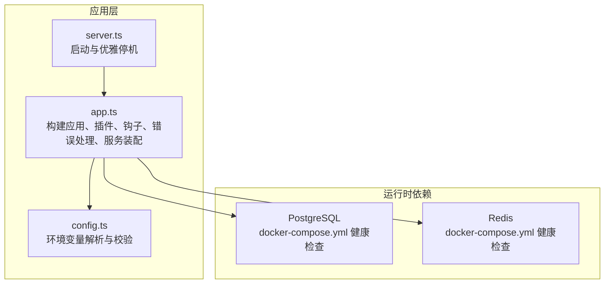
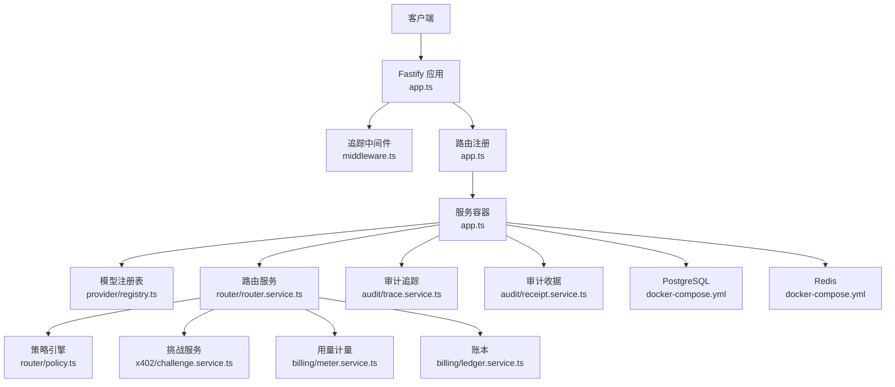
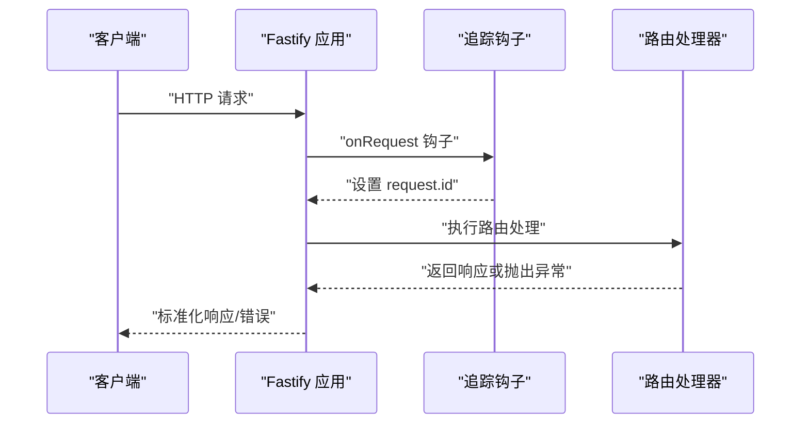
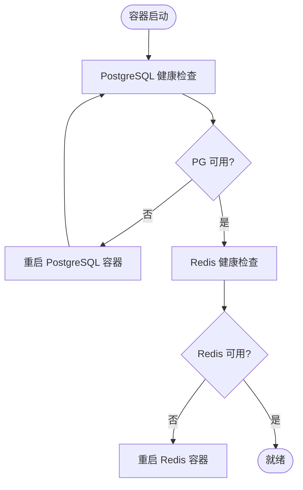
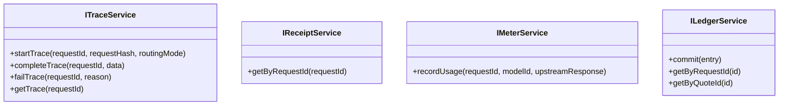
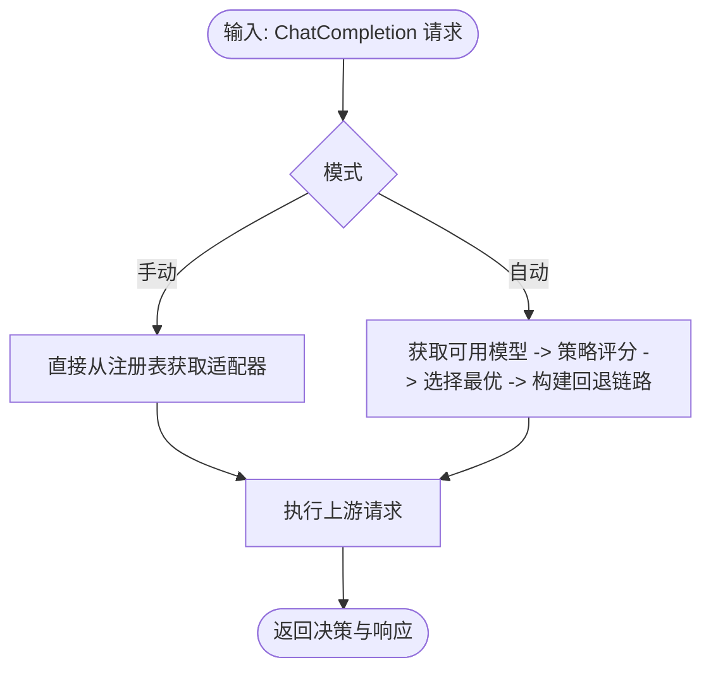
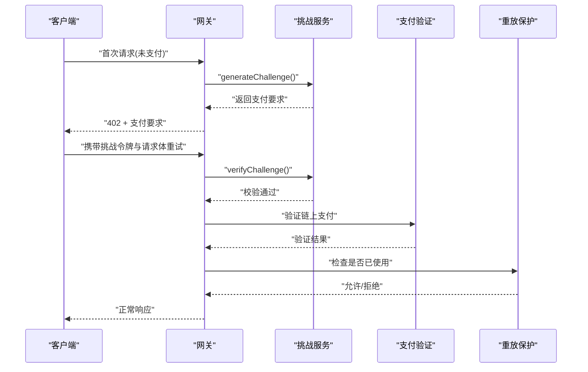
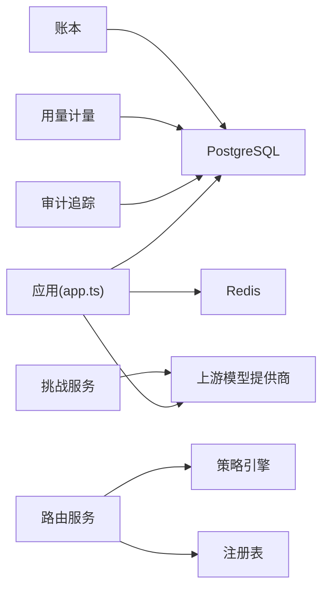

# 监控与运维

<cite>
**本文引用的文件**
- [src/app.ts](file://src/app.ts)
- [src/server.ts](file://src/server.ts)
- [src/config.ts](file://src/config.ts)
- [docker-compose.yml](file://docker-compose.yml)
- [package.json](file://package.json)
- [src/gateway/middleware.ts](file://src/gateway/middleware.ts)
- [src/audit/trace.service.ts](file://src/audit/trace.service.ts)
- [src/audit/receipt.service.ts](file://src/audit/receipt.service.ts)
- [src/billing/meter.service.ts](file://src/billing/meter.service.ts)
- [src/billing/ledger.service.ts](file://src/billing/ledger.service.ts)
- [src/router/router.service.ts](file://src/router/router.service.ts)
- [src/router/policy.ts](file://src/router/policy.ts)
- [src/provider/registry.ts](file://src/provider/registry.ts)
- [src/x402/challenge.service.ts](file://src/x402/challenge.service.ts)
- [src/errors.ts](file://src/errors.ts)
</cite>

## 目录
1. [简介](#简介)
2. [项目结构](#项目结构)
3. [核心组件](#核心组件)
4. [架构总览](#架构总览)
5. [详细组件分析](#详细组件分析)
6. [依赖关系分析](#依赖关系分析)
7. [性能考虑](#性能考虑)
8. [故障排除指南](#故障排除指南)
9. [结论](#结论)
10. [附录](#附录)

## 简介
本文件面向监控与运维团队，围绕日志记录、性能指标、健康检查、审计与计费、数据库与缓存监控、以及区块链支付流程的可观测性，提供可落地的实践建议与最佳实践。同时给出故障排除、性能调优、容量规划、自动化运维、备份与灾备策略，以及监控仪表板配置思路。

## 项目结构
该服务基于 Fastify 应用，通过配置加载、中间件注入请求追踪 ID、路由注册与全局错误处理，形成统一的入口；外部依赖包括 PostgreSQL 与 Redis；容器编排提供数据库与缓存的健康检查能力。

图表来源
- [src/server.ts:1-33](file://src/server.ts#L1-L33)
- [src/app.ts:35-100](file://src/app.ts#L35-L100)
- [src/config.ts:28-45](file://src/config.ts#L28-L45)
- [docker-compose.yml:1-31](file://docker-compose.yml#L1-L31)

章节来源
- [src/server.ts:1-33](file://src/server.ts#L1-L33)
- [src/app.ts:35-100](file://src/app.ts#L35-L100)
- [src/config.ts:28-45](file://src/config.ts#L28-L45)
- [docker-compose.yml:1-31](file://docker-compose.yml#L1-L31)

## 核心组件
- 日志与追踪：应用内置日志级别配置；请求进入时注入唯一追踪 ID，便于跨服务串联。
- 健康检查：PostgreSQL 与 Redis 提供健康检查探针，支持容器编排自动重启与状态上报。
- 审计与账单：提供审计追踪、收据查询、用量计量、账本登记等接口能力（当前为待实现占位）。
- 路由与策略：路由服务负责在手动/自动模式下选择上游模型与回退链路；策略引擎用于评分与优选。
- 支付挑战：生成与验证 402 挑战，绑定请求哈希与过期时间，保障重放防护与一致性。

章节来源
- [src/app.ts:35-100](file://src/app.ts#L35-L100)
- [src/gateway/middleware.ts:9-12](file://src/gateway/middleware.ts#L9-L12)
- [docker-compose.yml:12-27](file://docker-compose.yml#L12-L27)
- [src/audit/trace.service.ts:38-67](file://src/audit/trace.service.ts#L38-L67)
- [src/audit/receipt.service.ts:14-25](file://src/audit/receipt.service.ts#L14-L25)
- [src/billing/meter.service.ts:13-28](file://src/billing/meter.service.ts#L13-L28)
- [src/billing/ledger.service.ts:17-41](file://src/billing/ledger.service.ts#L17-L41)
- [src/router/router.service.ts:20-49](file://src/router/router.service.ts#L20-L49)
- [src/router/policy.ts:16-33](file://src/router/policy.ts#L16-L33)
- [src/x402/challenge.service.ts:28-70](file://src/x402/challenge.service.ts#L28-L70)

## 架构总览
下图展示从客户端到应用、再到下游依赖的整体调用路径与可观测性要点。

图表来源
- [src/app.ts:72-97](file://src/app.ts#L72-L97)
- [src/gateway/middleware.ts:9-12](file://src/gateway/middleware.ts#L9-L12)
- [src/provider/registry.ts:27-64](file://src/provider/registry.ts#L27-L64)
- [src/router/router.service.ts:26-47](file://src/router/router.service.ts#L26-L47)
- [src/router/policy.ts:18-31](file://src/router/policy.ts#L18-L31)
- [src/billing/meter.service.ts:15-25](file://src/billing/meter.service.ts#L15-L25)
- [src/billing/ledger.service.ts:19-39](file://src/billing/ledger.service.ts#L19-L39)
- [src/audit/trace.service.ts:39-65](file://src/audit/trace.service.ts#L39-L65)
- [src/audit/receipt.service.ts:16-22](file://src/audit/receipt.service.ts#L16-L22)
- [docker-compose.yml:2-27](file://docker-compose.yml#L2-L27)

## 详细组件分析

### 日志记录与请求追踪
- 日志级别：通过配置项控制，支持 fatal/error/warn/info/debug/trace。
- 请求追踪：在 onRequest 钩子中注入唯一请求 ID，便于跨服务链路定位问题。
- 错误处理：全局错误处理器区分业务错误与内部错误，并输出标准化响应。

图表来源
- [src/app.ts:49-70](file://src/app.ts#L49-L70)
- [src/gateway/middleware.ts:9-12](file://src/gateway/middleware.ts#L9-L12)

章节来源
- [src/app.ts:35-70](file://src/app.ts#L35-L70)
- [src/gateway/middleware.ts:9-12](file://src/gateway/middleware.ts#L9-L12)
- [src/config.ts:28-45](file://src/config.ts#L28-L45)

### 健康检查机制
- 数据库健康：PostgreSQL 使用健康检查探针，周期性检测连接可用性。
- 缓存健康：Redis 使用 ping 探针，周期性检测实例状态。
- 容器编排：健康检查失败将触发重启策略，确保服务自愈。

图表来源
- [docker-compose.yml:12-27](file://docker-compose.yml#L12-L27)

章节来源
- [docker-compose.yml:12-27](file://docker-compose.yml#L12-L27)

### 审计与账单（待实现占位）
- 审计追踪：开始、完成、失败、查询等接口定义，当前为占位实现，后续需接入数据库持久化。
- 审计收据：按请求 ID 组合审计记录，用于对外查询。
- 用量计量：从上游响应提取 token 数并持久化。
- 账本登记：按请求/报价维度写入账本，保证追加式不可变记录。

图表来源
- [src/audit/trace.service.ts:4-36](file://src/audit/trace.service.ts#L4-L36)
- [src/audit/receipt.service.ts:4-12](file://src/audit/receipt.service.ts#L4-L12)
- [src/billing/meter.service.ts:5-11](file://src/billing/meter.service.ts#L5-L11)
- [src/billing/ledger.service.ts:3-15](file://src/billing/ledger.service.ts#L3-L15)

章节来源
- [src/audit/trace.service.ts:38-67](file://src/audit/trace.service.ts#L38-L67)
- [src/audit/receipt.service.ts:14-25](file://src/audit/receipt.service.ts#L14-L25)
- [src/billing/meter.service.ts:13-28](file://src/billing/meter.service.ts#L13-L28)
- [src/billing/ledger.service.ts:17-41](file://src/billing/ledger.service.ts#L17-L41)

### 路由与策略（待实现占位）
- 路由服务：支持手动/自动两种模式，自动模式通过策略引擎评分与回退链路生成。
- 策略引擎：根据成本、能力匹配度与可用性对候选模型打分并优选。

图表来源
- [src/router/router.service.ts:14-47](file://src/router/router.service.ts#L14-L47)
- [src/router/policy.ts:18-31](file://src/router/policy.ts#L18-L31)
- [src/provider/registry.ts:31-62](file://src/provider/registry.ts#L31-L62)

章节来源
- [src/router/router.service.ts:20-49](file://src/router/router.service.ts#L20-L49)
- [src/router/policy.ts:16-33](file://src/router/policy.ts#L16-L33)
- [src/provider/registry.ts:27-64](file://src/provider/registry.ts#L27-L64)

### 支付挑战与重放防护（待实现占位）
- 挑战生成：计算请求哈希、签名挑战、设置过期时间。
- 挑战验证：校验签名、过期时间与请求哈希一致性。
- 重放保护：结合 Redis 或账本记录防止重复消费。

图表来源
- [src/x402/challenge.service.ts:36-68](file://src/x402/challenge.service.ts#L36-L68)
- [src/app.ts:77-94](file://src/app.ts#L77-L94)

章节来源
- [src/x402/challenge.service.ts:28-70](file://src/x402/challenge.service.ts#L28-L70)
- [src/app.ts:77-94](file://src/app.ts#L77-L94)

## 依赖关系分析
- 外部依赖：PostgreSQL、Redis、OpenAI/Anthropic 等上游模型提供商。
- 内部耦合：路由服务依赖策略引擎与注册表；审计与账单服务依赖数据库；挑战服务依赖签名与区块链参数。
- 运维关注点：数据库与缓存的连接池、超时、重试与健康检查；上游服务的 SLA 与降级策略。

图表来源
- [src/app.ts:77-94](file://src/app.ts#L77-L94)
- [src/router/router.service.ts:26-47](file://src/router/router.service.ts#L26-L47)
- [src/router/policy.ts:18-31](file://src/router/policy.ts#L18-L31)
- [src/provider/registry.ts:31-62](file://src/provider/registry.ts#L31-L62)
- [docker-compose.yml:2-27](file://docker-compose.yml#L2-L27)

章节来源
- [src/app.ts:77-94](file://src/app.ts#L77-L94)
- [src/router/router.service.ts:20-49](file://src/router/router.service.ts#L20-L49)
- [src/router/policy.ts:16-33](file://src/router/policy.ts#L16-L33)
- [src/provider/registry.ts:27-64](file://src/provider/registry.ts#L27-L64)
- [docker-compose.yml:2-27](file://docker-compose.yml#L2-L27)

## 性能考虑
- 日志级别与采样：生产环境建议使用 info 或 warn，避免 debug/trace 的高开销。
- 连接池与超时：为 PostgreSQL 与 Redis 设置合理的最大连接数、空闲超时与查询超时；对上游模型提供商设置超时与重试。
- 缓存命中：利用 Redis 缓存热点数据（如模型元数据、定价信息），降低数据库压力。
- 路由优化：策略评分与回退链路应尽量减少不必要的网络往返；对评分逻辑进行本地缓存与批量处理。
- 限流与熔断：结合速率限制中间件与上游熔断策略，避免雪崩效应。
- 监控指标：建议采集请求延迟、吞吐量、错误率、数据库/缓存命中率、上游成功率等。

## 故障排除指南
- 启动失败
  - 现象：进程退出码非零，日志出现致命错误。
  - 排查：检查监听端口占用、环境变量配置、依赖服务可达性。
  - 参考
    - [src/server.ts:8-14](file://src/server.ts#L8-L14)
    - [src/config.ts:28-45](file://src/config.ts#L28-L45)
- 402 支付相关
  - 现象：客户端收到 402，提示需要支付证明。
  - 排查：确认挑战生成与验证流程、请求哈希一致性、过期时间、重放防护。
  - 参考
    - [src/errors.ts:17-25](file://src/errors.ts#L17-L25)
    - [src/x402/challenge.service.ts:36-68](file://src/x402/challenge.service.ts#L36-L68)
- 上游超时/不可用
  - 现象：504/503 错误。
  - 排查：检查上游提供商状态、网络连通性、重试与熔断策略。
  - 参考
    - [src/errors.ts:67-81](file://src/errors.ts#L67-L81)
- 数据库/缓存异常
  - 现象：连接失败、查询超时。
  - 排查：查看健康检查状态、连接池配置、慢查询与锁等待。
  - 参考
    - [docker-compose.yml:12-27](file://docker-compose.yml#L12-L27)
- 审计/账单未落库
  - 现象：审计与账单接口返回空或报错。
  - 排查：确认数据库迁移、表结构与索引、事务边界与幂等性。
  - 参考
    - [src/audit/trace.service.ts:38-67](file://src/audit/trace.service.ts#L38-L67)
    - [src/billing/meter.service.ts:13-28](file://src/billing/meter.service.ts#L13-L28)
    - [src/billing/ledger.service.ts:17-41](file://src/billing/ledger.service.ts#L17-L41)

章节来源
- [src/server.ts:8-14](file://src/server.ts#L8-L14)
- [src/config.ts:28-45](file://src/config.ts#L28-L45)
- [src/errors.ts:17-25](file://src/errors.ts#L17-L25)
- [src/x402/challenge.service.ts:36-68](file://src/x402/challenge.service.ts#L36-L68)
- [src/errors.ts:67-81](file://src/errors.ts#L67-L81)
- [docker-compose.yml:12-27](file://docker-compose.yml#L12-L27)
- [src/audit/trace.service.ts:38-67](file://src/audit/trace.service.ts#L38-L67)
- [src/billing/meter.service.ts:13-28](file://src/billing/meter.service.ts#L13-L28)
- [src/billing/ledger.service.ts:17-41](file://src/billing/ledger.service.ts#L17-L41)

## 结论
本项目在架构上已具备清晰的服务装配与可观测性基础，但审计、用量与账单等功能仍处于占位阶段。建议优先完善数据库与缓存的连接与监控、实现挑战与重放保护、补齐审计与账单的持久化逻辑，并建立完善的日志、指标与告警体系，以支撑生产环境的稳定运行与持续演进。

## 附录

### 日志记录配置建议
- 日志级别：生产环境建议 info；仅在排查问题时临时提升至 debug。
- 日志格式：统一 JSON 格式，包含请求 ID、时间戳、级别、模块、消息与上下文字段。
- 日志轮转：按大小与时间轮转，保留天数视合规要求而定。
- 参考
  - [src/app.ts:36-41](file://src/app.ts#L36-L41)
  - [src/config.ts:8](file://src/config.ts#L8)

### 性能监控指标建议
- 应用层：请求延迟（P50/P90/P99）、请求速率、错误率、并发连接数。
- 数据库层：连接数、查询耗时、慢查询、锁等待、缓冲区命中率。
- 缓存层：命中率、过期/驱逐、内存使用、命令耗时。
- 上游层：成功率、延迟、超时率、重试次数。
- 审计/账单：入库延迟、批处理吞吐、重试与补偿次数。
- 参考
  - [src/app.ts:44-47](file://src/app.ts#L44-L47)
  - [docker-compose.yml:12-27](file://docker-compose.yml#L12-L27)

### 健康检查机制
- 数据库：使用 pg_isready 检查连接；失败自动重启。
- 缓存：使用 redis-cli ping；失败自动重启。
- 应用：提供 /healthz 或 /readyz 接口，组合数据库与缓存状态。
- 参考
  - [docker-compose.yml:12-27](file://docker-compose.yml#L12-L27)

### 服务器监控最佳实践
- 资源监控：CPU、内存、磁盘、网络；设置阈值告警。
- 进程管理：使用 systemd 或容器编排，启用健康检查与自动重启。
- 安全加固：启用 Helmet、CORS、速率限制；限制暴露端口与访问来源。
- 参考
  - [src/app.ts:44-47](file://src/app.ts#L44-L47)

### 数据库监控最佳实践
- 连接池：合理设置最大连接数、空闲超时、查询超时。
- 模式变更：使用迁移工具，禁止在线 DDL；变更前评估影响。
- 备份策略：定时全量+增量备份，定期恢复演练。
- 参考
  - [docker-compose.yml:2-16](file://docker-compose.yml#L2-L16)

### 区块链节点监控最佳实践
- 节点同步：监控区块高度、落后区块数、同步速度。
- RPC 可用性：多节点探测与切换，设置超时与重试。
- 费用与余额：监控账户余额与 gas 价格趋势，设置低余额告警。
- 参考
  - [src/config.ts:16-18](file://src/config.ts#L16-L18)

### 审计系统监控与使用量统计
- 审计完整性：追踪开始/完成/失败状态与关键字段（模型、tokens、费用、链、资产、付款人地址）。
- 收据聚合：按请求 ID、报价 ID、时间窗口聚合使用量与费用。
- 成本分析：按模型、供应商、链路维度拆分成本，支持预算与预警。
- 参考
  - [src/audit/trace.service.ts:15-29](file://src/audit/trace.service.ts#L15-L29)
  - [src/audit/receipt.service.ts:16-22](file://src/audit/receipt.service.ts#L16-L22)
  - [src/billing/meter.service.ts:15-25](file://src/billing/meter.service.ts#L15-L25)
  - [src/billing/ledger.service.ts:19-39](file://src/billing/ledger.service.ts#L19-L39)

### 运维自动化与灾备
- 自动化：CI/CD 中集成测试、lint、类型检查与打包；容器镜像版本化与灰度发布。
- 备份与恢复：数据库与缓存快照策略、异地容灾、RPO/RTO 明确。
- 灾难恢复：演练脚本与 SOP，明确恢复优先级与回切流程。
- 参考
  - [package.json:7-19](file://package.json#L7-L19)
  - [docker-compose.yml:1-31](file://docker-compose.yml#L1-L31)

### 监控仪表板配置示例
- 关键看板：请求速率与延迟、错误率、数据库/缓存命中率、上游成功率、审计入库延迟。
- 告警规则：基于阈值与同比/环比异常；区分 P0/P1/P2 级别。
- 参考
  - [src/app.ts:44-47](file://src/app.ts#L44-L47)
  - [docker-compose.yml:12-27](file://docker-compose.yml#L12-L27)