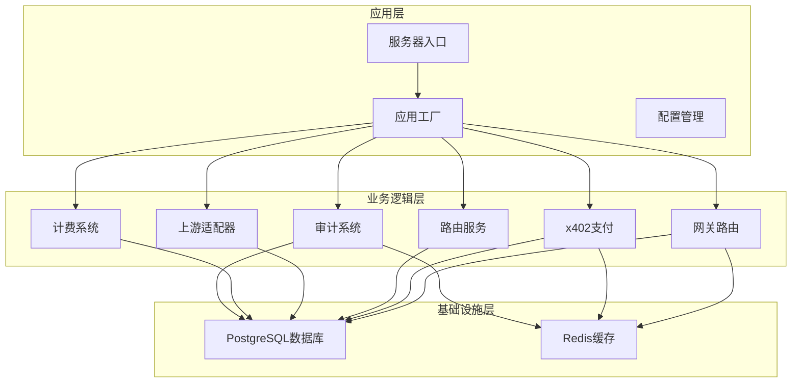
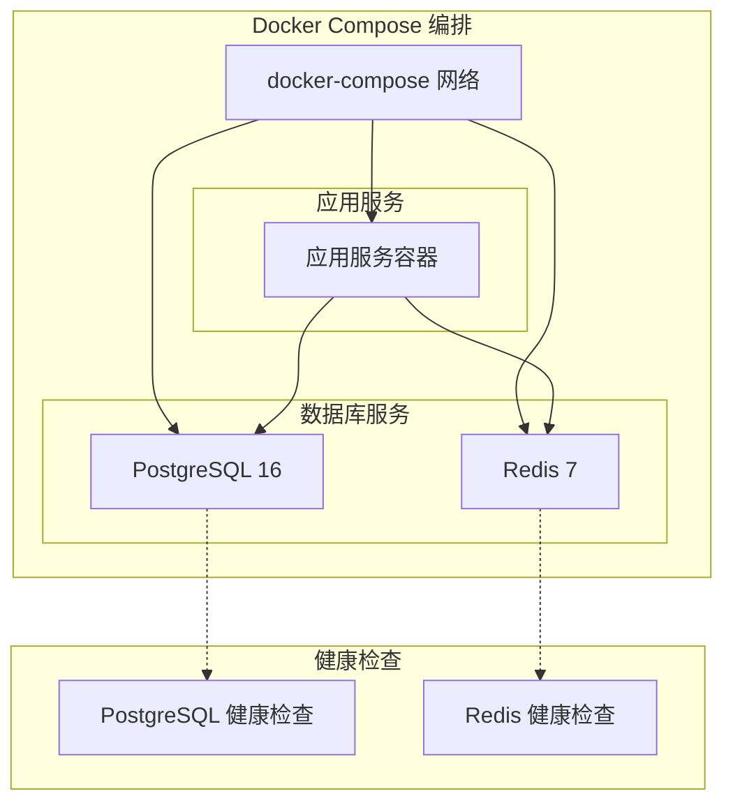
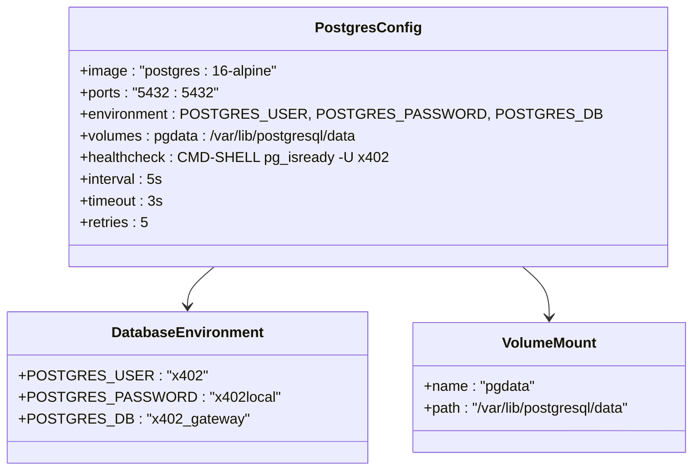
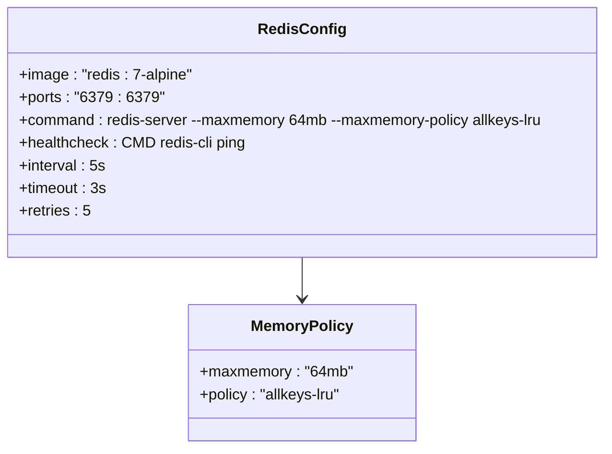
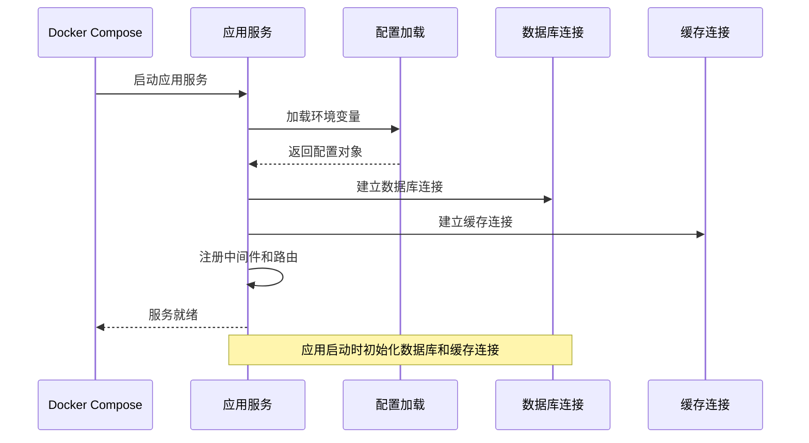
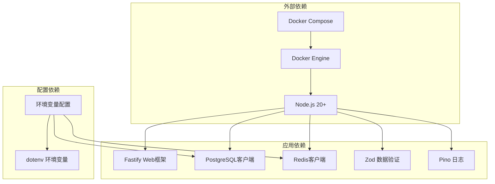
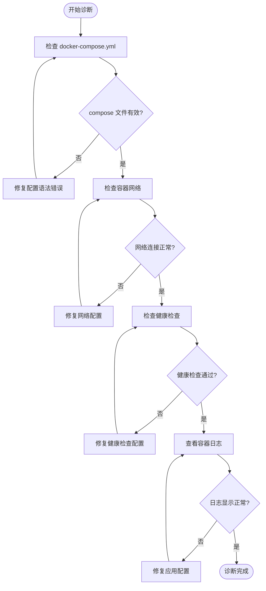

# Docker 容器化部署

<cite>
**本文档引用的文件**
- [docker-compose.yml](file://docker-compose.yml)
- [package.json](file://package.json)
- [README.md](file://README.md)
- [src/app.ts](file://src/app.ts)
- [src/server.ts](file://src/server.ts)
- [src/config.ts](file://src/config.ts)
- [src/gateway/routes.ts](file://src/gateway/routes.ts)
- [src/gateway/middleware.ts](file://src/gateway/middleware.ts)
- [src/types.ts](file://src/types.ts)
</cite>

## 目录
1. [简介](#简介)
2. [项目结构](#项目结构)
3. [核心组件](#核心组件)
4. [架构概览](#架构概览)
5. [详细组件分析](#详细组件分析)
6. [依赖关系分析](#依赖关系分析)
7. [性能考虑](#性能考虑)
8. [故障排除指南](#故障排除指南)
9. [结论](#结论)
10. [附录](#附录)

## 简介

本指南详细说明了基于 Docker 的容器化部署方案，涵盖 docker-compose.yml 文件的配置选项、容器编排、服务配置以及完整的部署流程。该系统采用 PostgreSQL 数据库和 Redis 缓存作为核心依赖服务，为 x402 网关应用提供数据持久化和缓存支持。

## 项目结构

该项目采用模块化的 TypeScript 架构，主要包含以下核心模块：



**图表来源**
- [src/app.ts:35-100](file://src/app.ts#L35-L100)
- [src/server.ts:4-26](file://src/server.ts#L4-L26)

**章节来源**
- [README.md:79-106](file://README.md#L79-L106)
- [src/app.ts:21-33](file://src/app.ts#L21-L33)

## 核心组件

### 应用服务容器

应用服务容器负责运行 x402 网关的核心功能，包括请求处理、支付验证、路由决策等。该服务通过环境变量进行配置管理，支持多种部署模式。

### 数据库服务容器

PostgreSQL 16 数据库容器提供数据持久化功能，存储账单记录、审计日志等重要数据。容器配置了健康检查机制，确保数据库服务的可用性。

### 缓存服务容器

Redis 7 缓存容器提供高速缓存和去重功能，支持请求去重保护和临时数据存储。配置了内存限制策略以优化资源使用。

**章节来源**
- [docker-compose.yml:1-31](file://docker-compose.yml#L1-L31)
- [src/config.ts:4-24](file://src/config.ts#L4-L24)

## 架构概览

系统采用微服务架构，通过 Docker Compose 进行容器编排：



**图表来源**
- [docker-compose.yml:1-31](file://docker-compose.yml#L1-L31)

## 详细组件分析

### PostgreSQL 数据库配置

PostgreSQL 16 数据库容器配置了完整的生产就绪设置：



**图表来源**
- [docker-compose.yml:2-16](file://docker-compose.yml#L2-L16)

#### 关键配置说明

- **镜像版本**: 使用 `postgres:16-alpine` 轻量级镜像
- **端口映射**: 将容器内部 5432 端口映射到主机 5432 端口
- **认证配置**: 设置用户名、密码和数据库名称
- **数据持久化**: 挂载名为 `pgdata` 的命名卷
- **健康检查**: 每 5 秒检查一次数据库连接状态

**章节来源**
- [docker-compose.yml:2-16](file://docker-compose.yml#L2-L16)

### Redis 缓存配置

Redis 7 缓存容器提供了高性能的内存数据存储：



**图表来源**
- [docker-compose.yml:18-27](file://docker-compose.yml#L18-L27)

#### 内存管理策略

- **最大内存**: 64MB 限制，防止内存溢出
- **淘汰策略**: LRU（最近最少使用）算法
- **端口映射**: 6379 端口对外暴露
- **健康检查**: 通过 PING 命令验证连接

**章节来源**
- [docker-compose.yml:18-27](file://docker-compose.yml#L18-L27)

### 应用服务配置

应用服务容器负责运行 x402 网关的核心逻辑：



**图表来源**
- [src/server.ts:4-26](file://src/server.ts#L4-L26)
- [src/app.ts:73-94](file://src/app.ts#L73-L94)

**章节来源**
- [src/server.ts:4-26](file://src/server.ts#L4-L26)
- [src/app.ts:73-94](file://src/app.ts#L73-L94)

## 依赖关系分析

系统各组件之间的依赖关系如下：



**图表来源**
- [package.json:21-36](file://package.json#L21-L36)
- [src/config.ts:1-46](file://src/config.ts#L1-L46)

**章节来源**
- [package.json:21-36](file://package.json#L21-L36)
- [src/config.ts:1-46](file://src/config.ts#L1-L46)

## 性能考虑

### 资源优化策略

1. **镜像选择**: 使用 Alpine Linux 基础镜像减少容器大小
2. **内存限制**: Redis 设置 64MB 内存上限，避免资源争用
3. **健康检查**: 短间隔检查确保快速故障检测
4. **日志级别**: 生产环境默认使用 info 级别日志

### 扩展性建议

- **水平扩展**: 应用服务可轻松复制多个实例
- **负载均衡**: 可添加反向代理进行流量分发
- **数据库优化**: 生产环境中考虑连接池配置
- **缓存策略**: 根据业务需求调整缓存大小和策略

## 故障排除指南

### 常见问题诊断



### 健康检查配置

每个服务都配置了健康检查机制：

- **PostgreSQL**: 每 5 秒执行 `pg_isready` 检查
- **Redis**: 每 5 秒执行 `redis-cli ping` 检查
- **超时设置**: 3 秒超时时间
- **重试次数**: 最多重试 5 次

**章节来源**
- [docker-compose.yml:12-16](file://docker-compose.yml#L12-L16)
- [docker-compose.yml:23-27](file://docker-compose.yml#L23-L27)

## 结论

本 Docker 容器化部署方案提供了生产就绪的基础设施配置，具有以下优势：

1. **模块化设计**: 清晰的服务分离和依赖管理
2. **生产就绪**: 健康检查、资源限制和配置验证
3. **易于维护**: 标准化的配置文件和部署流程
4. **可扩展性**: 支持水平扩展和负载均衡

该方案为 x402 网关应用提供了稳定可靠的运行环境，支持从开发到生产的完整部署流程。

## 附录

### 部署命令参考

```bash
# 启动所有服务
docker compose up -d

# 停止所有服务
docker compose down

# 查看服务状态
docker compose ps

# 查看服务日志
docker compose logs -f

# 重启特定服务
docker compose restart postgres
```

### 环境变量配置

应用服务需要以下环境变量：

- `DATABASE_URL`: PostgreSQL 数据库连接字符串
- `REDIS_URL`: Redis 缓存连接字符串
- `CHALLENGE_SECRET`: 支付挑战密钥
- `MERCHANT_ADDRESS`: 商户钱包地址
- `PORT`: 服务监听端口（默认 3000）
- `NODE_ENV`: 运行环境（development/production/test）

**章节来源**
- [src/config.ts:28-45](file://src/config.ts#L28-L45)
- [package.json:7-19](file://package.json#L7-L19)