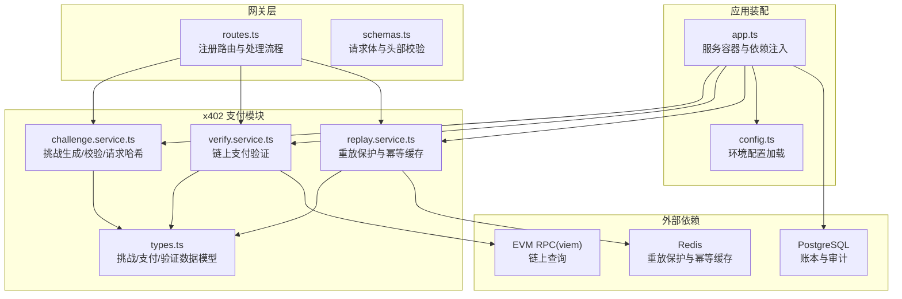
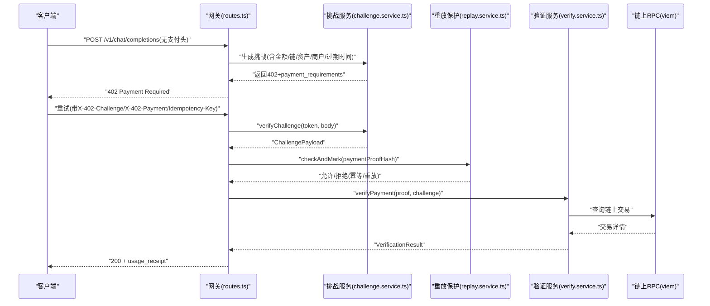
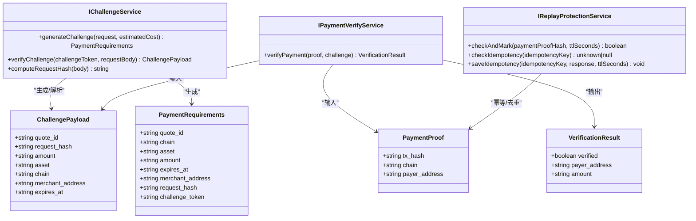
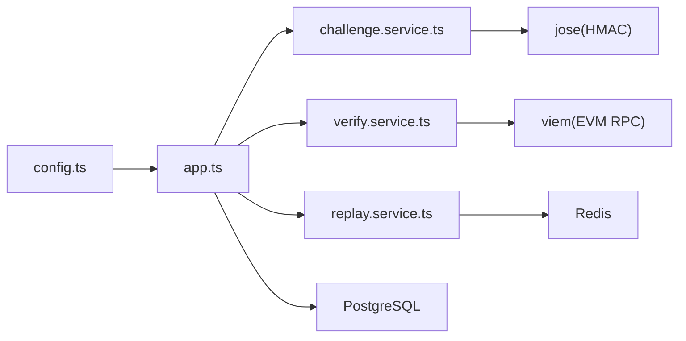

# 区块链与支付配置

<cite>
**本文档引用的文件**
- [config.ts](file://src/config.ts)
- [index.ts](file://src/x402/index.ts)
- [types.ts](file://src/x402/types.ts)
- [challenge.service.ts](file://src/x402/challenge.service.ts)
- [verify.service.ts](file://src/x402/verify.service.ts)
- [replay.service.ts](file://src/x402/replay.service.ts)
- [routes.ts](file://src/gateway/routes.ts)
- [schemas.ts](file://src/gateway/schemas.ts)
- [app.ts](file://src/app.ts)
- [errors.ts](file://src/errors.ts)
- [types.ts](file://src/types.ts)
- [api-spec-v0-x402-gateway.md](file://docs/api-spec-v0-x402-gateway.md)
- [README.md](file://README.md)
- [package.json](file://package.json)
- [challenge.test.ts](file://test/x402/challenge.test.ts)
</cite>

## 目录
1. [简介](#简介)
2. [项目结构](#项目结构)
3. [核心组件](#核心组件)
4. [架构总览](#架构总览)
5. [详细组件分析](#详细组件分析)
6. [依赖关系分析](#依赖关系分析)
7. [性能考量](#性能考量)
8. [故障排查指南](#故障排查指南)
9. [结论](#结论)
10. [附录](#附录)

## 简介
本文件面向部署与运维工程师，系统化说明 x402 支付系统的配置项与最佳实践，涵盖：
- 商户地址设置与支付链/资产配置
- CHALLENGE_SECRET 密钥管理与挑战过期时间设置
- 支付验证流程与安全约束
- 区块链网络（示例：Base 链）与稳定币资产（示例：USDC）配置
- 链上交互最佳实践与故障处理方案

## 项目结构
该服务采用模块化分层设计，x402 模块负责挑战生成、支付证明验证与重放防护；网关层负责请求校验与路由；计费与审计模块提供用量计量与账本记录。

图表来源
- [routes.ts:1-96](file://src/gateway/routes.ts#L1-L96)
- [challenge.service.ts:1-71](file://src/x402/challenge.service.ts#L1-L71)
- [verify.service.ts:1-34](file://src/x402/verify.service.ts#L1-L34)
- [replay.service.ts:1-52](file://src/x402/replay.service.ts#L1-L52)
- [app.ts:35-100](file://src/app.ts#L35-L100)
- [config.ts:28-45](file://src/config.ts#L28-L45)

章节来源
- [README.md:26-47](file://README.md#L26-L47)
- [package.json:21-36](file://package.json#L21-L36)

## 核心组件
- 配置加载器：从环境变量读取并校验所有配置项，确保启动时参数完整且类型正确。
- x402 挑战服务：生成挑战令牌、校验挑战令牌、计算请求哈希。
- 验证服务：基于 viem 对链上交易进行验证，确保金额、资产与收款人匹配。
- 重放保护服务：使用 Redis 原子操作防止同一支付证明被重复消费，并支持幂等键缓存。
- 网关路由：统一入口，按是否携带支付头决定返回 402 挑战或执行完整支付流程。

章节来源
- [config.ts:4-26](file://src/config.ts#L4-L26)
- [challenge.service.ts:28-71](file://src/x402/challenge.service.ts#L28-L71)
- [verify.service.ts:18-34](file://src/x402/verify.service.ts#L18-L34)
- [replay.service.ts:23-52](file://src/x402/replay.service.ts#L23-L52)
- [routes.ts:9-67](file://src/gateway/routes.ts#L9-L67)

## 架构总览
x402 支付流程在 API 层通过 402 挑战响应触发，客户端完成链上支付后重试请求，服务端依次验证挑战签名与有效期、请求哈希绑定、链上支付证明，最终路由到上游模型并返回带收据的响应。

图表来源
- [routes.ts:23-67](file://src/gateway/routes.ts#L23-L67)
- [challenge.service.ts:49-60](file://src/x402/challenge.service.ts#L49-L60)
- [verify.service.ts:20-31](file://src/x402/verify.service.ts#L20-L31)
- [replay.service.ts:25-33](file://src/x402/replay.service.ts#L25-L33)

章节来源
- [api-spec-v0-x402-gateway.md:21-103](file://docs/api-spec-v0-x402-gateway.md#L21-L103)

## 详细组件分析

### 配置项详解与最佳实践
- 环境变量与默认值
  - 端口与主机：默认端口与监听地址，便于容器化部署。
  - 日志级别：建议生产环境设为 info 或更高。
  - 数据库与缓存：PostgreSQL 与 Redis 连接字符串，用于账本与重放保护。
  - CHALLENGE_SECRET：HMAC 密钥，长度至少 32 字符，建议使用强随机密钥并定期轮换。
  - CHALLENGE_TTL_SECONDS：挑战有效期，默认 300 秒，建议根据链上确认时间与用户体验权衡。
  - 商户地址：以 0x 开头的十六进制地址，需为有效链上账户。
  - 支付链：默认 base，可扩展至其他 EVM 兼容链。
  - 支付资产：默认 USDC，可扩展至其他稳定币或代币。
  - 平台费率：以基点(bps)表示，建议谨慎设置并透明披露。

- 安全与合规
  - 密钥管理：CHALLENGE_SECRET 存储于受控环境变量，避免硬编码与日志泄露。
  - 传输安全：生产环境启用 HTTPS 与安全头策略。
  - 最小权限：数据库与 Redis 访问凭据仅授予必要权限。

章节来源
- [config.ts:13-24](file://src/config.ts#L13-L24)
- [config.ts:28-45](file://src/config.ts#L28-L45)
- [api-spec-v0-x402-gateway.md:177-183](file://docs/api-spec-v0-x402-gateway.md#L177-L183)

### CHALLENGE_SECRET 密钥管理与挑战过期时间
- 密钥要求
  - 最小长度：32 字符，推荐使用足够熵的随机字符串。
  - 轮换策略：定期轮换密钥，旧密钥在切换后短期内保留以兼容重试请求。
- 过期时间
  - TTL 默认 300 秒，建议结合链上出块时间与客户端重试策略调整。
  - 过期检查在挑战校验阶段执行，超时返回特定错误码。

章节来源
- [config.ts:13-14](file://src/config.ts#L13-L14)
- [challenge.service.ts:49-59](file://src/x402/challenge.service.ts#L49-L59)
- [errors.ts:27-33](file://src/errors.ts#L27-L33)

### 支付链与资产配置
- 支付链
  - 默认链：base，可通过配置项扩展至其他 EVM 兼容链。
  - 验证服务需适配目标链的 RPC 与资产合约地址。
- 支付资产
  - 默认资产：USDC，需确保链上存在对应合约并可查询余额与转账。
  - 扩展资产：新增稳定币或代币时，需同步更新验证逻辑与前端提示。

章节来源
- [config.ts:17-18](file://src/config.ts#L17-L18)
- [verify.service.ts:3-16](file://src/x402/verify.service.ts#L3-L16)

### 支付验证流程配置与安全考虑
- 验证步骤
  - 金额校验：支付金额必须大于等于挑战金额。
  - 资产校验：支付资产必须与挑战资产一致。
  - 收款人校验：支付收款人必须与挑战中的商户地址一致。
- 安全约束
  - 请求哈希绑定：挑战与请求体通过确定性哈希绑定，防止重放与篡改。
  - 幂等与重放：使用 Redis 原子操作防止同一支付证明被重复消费。
  - 错误分类：明确区分挑战过期、请求哈希不匹配、验证失败、重复支付等错误码。

章节来源
- [verify.service.ts:3-16](file://src/x402/verify.service.ts#L3-L16)
- [challenge.service.ts:62-68](file://src/x402/challenge.service.ts#L62-L68)
- [replay.service.ts:25-33](file://src/x402/replay.service.ts#L25-L33)
- [errors.ts:17-65](file://src/errors.ts#L17-L65)

### 类型与数据模型
- ChallengePayload：挑战载荷，包含报价单号、请求哈希、金额、资产、链、商户地址与过期时间。
- PaymentProof：支付证明，包含链上交易哈希与链信息、付款人地址。
- PaymentRequirements：402 响应体，包含报价单号、链、资产、金额、过期时间、商户地址、请求哈希与挑战令牌。
- VerificationResult：链上验证结果，包含验证状态、付款人地址与金额。

章节来源
- [types.ts:1-37](file://src/x402/types.ts#L1-L37)
- [types.ts:42-62](file://src/types.ts#L42-L62)

### 组件类图

图表来源
- [challenge.service.ts:4-26](file://src/x402/challenge.service.ts#L4-L26)
- [verify.service.ts:3-16](file://src/x402/verify.service.ts#L3-L16)
- [replay.service.ts:3-21](file://src/x402/replay.service.ts#L3-L21)
- [types.ts:1-37](file://src/x402/types.ts#L1-L37)

## 依赖关系分析
- 内部依赖
  - 网关路由依赖挑战、验证与重放服务接口。
  - 应用装配将配置注入各服务实例。
- 外部依赖
  - Redis：重放保护与幂等缓存。
  - PostgreSQL：账本与审计持久化。
  - viem：EVM 兼容链 RPC 查询。
  - jose：挑战令牌签名与验证。
  - zod：配置与请求体校验。

图表来源
- [app.ts:77-94](file://src/app.ts#L77-L94)
- [config.ts:28-45](file://src/config.ts#L28-L45)
- [package.json:21-36](file://package.json#L21-L36)

章节来源
- [app.ts:77-94](file://src/app.ts#L77-L94)
- [package.json:21-36](file://package.json#L21-L36)

## 性能考量
- 挑战与验证
  - 将挑战与请求体哈希绑定，减少不必要的链上查询。
  - 合理设置 CHALLENGE_TTL_SECONDS，平衡用户体验与资源占用。
- 缓存与去重
  - 使用 Redis 原子 SET NX EX 实现高并发下的幂等与去重。
  - 对常见查询结果进行短期缓存，降低重复计算。
- 链上交互
  - 批量查询与合并请求，避免频繁 RPC 调用。
  - 选择低延迟 RPC 提供商，必要时配置多节点轮询。
- 可观测性
  - 记录关键指标（请求量、验证成功率、链上查询耗时），及时发现异常。

## 故障排查指南
- 常见错误与处理
  - 挑战过期：检查 CHALLENGE_TTL_SECONDS 设置与客户端重试时机。
  - 请求哈希不匹配：确认客户端重试时请求体未被修改。
  - 验证失败：核对链、资产、金额与收款人是否与挑战一致。
  - 重复支付：检查 Redis 去重键是否正确写入与过期。
  - 上游不可用/超时：监控上游服务健康度，必要时降级或限流。
- 排查步骤
  - 查看服务日志与错误码映射。
  - 校验环境变量与配置文件一致性。
  - 使用测试用例验证挑战与验证流程。
  - 检查 Redis 与数据库连接状态。

章节来源
- [errors.ts:17-81](file://src/errors.ts#L17-L81)
- [challenge.test.ts:1-28](file://test/x402/challenge.test.ts#L1-L28)

## 结论
x402 支付系统通过挑战令牌与链上验证实现了“按请求付费”的无钥匙模式。正确配置 CHALLENGE_SECRET、挑战有效期、商户地址、支付链与资产，是保障安全与可用性的关键。配合 Redis 去重与幂等缓存、严格的错误分类与可观测性，可在生产环境中稳定运行。

## 附录

### 环境变量清单
- 必填项
  - CHALLENGE_SECRET：挑战签名密钥（≥32 字符）
  - MERCHANT_ADDRESS：收款人地址（0x 开头）
- 可选项
  - PAYMENT_CHAIN：默认 base
  - PAYMENT_ASSET：默认 USDC
  - CHALLENGE_TTL_SECONDS：默认 300
  - PLATFORM_FEE_BPS：平台费率（bps）

章节来源
- [config.ts:36-44](file://src/config.ts#L36-L44)