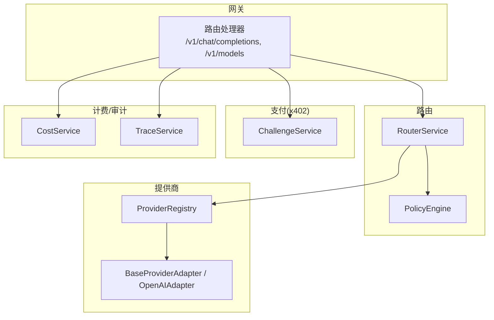
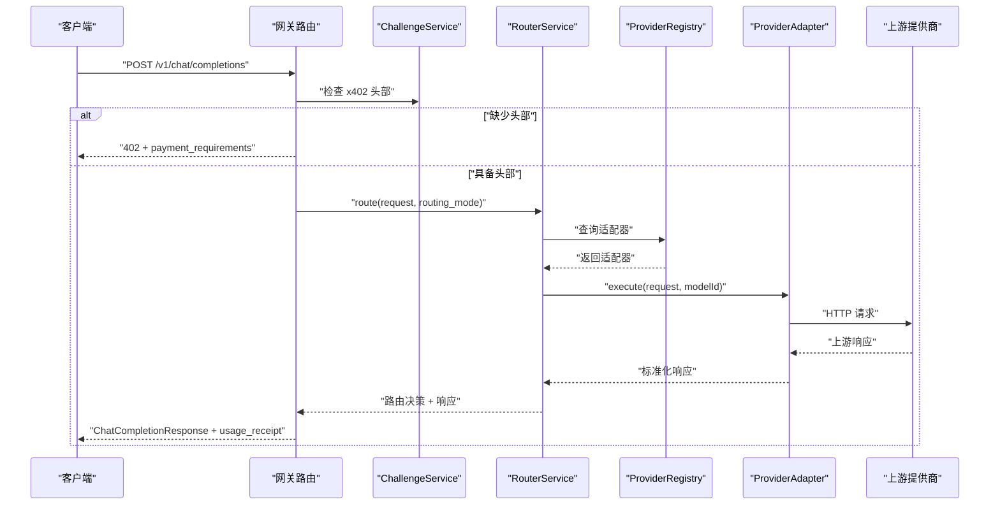
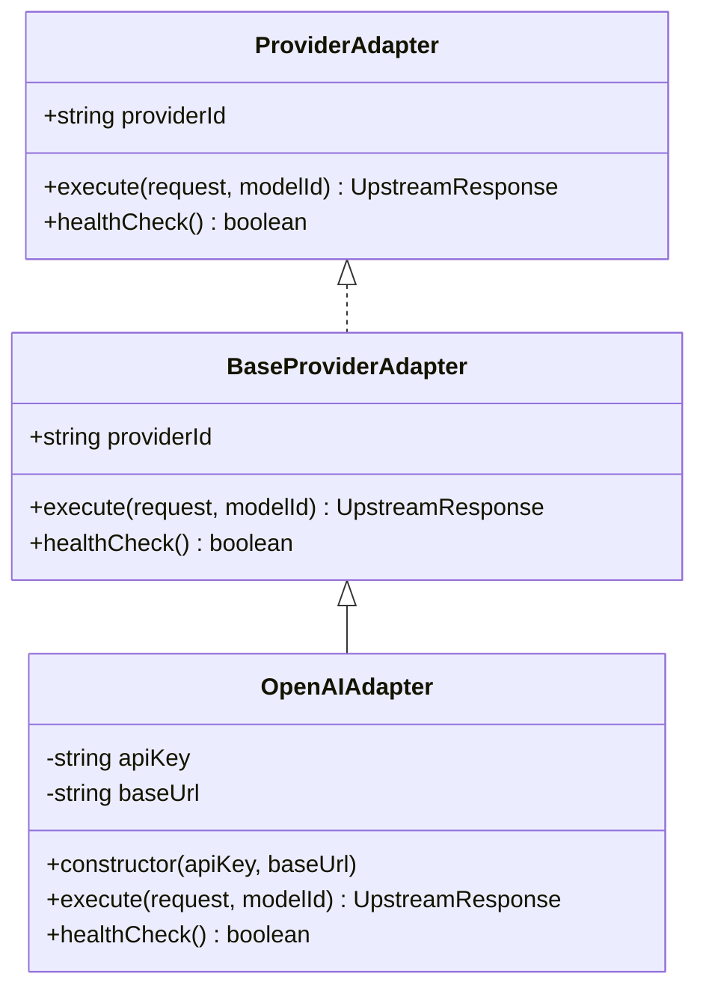
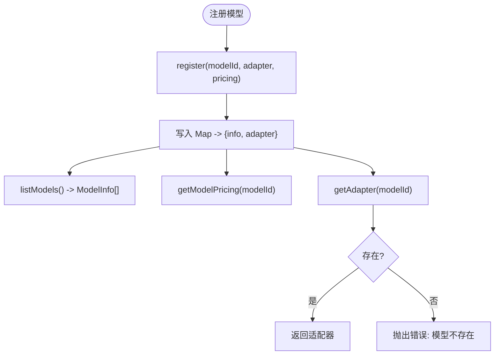
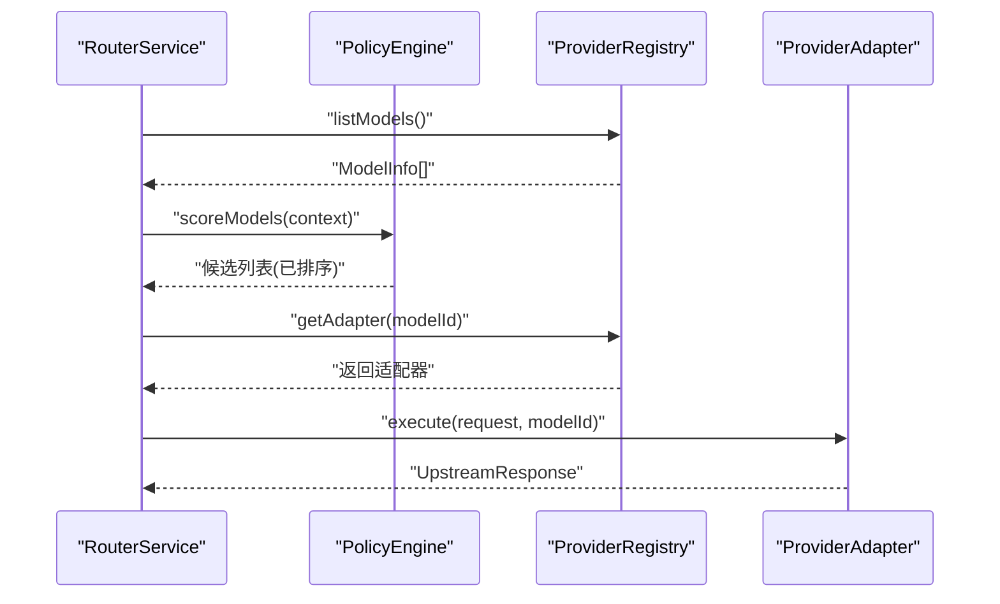
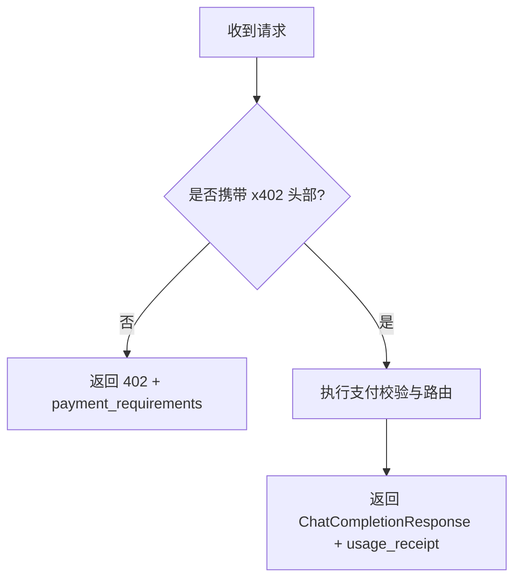
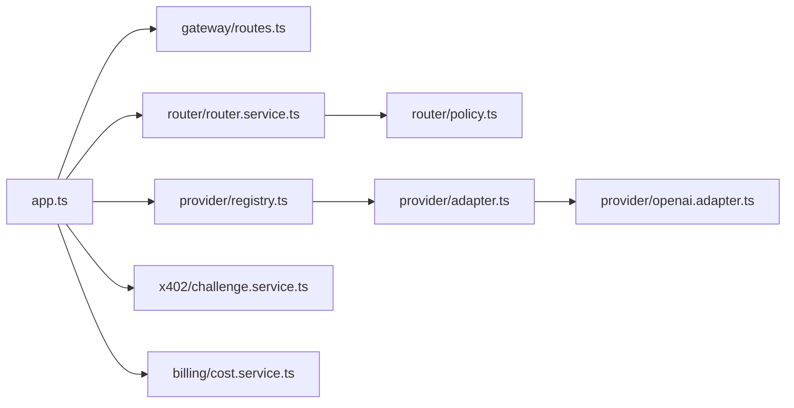

# 提供商 API 配置

<cite>
**本文引用的文件**
- [src/config.ts](file://src/config.ts)
- [src/provider/index.ts](file://src/provider/index.ts)
- [src/provider/adapter.ts](file://src/provider/adapter.ts)
- [src/provider/openai.adapter.ts](file://src/provider/openai.adapter.ts)
- [src/provider/registry.ts](file://src/provider/registry.ts)
- [src/provider/types.ts](file://src/provider/types.ts)
- [src/router/router.service.ts](file://src/router/router.service.ts)
- [src/router/policy.ts](file://src/router/policy.ts)
- [src/gateway/routes.ts](file://src/gateway/routes.ts)
- [src/app.ts](file://src/app.ts)
- [src/types.ts](file://src/types.ts)
- [src/x402/challenge.service.ts](file://src/x402/challenge.service.ts)
- [src/billing/cost.service.ts](file://src/billing/cost.service.ts)
- [package.json](file://package.json)
- [README.md](file://README.md)
- [test/helpers.ts](file://test/helpers.ts)
</cite>

## 目录
1. [简介](#简介)
2. [项目结构](#项目结构)
3. [核心组件](#核心组件)
4. [架构总览](#架构总览)
5. [详细组件分析](#详细组件分析)
6. [依赖关系分析](#依赖关系分析)
7. [性能与速率控制](#性能与速率控制)
8. [故障排查指南](#故障排查指南)
9. [结论](#结论)
10. [附录：配置与测试](#附录配置与测试)

## 简介
本指南面向需要在系统中集成与配置 AI 模型提供商（如 OpenAI、Anthropic 等）的工程师，围绕以下目标展开：
- 明确如何为不同提供商配置适配器与认证方式
- 解释 API 密钥的安全存储与轮换策略
- 给出配置示例与连接测试方法
- 说明 API 限制、速率控制与错误处理
- 指导如何新增提供商适配器与自定义提供商

系统采用“适配器 + 注册表”的模式，将上游提供商抽象为统一接口，通过注册表管理模型清单与定价信息，并由路由服务在手动或自动模式下选择最佳上游执行。

## 项目结构
- 配置层：从环境变量加载配置，支持 OpenAI 与 Anthropic 的 API 密钥字段
- 提供商层：抽象适配器接口，内置 OpenAI 兼容适配器，注册表集中管理模型与定价
- 路由层：策略引擎评分模型，构建回退链路，执行请求
- 网关层：暴露 OpenAI 兼容的 /v1/chat/completions 与 /v1/models 接口，内置速率限制
- x402 支付层：挑战生成与校验、支付验证、重放保护
- 计费与审计：用量计量、成本计算、账本与回执

图表来源
- [src/gateway/routes.ts:9-96](file://src/gateway/routes.ts#L9-L96)
- [src/router/router.service.ts:20-50](file://src/router/router.service.ts#L20-L50)
- [src/router/policy.ts:16-34](file://src/router/policy.ts#L16-L34)
- [src/provider/registry.ts:27-65](file://src/provider/registry.ts#L27-L65)
- [src/provider/adapter.ts:10-16](file://src/provider/adapter.ts#L10-L16)
- [src/x402/challenge.service.ts:28-71](file://src/x402/challenge.service.ts#L28-L71)
- [src/billing/cost.service.ts:16-32](file://src/billing/cost.service.ts#L16-L32)

章节来源
- [README.md:37-47](file://README.md#L37-L47)
- [src/app.ts:35-101](file://src/app.ts#L35-L101)

## 核心组件
- 配置加载：从环境变量解析端口、日志级别、数据库与缓存地址、挑战密钥、商户地址、支付链与资产、以及提供商 API 密钥等
- 提供商适配器：统一的 ProviderAdapter 接口，OpenAI 兼容适配器负责将标准化请求映射到上游 API 并返回标准化响应
- 注册表：以模型 ID 为键，维护模型元数据、定价与对应适配器实例
- 路由服务：根据手动或自动模式选择适配器，执行并产出路由决策与回退链
- 网关路由：暴露 OpenAI 兼容接口，内置速率限制；对未携带 x402 头部的请求返回 402 并生成支付要求
- x402 挑战服务：生成挑战令牌、校验挑战、绑定请求哈希
- 成本服务：基于 token 使用量与模型定价计算成本与平台费用

章节来源
- [src/config.ts:28-46](file://src/config.ts#L28-L46)
- [src/provider/types.ts:26-36](file://src/provider/types.ts#L26-L36)
- [src/provider/openai.adapter.ts:10-44](file://src/provider/openai.adapter.ts#L10-L44)
- [src/provider/registry.ts:27-65](file://src/provider/registry.ts#L27-L65)
- [src/router/router.service.ts:20-50](file://src/router/router.service.ts#L20-L50)
- [src/gateway/routes.ts:9-96](file://src/gateway/routes.ts#L9-L96)
- [src/x402/challenge.service.ts:28-71](file://src/x402/challenge.service.ts#L28-L71)
- [src/billing/cost.service.ts:16-32](file://src/billing/cost.service.ts#L16-L32)

## 架构总览
系统通过网关接收请求，先进行 x402 支付校验，再交由路由服务选择上游适配器，最终由适配器调用具体提供商完成推理。注册表集中管理模型与定价，便于扩展新提供商。

图表来源
- [src/gateway/routes.ts:23-67](file://src/gateway/routes.ts#L23-L67)
- [src/router/router.service.ts:26-47](file://src/router/router.service.ts#L26-L47)
- [src/provider/registry.ts:44-50](file://src/provider/registry.ts#L44-L50)
- [src/provider/openai.adapter.ts:25-34](file://src/provider/openai.adapter.ts#L25-L34)
- [src/x402/challenge.service.ts:36-68](file://src/x402/challenge.service.ts#L36-L68)

## 详细组件分析

### 配置与安全存储
- 环境变量字段
  - OPENAI_API_KEY：用于 OpenAI 兼容适配器
  - ANTHROPIC_API_KEY：用于 Anthropic 兼容适配器（若后续实现）
  - CHALLENGE_SECRET：x402 挑战签名密钥
  - DATABASE_URL、REDIS_URL：后端存储与缓存
  - MERCHANT_ADDRESS、PAYMENT_CHAIN、PAYMENT_ASSET：支付参数
  - PLATFORM_FEE_BPS：平台费率（基点）
- 安全建议
  - 将 API 密钥与 CHALLENGE_SECRET 存储于密钥管理系统或环境注入，避免硬编码
  - 定期轮换密钥，更新后滚动重启服务
  - 对敏感字段进行最小权限访问控制与审计

章节来源
- [src/config.ts:20-24](file://src/config.ts#L20-L24)
- [src/config.ts:34-44](file://src/config.ts#L34-L44)
- [README.md:16-22](file://README.md#L16-L22)

### 提供商适配器与认证
- 抽象接口
  - ProviderAdapter：定义 providerId、execute、healthCheck
  - BaseProviderAdapter：提供 providerId 构造与抽象方法
- OpenAI 兼容适配器
  - 构造函数接收 apiKey 与可选 baseUrl，默认指向 OpenAI v1
  - execute：待实现，需将标准化请求映射为上游请求，处理网络/超时错误并返回标准化响应
  - healthCheck：待实现，建议轻量探测（如列出模型）
- 认证方式
  - 通过 Authorization: Bearer <apiKey> 发送请求
  - 可通过 baseUrl 切换至兼容 OpenAI 的第三方提供商端点

图表来源
- [src/provider/types.ts:26-36](file://src/provider/types.ts#L26-L36)
- [src/provider/adapter.ts:10-16](file://src/provider/adapter.ts#L10-L16)
- [src/provider/openai.adapter.ts:10-44](file://src/provider/openai.adapter.ts#L10-L44)

章节来源
- [src/provider/types.ts:26-36](file://src/provider/types.ts#L26-L36)
- [src/provider/adapter.ts:10-16](file://src/provider/adapter.ts#L10-L16)
- [src/provider/openai.adapter.ts:10-44](file://src/provider/openai.adapter.ts#L10-L44)

### 注册表与模型目录
- 注册表职责
  - register：登记模型 ID、适配器与定价
  - getAdapter：按模型 ID 获取适配器
  - listModels：返回模型清单（含上下文窗口、能力、定价）
  - getModelPricing：按模型 ID 查询定价
- 默认能力与上下文窗口：当前注册逻辑为所有模型设置固定上下文窗口与“chat”能力，后续可扩展为从上游同步

图表来源
- [src/provider/registry.ts:31-62](file://src/provider/registry.ts#L31-L62)

章节来源
- [src/provider/registry.ts:27-65](file://src/provider/registry.ts#L27-L65)

### 路由与策略
- RouterService
  - 手动模式：直接从注册表取适配器执行
  - 自动模式：策略引擎评分候选模型，构建回退链，交由回退服务执行
- PolicyEngine
  - 评分维度：成本、能力匹配、可用性
  - 选择最佳候选

图表来源
- [src/router/router.service.ts:26-47](file://src/router/router.service.ts#L26-L47)
- [src/router/policy.ts:18-31](file://src/router/policy.ts#L18-L31)
- [src/provider/registry.ts:52-54](file://src/provider/registry.ts#L52-L54)

章节来源
- [src/router/router.service.ts:20-50](file://src/router/router.service.ts#L20-L50)
- [src/router/policy.ts:16-34](file://src/router/policy.ts#L16-L34)

### 网关与速率限制
- /v1/chat/completions
  - 若缺少 x402 头部，返回 402 并附带 payment_requirements
  - 已预留完整支付流程的调用顺序（挑战校验、支付验证、路由执行、用量记录、成本计算、账本提交、追踪完成）
- /v1/models
  - 返回注册表中的模型清单
- 速率限制：全局启用 @fastify/rate-limit，1 分钟最多 100 次请求

图表来源
- [src/gateway/routes.ts:23-67](file://src/gateway/routes.ts#L23-L67)

章节来源
- [src/gateway/routes.ts:9-96](file://src/gateway/routes.ts#L9-L96)
- [src/app.ts:46-46](file://src/app.ts#L46-L46)

### x402 支付与挑战
- ChallengeService
  - generateChallenge：生成 quote_id、request_hash、签名挑战令牌、设置过期时间
  - verifyChallenge：校验签名、过期与请求哈希一致性
  - computeRequestHash：对请求体进行规范化 JSON 序列化并哈希
- 与路由协作：网关在支付流程完成后，调用 RouterService 进行路由与执行

章节来源
- [src/x402/challenge.service.ts:28-71](file://src/x402/challenge.service.ts#L28-L71)

### 成本计算
- ICostService
  - 输入：用量记录、模型定价、平台费率（BPS）
  - 计算：小计 = 原始费用；平台费用 = 小计 × 费率 / 10000；总计 = 小计 + 平台费用
  - 输出：字符串化的 USD 数值，确保可复现

章节来源
- [src/billing/cost.service.ts:16-32](file://src/billing/cost.service.ts#L16-L32)
- [src/types.ts:68-80](file://src/types.ts#L68-L80)

## 依赖关系分析
- 应用工厂：构建 Fastify 实例，注册插件（CORS、Helmet、速率限制、sensible），装配服务容器
- 服务容器：包含 ProviderRegistry、ChallengeService、RouterService、Billing 与 Audit 相关服务
- 依赖注入：通过构造函数/工厂函数注入依赖，保持模块解耦

图表来源
- [src/app.ts:77-94](file://src/app.ts#L77-L94)
- [src/gateway/routes.ts:9-96](file://src/gateway/routes.ts#L9-L96)
- [src/provider/registry.ts:27-65](file://src/provider/registry.ts#L27-L65)
- [src/router/router.service.ts:20-50](file://src/router/router.service.ts#L20-L50)
- [src/router/policy.ts:16-34](file://src/router/policy.ts#L16-L34)
- [src/provider/adapter.ts:10-16](file://src/provider/adapter.ts#L10-L16)
- [src/provider/openai.adapter.ts:10-44](file://src/provider/openai.adapter.ts#L10-L44)
- [src/x402/challenge.service.ts:28-71](file://src/x402/challenge.service.ts#L28-L71)
- [src/billing/cost.service.ts:16-32](file://src/billing/cost.service.ts#L16-L32)

章节来源
- [src/app.ts:35-101](file://src/app.ts#L35-L101)

## 性能与速率控制
- 速率限制：全局 1 分钟 100 次请求，可根据业务峰值调整
- 上游适配器健康检查：建议在 healthCheck 中实现轻量探测，保障路由选择准确性
- 回退链：自动模式下构建候选链路，提升整体成功率与稳定性
- 缓存与去重：结合 Redis 实现重放保护与缓存，减少重复请求

章节来源
- [src/app.ts:46-46](file://src/app.ts#L46-L46)
- [src/router/router.service.ts:26-47](file://src/router/router.service.ts#L26-L47)

## 故障排查指南
- 常见错误类型
  - 验证错误：Zod 校验失败返回 400
  - 内部错误：未捕获异常统一返回 500
  - 402 未支付：缺少 x402 头部时返回 payment_requirements
- 定位步骤
  - 查看应用日志级别配置
  - 确认环境变量是否正确加载
  - 检查上游适配器的 execute/healthCheck 实现状态
  - 核对注册表中模型是否存在及定价是否正确
- 建议
  - 在开发环境使用较低速率限制与较短挑战 TTL
  - 对关键路径增加监控与告警

章节来源
- [src/app.ts:53-70](file://src/app.ts#L53-L70)
- [src/gateway/routes.ts:30-46](file://src/gateway/routes.ts#L30-L46)
- [src/config.ts:28-46](file://src/config.ts#L28-L46)

## 结论
本系统通过“适配器 + 注册表 + 路由策略”的架构，为多提供商推理提供了统一接入点。配置层支持 OpenAI 与 Anthropic 的 API 密钥，网关层提供 OpenAI 兼容接口与速率限制，x402 层保证按需付费与安全校验。建议在生产环境中强化密钥轮换与健康检查，并结合 Redis 与数据库优化性能与可靠性。

## 附录：配置与测试

### 环境变量与配置示例
- 必填项
  - CHALLENGE_SECRET：至少 32 字符
  - MERCHANT_ADDRESS：以 0x 开头的链上地址
  - DATABASE_URL、REDIS_URL：PostgreSQL 与 Redis 连接串
- 可选提供商密钥
  - OPENAI_API_KEY：OpenAI 兼容端点
  - ANTHROPIC_API_KEY：第三方兼容端点（若实现）
- 其他
  - PAYMENT_CHAIN、PAYMENT_ASSET：默认 Base 链与 USDC
  - PLATFORM_FEE_BPS：平台费率（基点）

章节来源
- [src/config.ts:20-24](file://src/config.ts#L20-L24)
- [src/config.ts:34-44](file://src/config.ts#L34-L44)
- [README.md:16-22](file://README.md#L16-L22)

### 添加新的提供商适配器
- 步骤
  - 新建适配器类，继承 BaseProviderAdapter，实现 execute 与 healthCheck
  - 在注册表中为该适配器注册模型与定价
  - 在路由服务中按需纳入策略评分或回退链
- 注意事项
  - execute 需将标准化请求映射为上游请求，并将上游响应标准化
  - healthCheck 需实现轻量探测，避免影响路由性能

章节来源
- [src/provider/adapter.ts:10-16](file://src/provider/adapter.ts#L10-L16)
- [src/provider/openai.adapter.ts:10-44](file://src/provider/openai.adapter.ts#L10-L44)
- [src/provider/registry.ts:31-42](file://src/provider/registry.ts#L31-L42)

### 连接测试方法
- 单元测试
  - 使用测试工具构建最小化服务容器，覆盖路由、注册表、适配器与支付流程
- 集成测试
  - 通过网关路由发起请求，验证 402 返回与支付流程调用顺序
- 端到端
  - 启动本地数据库与缓存，运行服务后使用 curl 或 SDK 测试 /v1/chat/completions 与 /v1/models

章节来源
- [test/helpers.ts:19-44](file://test/helpers.ts#L19-L44)
- [src/gateway/routes.ts:23-67](file://src/gateway/routes.ts#L23-L67)