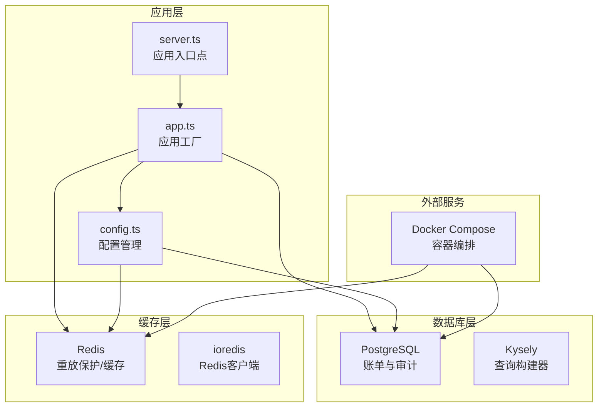
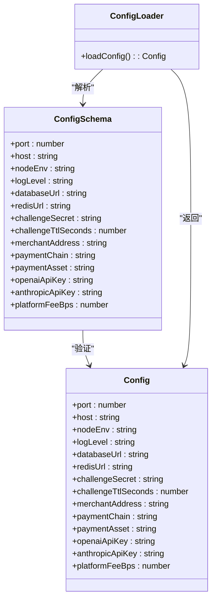
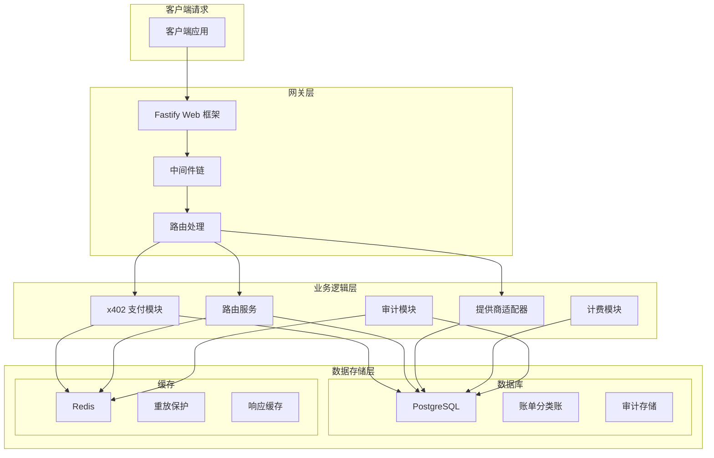
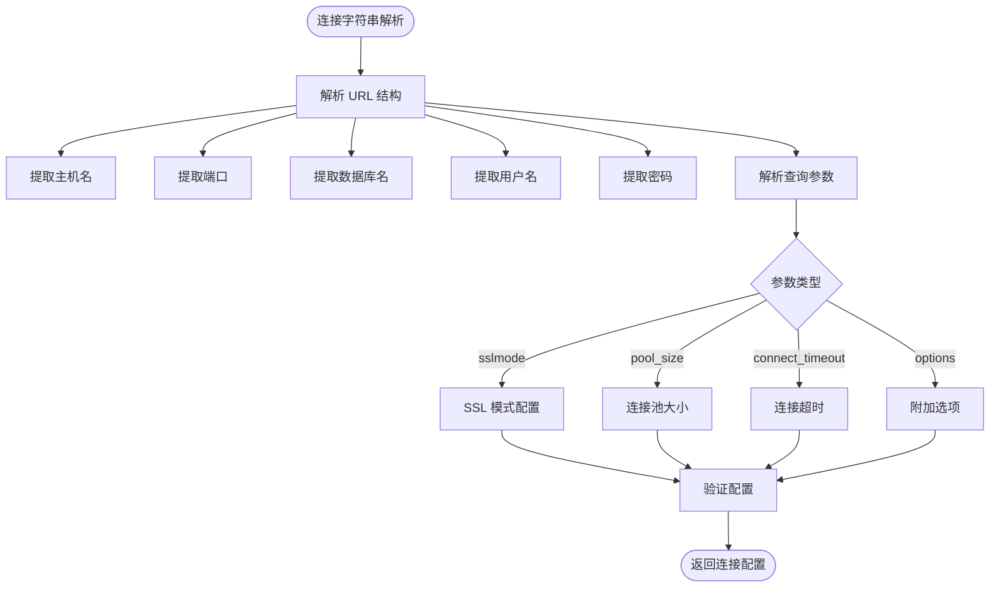
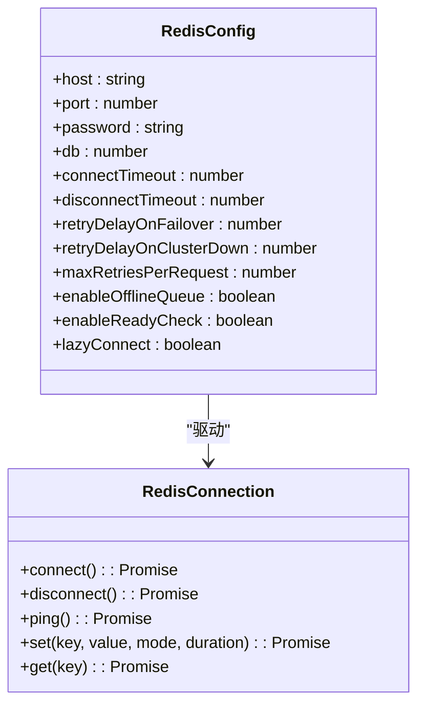
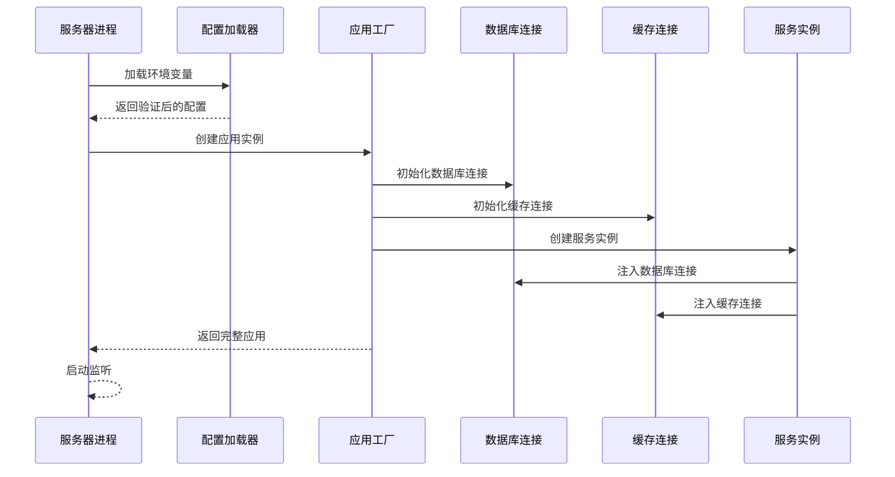

# 数据库与缓存配置

<cite>
**本文档引用的文件**
- [src/config.ts](file://src/config.ts)
- [src/app.ts](file://src/app.ts)
- [src/server.ts](file://src/server.ts)
- [docker-compose.yml](file://docker-compose.yml)
- [package.json](file://package.json)
- [src/x402/replay.service.ts](file://src/x402/replay.service.ts)
- [README.md](file://README.md)
</cite>

## 目录
1. [简介](#简介)
2. [项目结构概览](#项目结构概览)
3. [核心组件](#核心组件)
4. [架构总览](#架构总览)
5. [详细组件分析](#详细组件分析)
6. [依赖关系分析](#依赖关系分析)
7. [性能考虑](#性能考虑)
8. [故障排除指南](#故障排除指南)
9. [结论](#结论)

## 简介

本指南详细说明了项目中的数据库和缓存系统配置，包括 PostgreSQL 数据库连接配置、Redis 缓存配置和连接池设置。项目使用 Kysely 作为数据库查询构建器，使用 ioredis 作为 Redis 客户端，并通过 Docker Compose 提供本地开发环境。

根据项目架构图，系统包含以下关键组件：
- **PostgreSQL**: 用于账单分类账和审计日志存储
- **Redis**: 用于重放保护、缓存和幂等性控制
- **Fastify 应用**: 作为主要的服务入口点

## 项目结构概览

项目采用模块化的 TypeScript 架构，数据库和缓存配置主要分布在以下文件中：



**图表来源**
- [src/server.ts:1-33](file://src/server.ts#L1-L33)
- [src/app.ts:35-100](file://src/app.ts#L35-L100)
- [src/config.ts:10-11](file://src/config.ts#L10-L11)

**章节来源**
- [src/server.ts:1-33](file://src/server.ts#L1-L33)
- [src/app.ts:35-100](file://src/app.ts#L35-L100)
- [src/config.ts:10-11](file://src/config.ts#L10-L11)

## 核心组件

### 配置管理系统

项目使用 Zod 进行配置验证，确保所有环境变量的类型安全和完整性。



**图表来源**
- [src/config.ts:4-26](file://src/config.ts#L4-L26)
- [src/config.ts:28-45](file://src/config.ts#L28-L45)

### 数据库连接配置

项目支持两种主要的数据库连接方式：

1. **PostgreSQL 连接字符串格式**
2. **Kysely 查询构建器集成**

**章节来源**
- [src/config.ts:10](file://src/config.ts#L10)
- [src/app.ts:73-76](file://src/app.ts#L73-L76)

## 架构总览



**图表来源**
- [src/app.ts:22-33](file://src/app.ts#L22-L33)
- [src/x402/replay.service.ts:1-51](file://src/x402/replay.service.ts#L1-L51)

## 详细组件分析

### PostgreSQL 数据库配置

#### 连接字符串格式

PostgreSQL 连接字符串遵循标准格式，支持多种参数配置：



**图表来源**
- [src/config.ts:10](file://src/config.ts#L10)

#### 连接池设置

项目使用 pg-pool 作为 PostgreSQL 连接池管理器，支持以下关键参数：

| 参数名称 | 默认值 | 描述 | 性能影响 |
|---------|--------|------|----------|
| `max` | 10 | 最大连接数 | 直接影响并发处理能力 |
| `min` | 0 | 最小连接数 | 影响内存占用 |
| `idleTimeoutMillis` | 30000 | 空闲超时时间 | 影响资源回收效率 |
| `maxLifetimeMillis` | 3600000 | 连接最大生命周期 | 影响连接稳定性 |

#### 数据库 URL 参数详解

常见的 PostgreSQL 连接参数包括：

- **sslmode**: 控制 SSL 连接模式（disable、allow、prefer、require、verify-ca、verify-full）
- **connect_timeout**: 连接超时时间（秒）
- **pool_size**: 连接池大小
- **statement_timeout**: SQL 语句超时时间
- **application_name**: 应用程序名称

**章节来源**
- [src/config.ts:10](file://src/config.ts#L10)
- [docker-compose.yml:6-9](file://docker-compose.yml#L6-L9)

### Redis 缓存配置

#### 连接配置

Redis 连接配置支持以下参数：



**图表来源**
- [src/config.ts:11](file://src/config.ts#L11)
- [src/x402/replay.service.ts:1-51](file://src/x402/replay.service.ts#L1-L51)

#### 缓存策略

项目实现了三种主要的缓存策略：

1. **重放保护缓存**
   - 使用 Redis SET NX EX 原子操作
   - 键格式：`payment_proof:<hash>`
   - TTL 设置：基于挑战过期时间

2. **幂等性缓存**
   - 键格式：`idempotency:<key>`
   - 存储 JSON 格式的响应内容
   - TTL 设置：可配置的过期时间

3. **响应缓存**
   - 用于缓存计算结果
   - 支持 TTL 过期机制

#### Redis 内存配置

Docker Compose 中的 Redis 配置：

```yaml
redis:
  image: redis:7-alpine
  ports:
    - '6379:6379'
  command: redis-server --maxmemory 64mb --maxmemory-policy allkeys-lru
  healthcheck:
    test: ['CMD', 'redis-cli', 'ping']
    interval: 5s
    timeout: 3s
    retries: 5
```

**章节来源**
- [src/config.ts:11](file://src/config.ts#L11)
- [docker-compose.yml:18-27](file://docker-compose.yml#L18-L27)
- [src/x402/replay.service.ts:23-50](file://src/x402/replay.service.ts#L23-L50)

### 应用初始化流程



**图表来源**
- [src/server.ts:4-26](file://src/server.ts#L4-L26)
- [src/app.ts:73-94](file://src/app.ts#L73-L94)

**章节来源**
- [src/server.ts:4-26](file://src/server.ts#L4-L26)
- [src/app.ts:73-94](file://src/app.ts#L73-L94)

## 依赖关系分析

### 外部依赖

项目使用以下关键依赖来实现数据库和缓存功能：

```mermaid
graph TB
subgraph "数据库相关"
PG[pg@8.20.0<br/>PostgreSQL 驱动]
Kysely[kysely@0.27.6<br/>查询构建器]
PgPool[pg-pool@3.13.0<br/>连接池]
end
subgraph "缓存相关"
IoRedis[ioredis@5.10.1<br/>Redis 客户端]
RedisParser[redis-parser@3.0.0<br/>协议解析]
end
subgraph "应用框架"
Fastify[fastify@5.8.4<br/>Web 框架]
Dotenv[dotenv@16.6.1<br/>环境变量]
Zod[zod@3.25.76<br/>类型验证]
end
PG --> PgPool
IoRedis --> RedisParser
Fastify --> PG
Fastify --> IoRedis
Config --> PG
Config --> IoRedis
```

**图表来源**
- [package.json:21-36](file://package.json#L21-L36)

### 组件耦合度分析

项目在设计上采用了松耦合架构：

- **配置层**与**实现层**分离
- **服务层**不直接依赖具体的数据存储实现
- **依赖注入**模式用于连接管理

**章节来源**
- [package.json:21-36](file://package.json#L21-L36)
- [src/app.ts:73-94](file://src/app.ts#L73-L94)

## 性能考虑

### 数据库性能优化

1. **连接池优化**
   - 根据并发需求调整 `max` 和 `min` 参数
   - 合理设置 `idleTimeoutMillis` 避免连接泄漏
   - 使用 `maxLifetimeMillis` 控制连接生命周期

2. **查询优化**
   - 使用 Kysely 的类型安全查询避免运行时错误
   - 实施适当的索引策略
   - 避免 N+1 查询问题

3. **事务管理**
   - 合理使用事务边界
   - 减少长事务持有时间

### Redis 性能优化

1. **内存管理**
   - 使用 LRU 策略自动清理过期数据
   - 监控内存使用情况
   - 合理设置 `maxmemory` 限制

2. **网络优化**
   - 使用 Unix Socket 减少网络开销
   - 启用 TCP_NODELAY
   - 考虑连接复用

3. **键空间设计**
   - 使用命名空间避免键冲突
   - 合理设计键的 TTL
   - 避免过长的键名

## 故障排除指南

### 数据库连接问题

**常见问题及解决方案**：

1. **连接超时**
   - 检查网络连通性
   - 验证防火墙设置
   - 调整 `connect_timeout` 参数

2. **认证失败**
   - 验证用户名和密码
   - 检查用户权限
   - 确认 SSL 配置

3. **连接池耗尽**
   - 增加 `max` 连接数
   - 检查连接泄漏
   - 优化查询执行时间

### Redis 连接问题

**常见问题及解决方案**：

1. **连接拒绝**
   - 检查 Redis 服务状态
   - 验证端口配置
   - 检查防火墙规则

2. **内存不足**
   - 增加 `maxmemory` 设置
   - 调整 `maxmemory-policy`
   - 清理过期数据

3. **命令超时**
   - 检查网络延迟
   - 优化键空间设计
   - 考虑分片策略

### 连接测试方法

#### 数据库连接测试

```bash
# 测试 PostgreSQL 连接
psql "$DATABASE_URL"

# 检查连接池状态
echo "SELECT count(*) FROM pg_stat_activity;" | psql "$DATABASE_URL"
```

#### Redis 连接测试

```bash
# 测试 Redis 连接
redis-cli -u "$REDIS_URL" ping

# 检查内存使用
redis-cli -u "$REDIS_URL" info memory
```

#### 应用级连接测试

```typescript
// 在应用启动时添加连接测试
async function testConnections() {
  try {
    // 测试数据库连接
    await db.execute('SELECT 1')
    console.log('数据库连接成功')
    
    // 测试 Redis 连接
    await redis.ping()
    console.log('Redis 连接成功')
  } catch (error) {
    console.error('连接测试失败:', error)
    process.exit(1)
  }
}
```

**章节来源**
- [docker-compose.yml:12-16](file://docker-compose.yml#L12-L16)
- [docker-compose.yml:23-27](file://docker-compose.yml#L23-L27)

## 结论

本项目提供了完整的数据库和缓存系统配置方案，具有以下特点：

1. **类型安全**: 使用 Zod 进行配置验证，确保运行时的类型安全
2. **模块化设计**: 松耦合架构便于维护和扩展
3. **生产就绪**: 包含 Docker Compose 配置，支持本地开发和部署
4. **性能优化**: 合理的连接池配置和缓存策略

建议在生产环境中进一步完善的方面：
- 添加详细的监控和告警机制
- 实施备份和恢复策略
- 配置连接池的动态调整
- 建立性能基准测试体系

通过遵循本指南的配置建议，可以确保系统的稳定性和高性能运行。