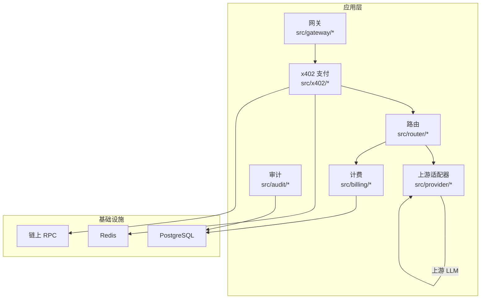
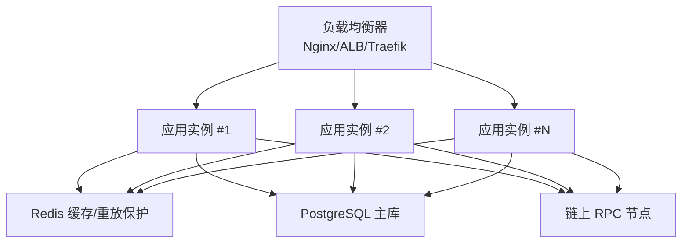
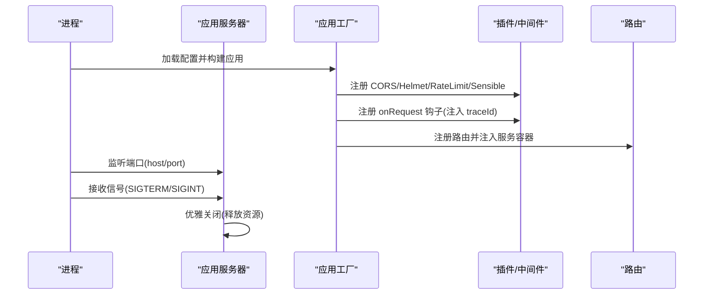
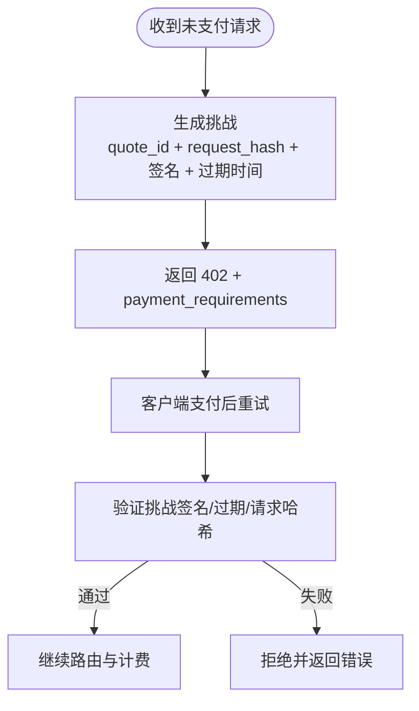
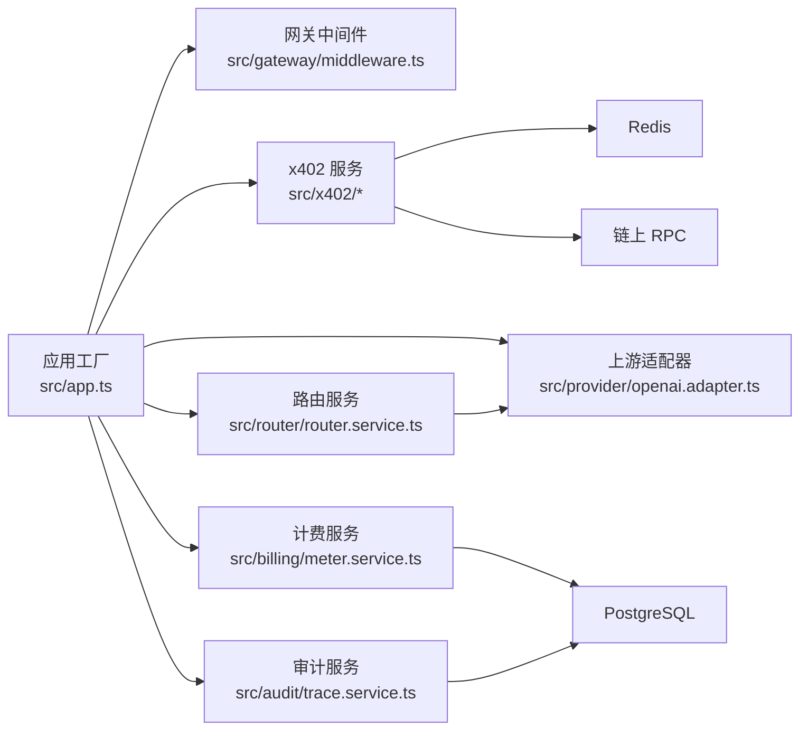

# 生产环境优化

<cite>
**本文引用的文件**
- [package.json](file://package.json)
- [docker-compose.yml](file://docker-compose.yml)
- [README.md](file://README.md)
- [src/app.ts](file://src/app.ts)
- [src/config.ts](file://src/config.ts)
- [src/server.ts](file://src/server.ts)
- [src/gateway/middleware.ts](file://src/gateway/middleware.ts)
- [src/provider/registry.ts](file://src/provider/registry.ts)
- [src/router/router.service.ts](file://src/router/router.service.ts)
- [src/billing/meter.service.ts](file://src/billing/meter.service.ts)
- [src/x402/challenge.service.ts](file://src/x402/challenge.service.ts)
- [src/audit/trace.service.ts](file://src/audit/trace.service.ts)
- [src/provider/openai.adapter.ts](file://src/provider/openai.adapter.ts)
- [src/types.ts](file://src/types.ts)
- [docs/ENGINEERING_PLAYBOOK.md](file://docs/ENGINEERING_PLAYBOOK.md)
</cite>

## 目录
1. [简介](#简介)
2. [项目结构](#项目结构)
3. [核心组件](#核心组件)
4. [架构总览](#架构总览)
5. [详细组件分析](#详细组件分析)
6. [依赖关系分析](#依赖关系分析)
7. [性能考虑](#性能考虑)
8. [故障排查指南](#故障排查指南)
9. [结论](#结论)
10. [附录](#附录)

## 简介
本指南面向生产环境部署与优化，围绕并发处理、内存管理、连接池配置、日志级别、监控指标、性能基准测试、负载均衡与高可用、故障转移、资源需求与容量规划、安全加固与访问控制、数据保护以及运维检查清单与最佳实践进行系统化说明。本文所有建议均基于仓库现有实现与配置文件进行提炼，并给出可落地的优化方向。

## 项目结构
该服务采用模块化设计，核心由网关层、支付验证层（x402）、路由层、上游适配器、计费与账簿、审计追踪等模块组成。应用通过 Fastify 提供 HTTP 接口，使用 PostgreSQL 存储账簿与审计记录，Redis 用于重放保护与缓存。

图示来源
- [README.md:26-35](file://README.md#L26-L35)
- [src/app.ts:35-100](file://src/app.ts#L35-L100)
- [src/config.ts:10-11](file://src/config.ts#L10-L11)
- [docker-compose.yml:2-27](file://docker-compose.yml#L2-L27)

章节来源
- [README.md:26-35](file://README.md#L26-L35)
- [src/app.ts:35-100](file://src/app.ts#L35-L100)
- [src/config.ts:10-11](file://src/config.ts#L10-L11)
- [docker-compose.yml:2-27](file://docker-compose.yml#L2-L27)

## 核心组件
- 应用工厂与插件注册：Fastify 实例按需注册 CORS、Helmet、限流、错误处理与请求钩子；日志级别来自配置。
- 配置加载：使用 Zod 对环境变量进行强类型校验，支持端口、主机、日志级别、数据库与 Redis 连接串、挑战密钥与过期时间、商户地址与支付链资产等。
- 服务容器：将各领域服务注入到路由处理器，便于统一管理与替换。
- 中间件：在 onRequest 钩子中生成唯一请求 ID，贯穿审计与日志追踪。
- 模型注册表：内存模型目录，后续可替换为持久化目录。
- 路由服务：占位实现，预留策略引擎、回退链与路由证明。
- 计费计量：占位实现，预留从上游响应提取用量并持久化。
- x402 挑战与验证：占位实现，预留挑战生成、签名验证、请求哈希绑定与过期检查。
- 审计追踪：占位实现，预留初始记录、完成与失败状态更新、查询接口。
- 上游适配器：OpenAI 兼容适配器，预留健康检查与错误映射。

章节来源
- [src/app.ts:35-100](file://src/app.ts#L35-L100)
- [src/config.ts:28-45](file://src/config.ts#L28-L45)
- [src/gateway/middleware.ts:9-12](file://src/gateway/middleware.ts#L9-L12)
- [src/provider/registry.ts:27-64](file://src/provider/registry.ts#L27-L64)
- [src/router/router.service.ts:20-49](file://src/router/router.service.ts#L20-L49)
- [src/billing/meter.service.ts:13-28](file://src/billing/meter.service.ts#L13-L28)
- [src/x402/challenge.service.ts:34-70](file://src/x402/challenge.service.ts#L34-L70)
- [src/audit/trace.service.ts:38-67](file://src/audit/trace.service.ts#L38-L67)
- [src/provider/openai.adapter.ts:10-43](file://src/provider/openai.adapter.ts#L10-L43)

## 架构总览
生产环境推荐的部署拓扑如下：

图示来源
- [README.md:28-35](file://README.md#L28-L35)
- [docker-compose.yml:2-27](file://docker-compose.yml#L2-L27)
- [src/config.ts:10-11](file://src/config.ts#L10-L11)

## 详细组件分析

### 应用工厂与启动流程
- 插件与中间件：CORS、Helmet、限流、sensible 错误处理；onRequest 注入 traceId。
- 错误处理：区分业务错误与 Zod 校验错误，统一输出结构化错误体；未知错误写入日志并返回通用 500。
- 服务装配：将 ProviderRegistry、ChallengeService、VerifyService、ReplayProtection、Router、Meter、Cost、Ledger、Trace、Receipt 等服务注入路由。
- 启动与优雅停机：监听配置端口与主机；捕获 SIGTERM/SIGINT，关闭应用并退出进程。

图示来源
- [src/app.ts:35-100](file://src/app.ts#L35-L100)
- [src/server.ts:4-26](file://src/server.ts#L4-L26)

章节来源
- [src/app.ts:35-100](file://src/app.ts#L35-L100)
- [src/server.ts:4-26](file://src/server.ts#L4-L26)

### 配置与环境变量
- 关键生产配置项：端口、主机、日志级别、数据库与 Redis 连接串、挑战密钥与 TTL、商户地址、支付链与资产、平台费率等。
- 类型安全：使用 Zod 解析与校验，确保运行时一致性。
- 建议：将敏感信息置于只读环境变量或密钥管理服务；避免硬编码。

章节来源
- [src/config.ts:4-24](file://src/config.ts#L4-L24)
- [src/config.ts:28-45](file://src/config.ts#L28-L45)

### 日志与可观测性
- 日志级别：通过配置控制，生产建议使用 info 或更高，避免 debug/trace 的高开销。
- 请求追踪：onRequest 钩子生成唯一请求 ID，便于跨服务关联日志。
- 建议：结合结构化日志与分布式追踪（如 Jaeger/Zipkin），在错误处理中输出标准化字段（请求 ID、错误码、路径、方法）。

章节来源
- [src/app.ts:36-41](file://src/app.ts#L36-L41)
- [src/gateway/middleware.ts:9-12](file://src/gateway/middleware.ts#L9-L12)

### 并发与内存管理
- 并发：Fastify 默认多进程模式可通过外部进程管理器（如 PM2、Docker Swarm、Kubernetes）横向扩展；单进程内核事件循环适合 I/O 密集型场景。
- 内存：避免在请求上下文存储大对象；使用流式处理与分页；及时释放临时缓存。
- 建议：启用 Node.js 堆快照与 GC 监控，识别内存泄漏；限制单请求体大小与并发连接数。

章节来源
- [src/app.ts:44-47](file://src/app.ts#L44-L47)
- [src/server.ts:4-26](file://src/server.ts#L4-L26)

### 连接池与数据库/缓存
- 数据库：使用 Kysely + pg，建议在生产中配置连接池参数（最大连接数、空闲超时、获取超时、最大生命周期）。
- Redis：当前容器设置了较小内存上限与淘汰策略，生产应根据 QPS 与缓存命中率调整 maxmemory 与策略，并开启持久化或主从复制。
- 建议：为不同用途分离连接池（读写分离、审计/账簿专用池）；监控慢查询与阻塞命令。

章节来源
- [src/app.ts:73-76](file://src/app.ts#L73-L76)
- [src/config.ts:10-11](file://src/config.ts#L10-L11)
- [docker-compose.yml:18-27](file://docker-compose.yml#L18-L27)

### x402 支付与重放保护
- 挑战生成：计算 quote_id、请求哈希、签名与过期时间；返回 payment_requirements。
- 验证流程：校验签名、过期时间、请求哈希一致性；失败抛出明确错误。
- 重放保护：利用 Redis 存储已消费的 challenge_token，设置 TTL 与幂等键。

图示来源
- [src/x402/challenge.service.ts:34-70](file://src/x402/challenge.service.ts#L34-L70)
- [src/audit/trace.service.ts:38-67](file://src/audit/trace.service.ts#L38-L67)

章节来源
- [src/x402/challenge.service.ts:34-70](file://src/x402/challenge.service.ts#L34-L70)
- [src/audit/trace.service.ts:38-67](file://src/audit/trace.service.ts#L38-L67)

### 路由与回退链
- 手动模式：直接从注册表获取适配器执行。
- 自动模式：评分候选模型、构建回退链、执行并生成路由证明。
- 建议：为每个上游配置健康检查与超时；记录路由决策摘要与回退链，便于审计与排障。

章节来源
- [src/router/router.service.ts:20-49](file://src/router/router.service.ts#L20-L49)
- [src/provider/registry.ts:27-64](file://src/provider/registry.ts#L27-L64)

### 计费与账簿
- 用量记录：从上游响应提取 token 数量，构建用量记录并持久化。
- 成本计算：按单价与费率计算小计、平台费用与总计。
- 建议：使用事务保证账簿一致性；对重复请求进行幂等处理；定期归档历史数据。

章节来源
- [src/billing/meter.service.ts:13-28](file://src/billing/meter.service.ts#L13-L28)
- [src/types.ts:42-62](file://src/types.ts#L42-L62)

### 审计与收据
- 初始追踪：记录 pending 状态与路由模式。
- 完成追踪：填充模型、回退链、用量、成本、支付信息与耗时。
- 查询接口：按 request_id 返回完整收据，支持审计与争议解决。

章节来源
- [src/audit/trace.service.ts:38-67](file://src/audit/trace.service.ts#L38-L67)
- [src/types.ts:110-118](file://src/types.ts#L110-L118)

### 上游适配器
- OpenAI 兼容：统一请求与响应形态，映射网络/超时错误为上游错误类型。
- 健康检查：轻量探测上游可用性。
- 建议：为每个适配器配置独立超时与重试策略；隔离故障域。

章节来源
- [src/provider/openai.adapter.ts:10-43](file://src/provider/openai.adapter.ts#L10-L43)

## 依赖关系分析
- 外部依赖：Fastify、CORS、Helmet、限流、sensible、ioredis、pg、kysely、zod、jose、pino、dotenv、viem。
- 内部耦合：应用工厂集中装配服务；路由依赖服务容器；x402 依赖 Redis 与链上 RPC；审计与账簿依赖数据库。

图示来源
- [package.json:21-36](file://package.json#L21-L36)
- [src/app.ts:77-94](file://src/app.ts#L77-L94)

章节来源
- [package.json:21-36](file://package.json#L21-L36)
- [src/app.ts:77-94](file://src/app.ts#L77-L94)

## 性能考虑
- 并发与线程模型
  - 使用进程外负载均衡与多实例部署；单实例内利用 Fastify 的异步 I/O。
  - 控制并发连接上限与请求体大小，避免 OOM。
- 内存管理
  - 避免在请求上下文累积大对象；使用流式解析与分页；定期 GC 与堆快照分析。
- 连接池
  - PostgreSQL：合理设置最大连接数、空闲超时、获取超时；读写分离与只读副本。
  - Redis：根据 QPS 与缓存命中率调整 maxmemory 与淘汰策略；开启持久化与主从复制。
- 缓存与去重
  - 利用 Redis 缓存热点模型元数据与近期挑战；为重放保护设置短 TTL。
- 限流与熔断
  - 在网关层启用速率限制；为上游适配器配置超时与重试；必要时引入熔断器。
- 日志与追踪
  - 生产使用 info 级别；结构化日志；分布式追踪；关键路径埋点。
- 基准测试
  - 参考工程文档中的基准目标：RPS 与 P95 指标要求，持续回归测试。

章节来源
- [src/app.ts:44-47](file://src/app.ts#L44-L47)
- [src/config.ts:8](file://src/config.ts#L8)
- [docker-compose.yml:22](file://docker-compose.yml#L22)
- [docs/ENGINEERING_PLAYBOOK.md:112-117](file://docs/ENGINEERING_PLAYBOOK.md#L112-L117)

## 故障排查指南
- 启动失败
  - 检查端口占用与权限；确认 DATABASE_URL/REDIS_URL 可达；查看致命日志。
- 402 挑战相关
  - 校验 CHALLENGE_SECRET 是否一致；检查挑战过期时间与请求哈希是否匹配；确认 Redis 可用。
- 上游适配器
  - 观察健康检查结果；检查 API Key 与上游限流；定位超时与网络异常。
- 计费与账簿
  - 核对用量提取逻辑；检查数据库事务与幂等键；关注重复计费风险。
- 审计与收据
  - 确认追踪记录写入成功；查询接口返回空值时检查索引与分区。

章节来源
- [src/server.ts:11-14](file://src/server.ts#L11-L14)
- [src/x402/challenge.service.ts:49-60](file://src/x402/challenge.service.ts#L49-L60)
- [src/provider/openai.adapter.ts:39-42](file://src/provider/openai.adapter.ts#L39-L42)
- [src/billing/meter.service.ts:15-26](file://src/billing/meter.service.ts#L15-L26)
- [src/audit/trace.service.ts:39-66](file://src/audit/trace.service.ts#L39-L66)

## 结论
本指南基于现有代码与配置，给出了生产环境的性能调优、高可用部署、安全加固与运维最佳实践建议。建议优先补齐数据库与 Redis 连接池配置、完善 x402 与路由实现、建立完善的监控与告警体系，并以工程文档的基准为目标持续优化。

## 附录

### 生产环境检查清单
- 基础设施
  - PostgreSQL 与 Redis 集群/主从复制；备份与恢复演练。
  - 链上 RPC 节点高可用与限流策略。
- 应用配置
  - 端口与主机绑定；日志级别；数据库/Redis 连接串；挑战密钥与 TTL；商户地址与支付链资产。
- 安全加固
  - Helmet 安全头；CORS 白名单；速率限制；最小权限原则；密钥轮换。
- 监控与告警
  - 健康检查端点；关键指标（RPS、P95/P99、错误率、数据库/Redis 延迟）；日志聚合与告警。
- 部署与扩缩容
  - 负载均衡器配置；多实例部署；滚动升级；自动伸缩策略。
- 故障转移
  - 上游适配器熔断；回退链；重试与幂等；审计与收据查询。
- 容量规划
  - 基于基准测试设定目标；评估数据库/Redis/QPS/延迟关系；预留扩容空间。

章节来源
- [src/config.ts:4-24](file://src/config.ts#L4-L24)
- [src/app.ts:44-47](file://src/app.ts#L44-L47)
- [docker-compose.yml:2-27](file://docker-compose.yml#L2-L27)
- [docs/ENGINEERING_PLAYBOOK.md:112-117](file://docs/ENGINEERING_PLAYBOOK.md#L112-L117)