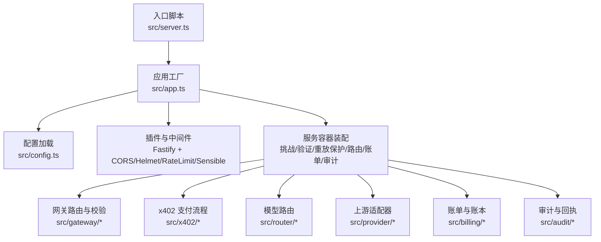
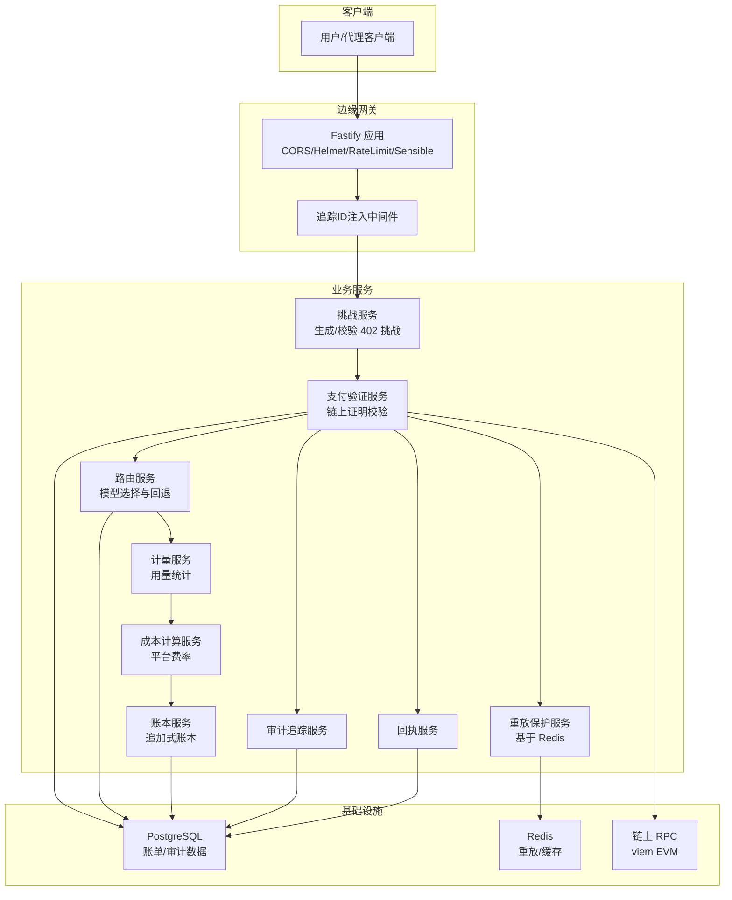
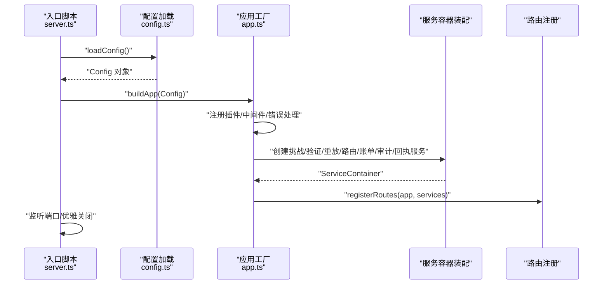

# 配置与部署

<cite>
**本文引用的文件**
- [src/config.ts](file://src/config.ts)
- [src/app.ts](file://src/app.ts)
- [src/server.ts](file://src/server.ts)
- [docker-compose.yml](file://docker-compose.yml)
- [package.json](file://package.json)
- [README.md](file://README.md)
- [src/gateway/middleware.ts](file://src/gateway/middleware.ts)
- [src/x402/challenge.service.ts](file://src/x402/challenge.service.ts)
- [src/billing/cost.service.ts](file://src/billing/cost.service.ts)
- [src/errors.ts](file://src/errors.ts)
- [src/types.ts](file://src/types.ts)
- [test/helpers.ts](file://test/helpers.ts)
- [vitest.config.ts](file://vitest.config.ts)
</cite>

## 目录
1. [简介](#简介)
2. [项目结构](#项目结构)
3. [核心组件](#核心组件)
4. [架构总览](#架构总览)
5. [详细组件分析](#详细组件分析)
6. [依赖关系分析](#依赖关系分析)
7. [性能考量](#性能考量)
8. [故障排除指南](#故障排除指南)
9. [结论](#结论)
10. [附录](#附录)

## 简介
本指南面向运维与开发团队，提供从环境变量到容器化部署、生产优化与监控的完整配置与部署方案。内容覆盖：
- 环境变量配置项与默认值、校验规则与安全建议
- 数据库与缓存（PostgreSQL、Redis）设置与健康检查
- 区块链支付验证与链上参数配置
- Docker Compose 本地与开发环境一键启动
- 生产环境优化、资源估算与扩展策略
- 配置验证机制、部署检查清单与常见问题排查

## 项目结构
项目采用模块化分层设计：入口脚本负责加载配置并构建应用；应用工厂注册插件、中间件与全局错误处理，并注入服务容器；各子系统（网关、x402、路由、账单、审计）通过服务容器解耦协作。

图表来源
- [src/server.ts:1-33](file://src/server.ts#L1-L33)
- [src/app.ts:1-101](file://src/app.ts#L1-L101)
- [src/config.ts:1-46](file://src/config.ts#L1-L46)

章节来源
- [README.md:1-124](file://README.md#L1-L124)
- [src/server.ts:1-33](file://src/server.ts#L1-L33)
- [src/app.ts:1-101](file://src/app.ts#L1-L101)

## 核心组件
- 配置加载与校验：使用 zod 对环境变量进行强类型解析与默认值注入，确保启动前即发现配置错误。
- 应用工厂：注册安全与限流插件、注入追踪 ID 的请求钩子、统一错误处理，并装配服务容器。
- 服务容器：包含挑战服务、支付验证、重放保护、路由、计费、账本、审计与回执等服务。
- 中间件：在请求进入时生成唯一追踪 ID，便于日志与审计串联。
- 错误体系：统一的 AppError 子类映射到 API 错误码，支持结构化响应。

章节来源
- [src/config.ts:1-46](file://src/config.ts#L1-L46)
- [src/app.ts:1-101](file://src/app.ts#L1-L101)
- [src/gateway/middleware.ts:1-13](file://src/gateway/middleware.ts#L1-L13)
- [src/errors.ts:1-106](file://src/errors.ts#L1-L106)

## 架构总览
下图展示从客户端到链上验证的整体路径，以及数据持久化与缓存位置。

图表来源
- [src/app.ts:1-101](file://src/app.ts#L1-L101)
- [src/x402/challenge.service.ts:1-71](file://src/x402/challenge.service.ts#L1-L71)
- [src/billing/cost.service.ts:1-32](file://src/billing/cost.service.ts#L1-L32)
- [docker-compose.yml:1-31](file://docker-compose.yml#L1-L31)

## 详细组件分析

### 配置与环境变量
- 配置来源：通过 dotenv 加载 .env 文件，随后由 zod schema 解析为强类型配置对象。
- 关键配置项与默认值：
  - 服务器：端口、主机、节点环境、日志级别
  - 数据存储：数据库 URL、Redis URL
  - x402 支付：挑战密钥（最小长度）、挑战过期秒数、商户地址（以 0x 开头）、支付链、支付资产
  - 上游提供商密钥：可选（OpenAI、Anthropic）
  - 平台费率（基点）
- 默认值与校验：
  - 数值字段使用 coerce 转换并提供默认值
  - 字符串字段限制格式（URL、0x 前缀、枚举）
  - 必填字段在 schema 中强制要求
- 安全建议：
  - 挑战密钥长度至少 32 字符，避免硬编码在源码中
  - 商户地址必须为有效 EVM 地址格式
  - 生产环境使用只读数据库账号与受限 Redis 权限
  - 使用只读/最小权限的链上 RPC 凭据

章节来源
- [src/config.ts:1-46](file://src/config.ts#L1-L46)
- [test/helpers.ts:19-44](file://test/helpers.ts#L19-L44)

### 应用工厂与中间件
- 插件注册：CORS、Helmet、RateLimit（默认 100 次/分钟）、Sensible
- 请求钩子：注入唯一追踪 ID，便于跨服务日志关联
- 全局错误处理：区分业务错误（AppError）、Zod 校验错误与内部异常，返回结构化响应
- 服务装配：将挑战、验证、重放、路由、计费、账本、审计、回执等服务注入容器

章节来源
- [src/app.ts:1-101](file://src/app.ts#L1-L101)
- [src/gateway/middleware.ts:1-13](file://src/gateway/middleware.ts#L1-L13)
- [src/errors.ts:1-106](file://src/errors.ts#L1-L106)

### x402 挑战与支付验证
- 挑战生成：计算请求哈希、签名挑战令牌、设置过期时间
- 挑战校验：验证签名、过期时间、请求哈希一致性
- 请求哈希：对请求体进行规范化 JSON 序列化后计算哈希
- 支付验证：对接链上 RPC，校验交易存在性、金额、收款人与资产
- 重放保护：基于 Redis 的幂等与去重

章节来源
- [src/x402/challenge.service.ts:1-71](file://src/x402/challenge.service.ts#L1-L71)
- [src/types.ts:1-119](file://src/types.ts#L1-L119)

### 计费与账单
- 成本计算：按输入/输出 token 计算小计，叠加平台费率，结果为字符串格式美元值
- 可复现性：相同输入始终产生相同结果，便于审计与争议解决

章节来源
- [src/billing/cost.service.ts:1-32](file://src/billing/cost.service.ts#L1-L32)
- [src/types.ts:1-119](file://src/types.ts#L1-L119)

### 数据库与缓存
- PostgreSQL：用于账单与审计数据持久化，Compose 提供健康检查
- Redis：用于重放保护与缓存，设置内存上限与淘汰策略
- 连接管理：当前应用工厂预留初始化位置，需在生产中补充连接池与关闭逻辑

章节来源
- [docker-compose.yml:1-31](file://docker-compose.yml#L1-L31)
- [src/app.ts:73-75](file://src/app.ts#L73-L75)

### 区块链连接与支付链参数
- 支付链与资产：默认链为 base，资产为 USDC
- 验证服务：通过 viem 与链上 RPC 交互，校验交易有效性
- 地址与链参数：商户地址需为 0x 前缀，链与资产需与上游链路一致

章节来源
- [src/config.ts:16-18](file://src/config.ts#L16-L18)
- [src/x402/challenge.service.ts:28-34](file://src/x402/challenge.service.ts#L28-L34)

## 依赖关系分析
- 启动流程：server.ts -> config.ts -> app.ts -> 注册插件/中间件/错误处理 -> 装配服务容器 -> 注册路由
- 测试配置：测试通过 dotenv 加载示例环境，便于离线验证

图表来源
- [src/server.ts:1-33](file://src/server.ts#L1-L33)
- [src/config.ts:1-46](file://src/config.ts#L1-L46)
- [src/app.ts:1-101](file://src/app.ts#L1-L101)

章节来源
- [src/server.ts:1-33](file://src/server.ts#L1-L33)
- [src/app.ts:1-101](file://src/app.ts#L1-L101)
- [vitest.config.ts:1-15](file://vitest.config.ts#L1-L15)

## 性能考量
- 连接池与资源回收
  - PostgreSQL：使用连接池减少握手开销；在优雅关闭时释放连接
  - Redis：合理设置 maxmemory 与淘汰策略，避免 OOM
- 缓存策略
  - 利用 Redis 缓存热点查询与去重，降低重复支付验证压力
- 限流与熔断
  - RateLimit 已内置，建议结合上游服务超时与熔断策略
- 日志与追踪
  - 使用结构化日志与追踪 ID，便于定位慢请求与异常路径
- 平台费率与成本
  - 成本计算需稳定且可复现，避免因微小差异导致争议

[本节为通用指导，不直接分析具体文件]

## 故障排除指南
- 启动失败
  - 检查端口占用与权限；查看致命日志
  - 章节来源: [src/server.ts:8-14](file://src/server.ts#L8-L14)
- 配置错误
  - Zod 校验失败会返回 400；检查必填项与格式
  - 章节来源: [src/app.ts:59-64](file://src/app.ts#L59-L64), [src/config.ts:28-45](file://src/config.ts#L28-L45)
- 支付相关
  - 402 支付必需：确认挑战令牌生成与过期时间
  - 402 支付验证失败：检查链上交易、金额、收款人与资产
  - 409 重放：检查 Redis 去重状态
  - 章节来源: [src/errors.ts:17-57](file://src/errors.ts#L17-L57), [src/x402/challenge.service.ts:12-26](file://src/x402/challenge.service.ts#L12-L26)
- 数据库/缓存
  - PostgreSQL/Redis 未就绪：查看健康检查与日志
  - 章节来源: [docker-compose.yml:12-27](file://docker-compose.yml#L12-L27)
- 测试环境
  - 测试加载 .env.example；如需自定义，请复制并修改
  - 章节来源: [vitest.config.ts:8](file://vitest.config.ts#L8), [test/helpers.ts:19-44](file://test/helpers.ts#L19-L44)

## 结论
本指南提供了从配置到部署的全栈方案。通过严格的环境变量校验、容器化基础设施与可复现的成本计算，可在保证安全性与可观测性的前提下实现稳定运行。建议在生产环境中完善连接池与优雅关闭、强化密钥与网络访问控制，并建立完善的监控与告警体系。

[本节为总结性内容，不直接分析具体文件]

## 附录

### 环境变量与默认值对照表
- 服务器
  - PORT：数值，默认 3000
  - HOST：字符串，默认 0.0.0.0
  - NODE_ENV：枚举 development/production/test，默认 development
  - LOG_LEVEL：枚举 fatal/error/warn/info/debug/trace，默认 info
- 数据存储
  - DATABASE_URL：URL，必填
  - REDIS_URL：URL，必填
- x402 支付
  - CHALLENGE_SECRET：字符串，最小长度 32，必填
  - CHALLENGE_TTL_SECONDS：数值，默认 300
  - MERCHANT_ADDRESS：以 0x 开头的字符串，必填
  - PAYMENT_CHAIN：字符串，默认 base
  - PAYMENT_ASSET：字符串，默认 USDC
- 上游提供商
  - OPENAI_API_KEY：可选
  - ANTHROPIC_API_KEY：可选
- 平台费率
  - PLATFORM_FEE_BPS：数值，默认 500（5%）

章节来源
- [src/config.ts:4-24](file://src/config.ts#L4-L24)

### Docker Compose 本地部署
- 启动命令：使用脚本一键启动 PostgreSQL 与 Redis，并暴露端口
- 健康检查：PostgreSQL 与 Redis 均配置健康检查，便于编排工具探测
- 卷：PostgreSQL 数据目录持久化

章节来源
- [docker-compose.yml:1-31](file://docker-compose.yml#L1-L31)
- [package.json:18-19](file://package.json#L18-L19)

### 生产环境优化与监控
- 连接池与资源回收：为 PostgreSQL 与 Redis 配置连接池与超时
- 限流与熔断：结合上游服务能力设置速率限制与超时
- 日志与追踪：统一结构化日志与追踪 ID，接入集中式日志系统
- 健康检查：对外暴露健康端点，结合容器编排进行探活
- 监控指标：关注请求延迟、错误率、数据库与缓存命中率、链上 RPC 响应时间

[本节为通用指导，不直接分析具体文件]

### 部署检查清单
- 环境变量齐全且通过校验
- 数据库与 Redis 可达且健康
- 挑战密钥安全存储，长度满足要求
- 商户地址与支付链/资产正确
- 上游提供商密钥按需配置
- 平台费率与成本计算逻辑已实现并可审计
- 优雅关闭与信号处理正常
- 日志级别与输出符合生产要求
- 健康检查与监控告警已配置

[本节为通用指导，不直接分析具体文件]