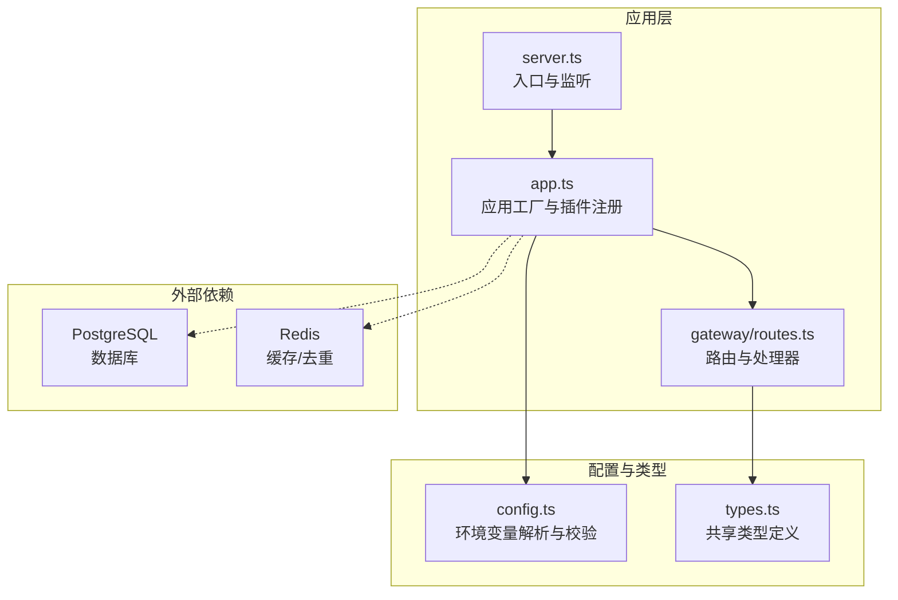
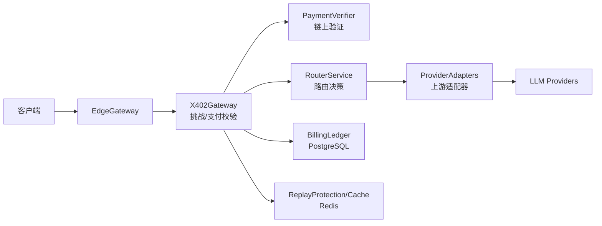
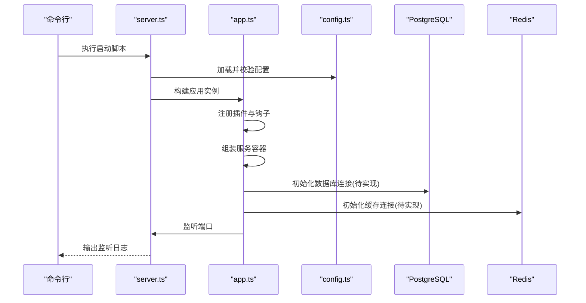
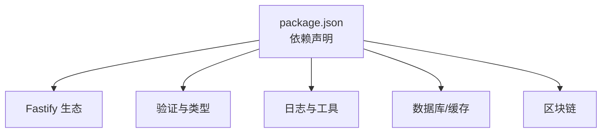

# 快速开始

<cite>
**本文引用的文件**
- [README.md](file://README.md)
- [package.json](file://package.json)
- [docker-compose.yml](file://docker-compose.yml)
- [src/config.ts](file://src/config.ts)
- [src/app.ts](file://src/app.ts)
- [src/server.ts](file://src/server.ts)
- [src/gateway/routes.ts](file://src/gateway/routes.ts)
- [src/x402/challenge.service.ts](file://src/x402/challenge.service.ts)
- [src/types.ts](file://src/types.ts)
- [docs/api-spec-v0-x402-gateway.md](file://docs/api-spec-v0-x402-gateway.md)
- [test/helpers.ts](file://test/helpers.ts)
</cite>

## 目录
1. [简介](#简介)
2. [项目结构](#项目结构)
3. [核心组件](#核心组件)
4. [架构总览](#架构总览)
5. [详细组件分析](#详细组件分析)
6. [依赖关系分析](#依赖关系分析)
7. [性能注意事项](#性能注意事项)
8. [故障排除指南](#故障排除指南)
9. [结论](#结论)
10. [附录](#附录)

## 简介
本指南面向首次部署 x402 Gateway 的用户，提供从环境准备到服务启动、数据库与缓存启动、环境变量配置、以及基础 API 验证的完整流程。项目基于 Node.js 20+、Fastify、PostgreSQL 与 Redis，并通过 Docker Compose 提供本地数据库与缓存服务。

## 项目结构
- 入口与运行时
  - 服务器入口：src/server.ts
  - 应用工厂：src/app.ts
  - 配置加载：src/config.ts
- 网关与路由
  - 路由注册：src/gateway/routes.ts
- 支付与挑战
  - 挑战服务接口：src/x402/challenge.service.ts
- 类型定义
  - 共享类型：src/types.ts
- 文档与规范
  - API 规范：docs/api-spec-v0-x402-gateway.md
- 开发工具与脚本
  - 包管理与脚本：package.json
  - 数据库编排：docker-compose.yml

图表来源
- [src/server.ts:1-33](file://src/server.ts#L1-L33)
- [src/app.ts:1-101](file://src/app.ts#L1-L101)
- [src/gateway/routes.ts:1-96](file://src/gateway/routes.ts#L1-L96)
- [src/config.ts:1-46](file://src/config.ts#L1-L46)
- [src/types.ts:1-119](file://src/types.ts#L1-L119)
- [docker-compose.yml:1-31](file://docker-compose.yml#L1-L31)

章节来源
- [README.md:79-106](file://README.md#L79-L106)
- [src/server.ts:1-33](file://src/server.ts#L1-L33)
- [src/app.ts:1-101](file://src/app.ts#L1-L101)
- [src/gateway/routes.ts:1-96](file://src/gateway/routes.ts#L1-L96)
- [src/config.ts:1-46](file://src/config.ts#L1-L46)
- [src/types.ts:1-119](file://src/types.ts#L1-L119)
- [docker-compose.yml:1-31](file://docker-compose.yml#L1-L31)

## 核心组件
- 服务器入口与监听：负责读取配置并启动 Fastify 服务，支持优雅关闭信号。
- 应用工厂：注册 CORS、安全头、速率限制、错误处理钩子；装配服务容器并注册路由。
- 配置加载：使用 zod 解析环境变量，包含端口、日志级别、数据库与缓存连接、挑战密钥与商户地址、上游提供商密钥、平台费率等。
- 路由与处理器：注册 /v1/chat/completions、/v1/models、/v1/audit/requests/:request_id 等端点，当前开发中部分逻辑为占位实现。
- 挑战服务接口：定义挑战生成、挑战校验与请求哈希计算的接口，当前实现为占位。
- 类型定义：统一的聊天补全、模型列表、审计记录等数据结构。

章节来源
- [src/server.ts:1-33](file://src/server.ts#L1-L33)
- [src/app.ts:1-101](file://src/app.ts#L1-L101)
- [src/config.ts:1-46](file://src/config.ts#L1-L46)
- [src/gateway/routes.ts:1-96](file://src/gateway/routes.ts#L1-L96)
- [src/x402/challenge.service.ts:1-71](file://src/x402/challenge.service.ts#L1-L71)
- [src/types.ts:1-119](file://src/types.ts#L1-L119)

## 架构总览
下图展示从客户端到上游提供商的调用链路，以及 x402 支付流程在服务内部的处理位置。

图表来源
- [README.md:26-35](file://README.md#L26-L35)
- [src/gateway/routes.ts:10-22](file://src/gateway/routes.ts#L10-L22)

章节来源
- [README.md:26-35](file://README.md#L26-L35)
- [src/gateway/routes.ts:10-22](file://src/gateway/routes.ts#L10-L22)

## 详细组件分析

### 安装与环境准备
- 前置条件
  - Node.js 20+
  - pnpm
  - Docker
- 安装依赖
  - 在项目根目录执行依赖安装命令
- 启动数据库与缓存
  - 使用 Docker Compose 启动 PostgreSQL 与 Redis
- 复制并编辑环境变量
  - 复制示例环境文件并按需填写关键配置项
- 启动开发服务器
  - 启动后服务默认监听 http://localhost:3000

章节来源
- [README.md:5-24](file://README.md#L5-L24)
- [package.json:7-19](file://package.json#L7-L19)
- [docker-compose.yml:1-31](file://docker-compose.yml#L1-L31)

### 环境变量与 .env 配置
- 关键配置项
  - PORT：服务监听端口，默认 3000
  - HOST：服务监听地址，默认 0.0.0.0
  - NODE_ENV：运行环境，development/production/test
  - LOG_LEVEL：日志级别
  - DATABASE_URL：PostgreSQL 连接字符串
  - REDIS_URL：Redis 连接字符串
  - CHALLENGE_SECRET：挑战签名密钥，长度至少 32
  - CHALLENGE_TTL_SECONDS：挑战有效期（秒），默认 300
  - MERCHANT_ADDRESS：收款人钱包地址，需以 0x 开头
  - PAYMENT_CHAIN：支付链，默认 base
  - PAYMENT_ASSET：支付资产，默认 USDC
  - OPENAI_API_KEY：可选，上游提供商密钥
  - ANTHROPIC_API_KEY：可选，上游提供商密钥
  - PLATFORM_FEE_BPS：平台费率（基点），默认 500
- 配置加载与校验
  - 使用 zod 对上述字段进行解析与校验，缺失或格式不正确会导致启动失败

章节来源
- [src/config.ts:4-24](file://src/config.ts#L4-L24)
- [src/config.ts:28-45](file://src/config.ts#L28-L45)
- [test/helpers.ts:24-30](file://test/helpers.ts#L24-L30)

### 服务器启动流程
- 读取配置
  - 从环境变量加载并校验配置
- 构建应用
  - 注册 CORS、安全头、速率限制、错误处理等插件
  - 注入全局请求追踪 ID 钩子
  - 组装服务容器（挑战、支付验证、重放保护、路由、计费、账簿、审计等）
  - 注册路由
- 监听端口
  - 默认监听 0.0.0.0:3000
- 优雅关闭
  - 接收 SIGTERM/SIGINT 信号后关闭应用

图表来源
- [src/server.ts:4-14](file://src/server.ts#L4-L14)
- [src/app.ts:35-99](file://src/app.ts#L35-L99)
- [src/config.ts:28-45](file://src/config.ts#L28-L45)

章节来源
- [src/server.ts:1-33](file://src/server.ts#L1-L33)
- [src/app.ts:1-101](file://src/app.ts#L1-L101)
- [src/config.ts:1-46](file://src/config.ts#L1-L46)

### 路由与 API 行为
- /v1/chat/completions
  - 无支付头时返回 402 并携带支付要求（含报价单号、金额、到期时间、收款地址、请求哈希、挑战令牌等）
  - 已有支付头时，当前为占位实现，尚未完成挑战校验、支付验证、路由与计费等完整流程
- /v1/models
  - 返回可用模型列表与定价元数据
- /v1/audit/requests/:request_id
  - 当前为占位实现，尚未接入审计查询

章节来源
- [src/gateway/routes.ts:23-67](file://src/gateway/routes.ts#L23-L67)
- [src/gateway/routes.ts:73-76](file://src/gateway/routes.ts#L73-L76)
- [src/gateway/routes.ts:82-94](file://src/gateway/routes.ts#L82-L94)
- [docs/api-spec-v0-x402-gateway.md:17-103](file://docs/api-spec-v0-x402-gateway.md#L17-L103)

### 挑战服务接口
- 生成挑战：根据请求体生成报价单号、请求哈希、签名挑战令牌，并设置到期时间
- 校验挑战：验证签名、过期时间与请求哈希一致性
- 请求哈希：对请求体进行规范化序列化后计算哈希，用于绑定挑战与请求

章节来源
- [src/x402/challenge.service.ts:4-26](file://src/x402/challenge.service.ts#L4-L26)
- [src/x402/challenge.service.ts:34-70](file://src/x402/challenge.service.ts#L34-L70)

### 数据模型与类型
- ChatCompletionRequest/Response：OpenAI 兼容的消息与响应结构
- UsageReceipt：使用凭据，包含请求 ID、报价单号、付款人地址、模型、单价与总成本、路由证明哈希
- ModelInfo/ModelListResponse：模型目录与定价
- AuditRecord/AuditPayment/AuditCost/AuditRouteDecision：审计记录结构

章节来源
- [src/types.ts:22-62](file://src/types.ts#L22-L62)
- [src/types.ts:74-84](file://src/types.ts#L74-L84)
- [src/types.ts:110-119](file://src/types.ts#L110-L119)

## 依赖关系分析
- 运行时与框架
  - Fastify 及其生态插件（CORS、Helmet、Rate Limit、Sensible）
  - 类型系统与校验（zod）
  - 日志（pino）、加密与 JWT（jose）、ID 生成（nanoid）
  - 区块链交互（viem）
- 数据存储
  - PostgreSQL（pg、kysely）
  - Redis（ioredis）
- 开发与构建
  - TypeScript、ESLint、Prettier、Vitest、tsx

图表来源
- [package.json:21-47](file://package.json#L21-L47)

章节来源
- [package.json:1-52](file://package.json#L1-L52)

## 性能注意事项
- 速率限制：已内置速率限制中间件，建议结合实际流量调整策略
- 缓存与去重：Redis 用于重放保护与缓存，建议合理设置内存策略与容量
- 数据库连接：当前服务容器初始化处留有 TODO，应确保数据库连接池与健康检查完善
- 日志级别：生产环境建议降低日志级别以减少 IO

[本节为通用指导，无需特定文件来源]

## 故障排除指南
- 启动失败（配置校验错误）
  - 症状：启动时报错，提示配置无效
  - 排查：确认 DATABASE_URL、REDIS_URL、CHALLENGE_SECRET、MERCHANT_ADDRESS 等关键配置是否正确
- 数据库/缓存未就绪
  - 症状：启动后无法连接数据库或缓存
  - 排查：确认 Docker Compose 是否正常启动，PostgreSQL 与 Redis 健康检查是否通过
- 端口占用
  - 症状：监听失败
  - 排查：修改 PORT 或释放占用端口
- 路由未实现
  - 症状：/v1/chat/completions 返回占位错误
  - 排查：当前开发中，完整支付流程尚未实现

章节来源
- [src/config.ts:28-45](file://src/config.ts#L28-L45)
- [docker-compose.yml:12-27](file://docker-compose.yml#L12-L27)
- [src/gateway/routes.ts:23-67](file://src/gateway/routes.ts#L23-L67)

## 结论
本指南提供了从环境准备到服务启动、数据库与缓存启动、环境变量配置与服务器启动的完整路径。由于当前处于开发阶段，部分支付流程仍为占位实现，建议在完成配置后先验证 /v1/models 与 /v1/audit/requests/:request_id 的可用性，再逐步推进支付流程的集成与测试。

[本节为总结性内容，无需特定文件来源]

## 附录

### 安装与启动步骤
- 步骤 1：安装依赖
  - 在项目根目录执行依赖安装命令
- 步骤 2：启动数据库与缓存
  - 使用 Docker Compose 启动 PostgreSQL 与 Redis
- 步骤 3：复制并编辑 .env
  - 复制示例文件并填写关键配置项
- 步骤 4：启动开发服务器
  - 启动后服务默认监听 http://localhost:3000

章节来源
- [README.md:5-24](file://README.md#L5-L24)
- [package.json:18-19](file://package.json#L18-L19)
- [docker-compose.yml:1-31](file://docker-compose.yml#L1-31)

### .env 关键配置项说明
- DATABASE_URL：PostgreSQL 连接字符串
- REDIS_URL：Redis 连接字符串
- CHALLENGE_SECRET：挑战签名密钥，长度至少 32
- CHALLENGE_TTL_SECONDS：挑战有效期（秒），默认 300
- MERCHANT_ADDRESS：收款人钱包地址，需以 0x 开头
- PAYMENT_CHAIN：支付链，默认 base
- PAYMENT_ASSET：支付资产，默认 USDC
- OPENAI_API_KEY：可选，上游提供商密钥
- ANTHROPIC_API_KEY：可选，上游提供商密钥
- PLATFORM_FEE_BPS：平台费率（基点），默认 500

章节来源
- [src/config.ts:4-24](file://src/config.ts#L4-L24)
- [src/config.ts:28-45](file://src/config.ts#L28-L45)

### 验证安装成功
- 访问 /v1/models
  - 预期：返回可用模型列表与定价元数据
- 访问 /v1/audit/requests/:request_id
  - 预期：当前为占位实现，返回未实现错误
- 访问 /v1/chat/completions
  - 预期：无支付头时返回 402 并携带支付要求；已有支付头时当前为占位实现

章节来源
- [src/gateway/routes.ts:73-76](file://src/gateway/routes.ts#L73-L76)
- [src/gateway/routes.ts:82-94](file://src/gateway/routes.ts#L82-L94)
- [src/gateway/routes.ts:23-67](file://src/gateway/routes.ts#L23-L67)
- [docs/api-spec-v0-x402-gateway.md:17-103](file://docs/api-spec-v0-x402-gateway.md#L17-L103)

### 基本 API 调用示例
- 获取模型列表
  - 方法：GET
  - 路径：/v1/models
  - 说明：无需认证
- 发送聊天请求（未支付）
  - 方法：POST
  - 路径：/v1/chat/completions
  - 说明：首次请求返回 402 并携带支付要求；后续请参考 API 规范添加 x402 相关头部

章节来源
- [docs/api-spec-v0-x402-gateway.md:17-103](file://docs/api-spec-v0-x402-gateway.md#L17-L103)
- [src/gateway/routes.ts:23-67](file://src/gateway/routes.ts#L23-L67)