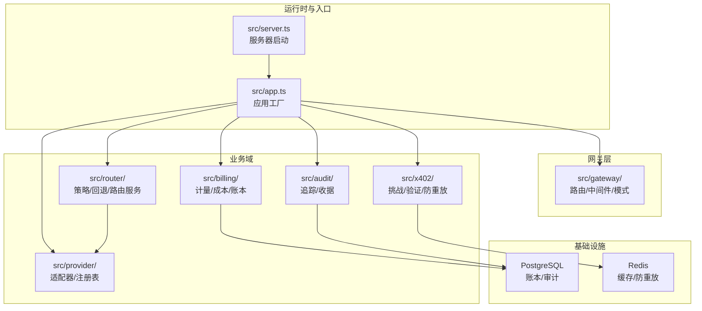
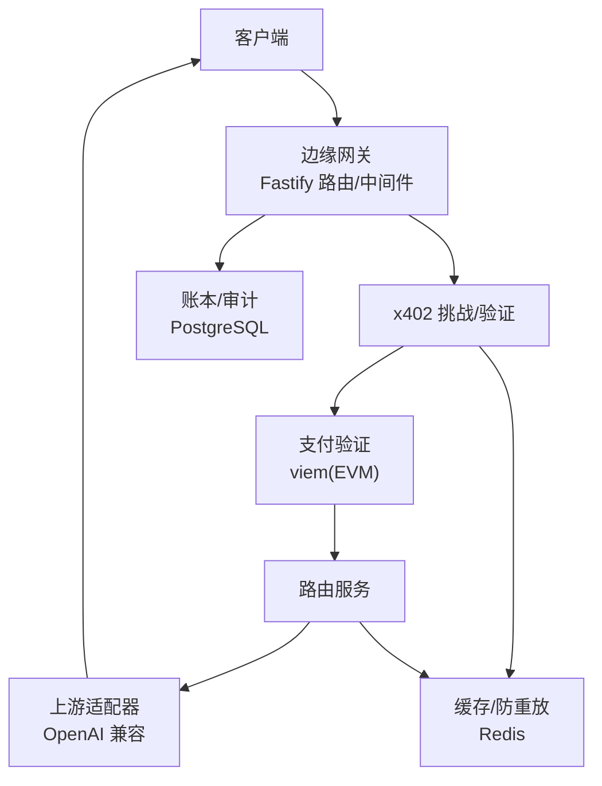
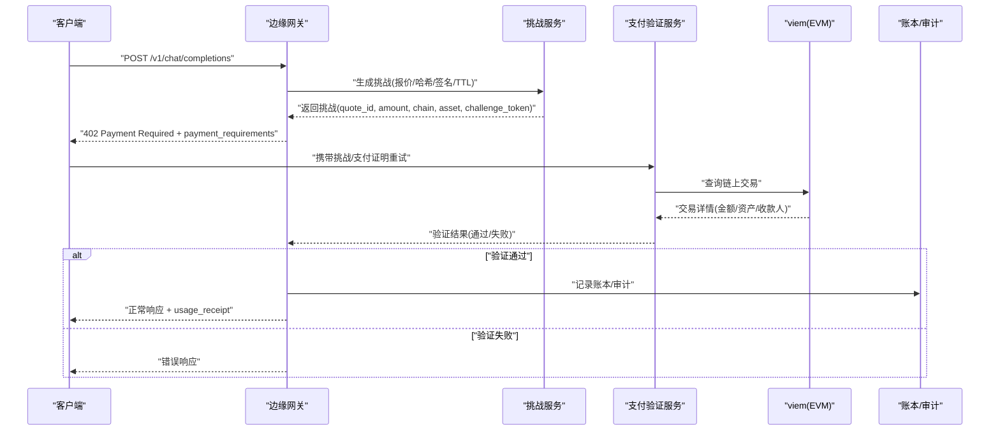
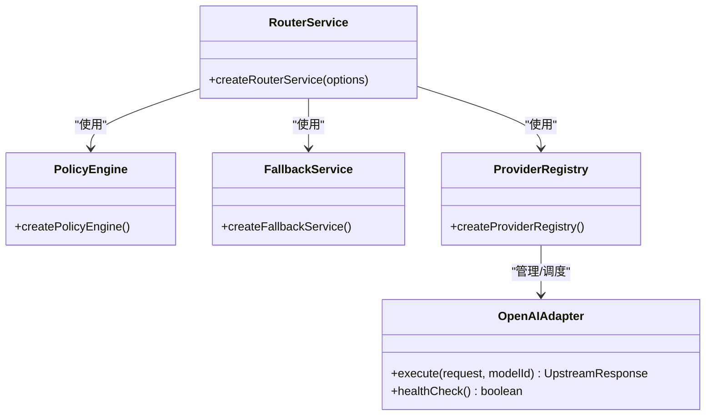
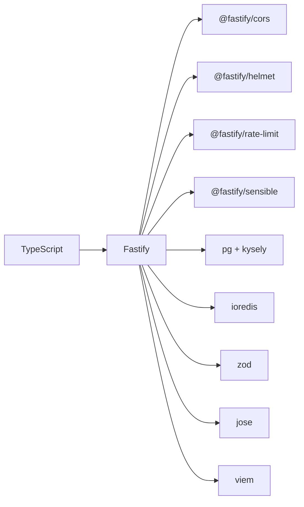

# 技术概览

<cite>
**本文引用的文件**
- [package.json](file://package.json)
- [README.md](file://README.md)
- [docker-compose.yml](file://docker-compose.yml)
- [src/app.ts](file://src/app.ts)
- [src/server.ts](file://src/server.ts)
- [src/config.ts](file://src/config.ts)
- [src/gateway/index.ts](file://src/gateway/index.ts)
- [src/x402/index.ts](file://src/x402/index.ts)
- [src/router/index.ts](file://src/router/index.ts)
- [src/provider/index.ts](file://src/provider/index.ts)
- [src/x402/challenge.service.ts](file://src/x402/challenge.service.ts)
- [src/x402/verify.service.ts](file://src/x402/verify.service.ts)
- [src/billing/ledger.service.ts](file://src/billing/ledger.service.ts)
- [src/audit/trace.service.ts](file://src/audit/trace.service.ts)
- [src/provider/openai.adapter.ts](file://src/provider/openai.adapter.ts)
</cite>

## 目录
1. [简介](#简介)
2. [项目结构](#项目结构)
3. [核心组件](#核心组件)
4. [架构总览](#架构总览)
5. [详细组件分析](#详细组件分析)
6. [依赖分析](#依赖分析)
7. [性能考虑](#性能考虑)
8. [故障排查指南](#故障排查指南)
9. [结论](#结论)
10. [附录](#附录)

## 简介
x402 Gateway 是一个面向 Agent-to-Agent 的计算中继服务，支持按请求支付的 x402 机制，无需 API 密钥或账户。其技术栈围绕 TypeScript + Fastify 运行时构建，结合 PostgreSQL 与 Redis 实现账务与审计持久化及缓存/去重，使用 viem 与 EVM 链交互完成支付验证，借助 Zod 进行运行时类型校验，使用 JOSE 实现挑战令牌与 JWT/JWS 签名。

## 项目结构
项目采用按功能域分层的模块化组织方式，核心入口在应用工厂与服务器启动脚本中装配路由、中间件与服务容器；配置通过 Zod 校验并从环境变量加载；数据访问通过 Kysely 与 PostgreSQL 交互，缓存与去重通过 Redis 实现；链上支付验证由 viem 完成；加密签名与令牌处理由 JOSE 提供。

图表来源
- [src/server.ts:1-33](file://src/server.ts#L1-L33)
- [src/app.ts:35-100](file://src/app.ts#L35-L100)
- [src/gateway/index.ts:1-9](file://src/gateway/index.ts#L1-L9)
- [src/x402/index.ts:1-13](file://src/x402/index.ts#L1-L13)
- [src/router/index.ts:1-8](file://src/router/index.ts#L1-L8)
- [src/provider/index.ts:1-6](file://src/provider/index.ts#L1-L6)
- [src/billing/ledger.service.ts:17-41](file://src/billing/ledger.service.ts#L17-L41)
- [src/audit/trace.service.ts:38-67](file://src/audit/trace.service.ts#L38-L67)

章节来源
- [README.md:79-106](file://README.md#L79-L106)
- [src/server.ts:1-33](file://src/server.ts#L1-L33)
- [src/app.ts:35-100](file://src/app.ts#L35-L100)

## 核心组件
- 应用工厂与错误处理：在应用工厂中注册 CORS、Helmet、限流与通用响应插件，并注入全局错误处理器，统一处理业务错误与 Zod 校验错误。
- 服务容器：将 Provider 注册表、挑战服务、支付验证、防重放、路由、计量、成本、账本、追踪、收据等服务实例化并注入到路由处理函数。
- 配置系统：使用 Zod 对环境变量进行强类型校验，涵盖数据库与 Redis 连接串、挑战密钥与 TTL、商户地址、支付链与资产、平台费率等。
- 数据与缓存：账本与审计写入 PostgreSQL；挑战令牌与幂等键等短期状态写入 Redis；Kysely 作为数据库查询构建器（当前连接初始化为 TODO）。

章节来源
- [src/app.ts:35-100](file://src/app.ts#L35-L100)
- [src/config.ts:28-45](file://src/config.ts#L28-L45)
- [src/billing/ledger.service.ts:17-41](file://src/billing/ledger.service.ts#L17-L41)
- [src/audit/trace.service.ts:38-67](file://src/audit/trace.service.ts#L38-L67)

## 架构总览
下图展示了从客户端到上游模型提供商的整体调用链路，以及 x402 支付流程与数据存储位置：

图表来源
- [README.md:26-35](file://README.md#L26-L35)
- [src/app.ts:77-94](file://src/app.ts#L77-L94)
- [src/x402/verify.service.ts:18-33](file://src/x402/verify.service.ts#L18-L33)
- [src/billing/ledger.service.ts:17-41](file://src/billing/ledger.service.ts#L17-L41)
- [src/audit/trace.service.ts:38-67](file://src/audit/trace.service.ts#L38-L67)

## 详细组件分析

### 网关层（路由、中间件、模式）
- 责任：请求体与头部模式定义、速率限制、CORS、安全头、可感知响应、追踪 ID 注入、OpenAI 兼容端点注册。
- 关键点：全局错误处理器对业务错误与 Zod 校验错误进行统一响应；追踪 ID Hook 在 onRequest 阶段生成并注入请求上下文。

章节来源
- [src/gateway/index.ts:1-9](file://src/gateway/index.ts#L1-L9)
- [src/app.ts:43-70](file://src/app.ts#L43-L70)

### x402 支付域
- 挑战服务：生成挑战（含报价单、请求哈希绑定、签名、过期时间），并验证挑战令牌与请求哈希一致性。
- 支付验证服务：基于 viem 查询链上交易，校验金额、资产与收款人是否满足挑战要求。
- 防重放服务：利用 Redis 存储已处理的挑战/请求标识，避免重复消费。

图表来源
- [src/x402/challenge.service.ts:28-70](file://src/x402/challenge.service.ts#L28-L70)
- [src/x402/verify.service.ts:18-33](file://src/x402/verify.service.ts#L18-L33)
- [src/billing/ledger.service.ts:17-41](file://src/billing/ledger.service.ts#L17-L41)
- [src/audit/trace.service.ts:38-67](file://src/audit/trace.service.ts#L38-L67)

章节来源
- [src/x402/index.ts:1-13](file://src/x402/index.ts#L1-L13)
- [src/x402/challenge.service.ts:28-70](file://src/x402/challenge.service.ts#L28-L70)
- [src/x402/verify.service.ts:18-33](file://src/x402/verify.service.ts#L18-L33)

### 路由与上游适配器
- 路由策略：根据请求上下文与策略引擎选择模型，支持自动与手动策略，具备回退链能力。
- 上游适配器：以 OpenAI 兼容接口封装，屏蔽不同提供商差异，统一输出标准化响应与用量信息。

图表来源
- [src/router/index.ts:1-8](file://src/router/index.ts#L1-L8)
- [src/provider/index.ts:1-6](file://src/provider/index.ts#L1-L6)
- [src/provider/openai.adapter.ts:10-43](file://src/provider/openai.adapter.ts#L10-L43)

章节来源
- [src/router/index.ts:1-8](file://src/router/index.ts#L1-L8)
- [src/provider/index.ts:1-6](file://src/provider/index.ts#L1-L6)
- [src/provider/openai.adapter.ts:10-43](file://src/provider/openai.adapter.ts#L10-L43)

### 计费与审计
- 账本服务：仅追加写入，不更新或删除，确保不可篡改性；支持按 request_id 或 quote_id 查询。
- 追踪服务：记录请求生命周期内的状态、评分、用量、费用与支付信息，支持成功与失败两种终态。

章节来源
- [src/billing/ledger.service.ts:17-41](file://src/billing/ledger.service.ts#L17-L41)
- [src/audit/trace.service.ts:38-67](file://src/audit/trace.service.ts#L38-L67)

## 依赖分析
- 运行时与框架：Fastify 为核心 Web 框架，配合 CORS、Helmet、Rate Limit、Sensible 插件提升安全性与稳定性。
- 数据库与 ORM：PostgreSQL 作为主存储，Kysely 作为查询构建器；Redis 用于缓存与防重放。
- 区块链交互：viem 用于 EVM 兼容链的链上交易查询与验证。
- 类型与加密：Zod 用于配置与运行时参数的强类型校验；JOSE 用于挑战令牌签名与 JWT/JWS 处理。
- 开发工具链：TypeScript、ESLint、Prettier、Vitest、tsx、dotenv。

图表来源
- [package.json:21-36](file://package.json#L21-L36)
- [src/app.ts:44-47](file://src/app.ts#L44-L47)

章节来源
- [package.json:21-36](file://package.json#L21-L36)
- [src/app.ts:44-47](file://src/app.ts#L44-L47)

## 性能考虑
- 限流与安全：启用 Helmet 与 Rate Limit 插件，降低滥用风险；CORS 与 Sensible 提升跨域与错误处理一致性。
- 缓存与去重：Redis 用于短期挑战/请求标识缓存与防重放，建议合理设置过期策略与内存上限。
- 数据库写入：账本为追加写，建议批量提交与索引优化；审计表按 request_id/quote_id 建立必要索引。
- 链上查询：viem 查询应结合本地缓存与超时控制，避免阻塞请求处理。

## 故障排查指南
- 启动与监听：检查服务器启动日志与端口占用；优雅关闭钩子需确保资源释放。
- 配置校验：若出现配置解析错误，检查环境变量与最小长度/前缀约束（如挑战密钥长度、商户地址前缀）。
- 错误处理：业务错误与 Zod 校验错误会统一转换为标准响应；内部错误将记录日志并返回通用错误码。
- 数据库与缓存：确认 PostgreSQL 与 Redis 容器健康状态与连接串；Kysely 连接初始化为 TODO，需补充实现。

章节来源
- [src/server.ts:4-26](file://src/server.ts#L4-L26)
- [src/config.ts:28-45](file://src/config.ts#L28-L45)
- [src/app.ts:53-70](file://src/app.ts#L53-L70)
- [docker-compose.yml:12-27](file://docker-compose.yml#L12-L27)

## 结论
x402 Gateway 通过清晰的模块划分与稳健的技术栈，实现了“按请求付费”的计算中继能力。Fastify 提供高性能与可扩展的运行时，PostgreSQL 与 Redis 保障了账务与审计的可靠性与低延迟，viem 与 JOSE 则分别解决了链上验证与挑战令牌的安全性问题。Zod 的引入进一步提升了系统的健壮性与可维护性。

## 附录

### 系统要求与依赖
- 运行时：Node.js >= 20
- 包管理：推荐使用 pnpm
- 容器：Docker（用于本地 PostgreSQL 与 Redis）
- 数据库：PostgreSQL 16；Redis 7
- 开发工具：TypeScript、ESLint、Prettier、Vitest、tsx、dotenv

章节来源
- [package.json:48-50](file://package.json#L48-L50)
- [README.md:7](file://README.md#L7)
- [docker-compose.yml:1-31](file://docker-compose.yml#L1-L31)

### 技术选型学习路径与参考
- 运行时与框架
  - Fastify：插件生态、中间件与错误处理、路由与序列化
  - TypeScript：严格类型、编译与类型检查
- 数据与缓存
  - PostgreSQL：表设计、索引与事务；Kysely 查询构建器
  - Redis：键值存储、过期策略、LRU 策略
- 区块链与加密
  - viem：EVM 交易查询、链上数据校验
  - JOSE：JWK、JWS、JWT 与 HMAC 签名
- 类型与校验
  - Zod：对象模式、coercions、parse 与错误处理
- 开发与测试
  - ESLint + Prettier：代码风格与静态检查
  - Vitest：单元与集成测试

章节来源
- [README.md:108-114](file://README.md#L108-L114)
- [package.json:21-46](file://package.json#L21-L46)