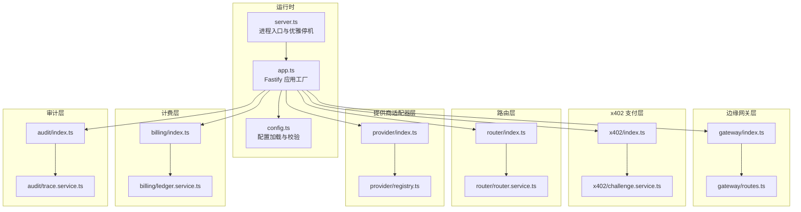
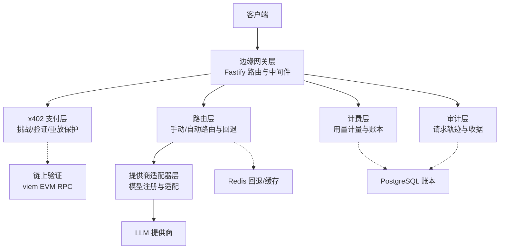
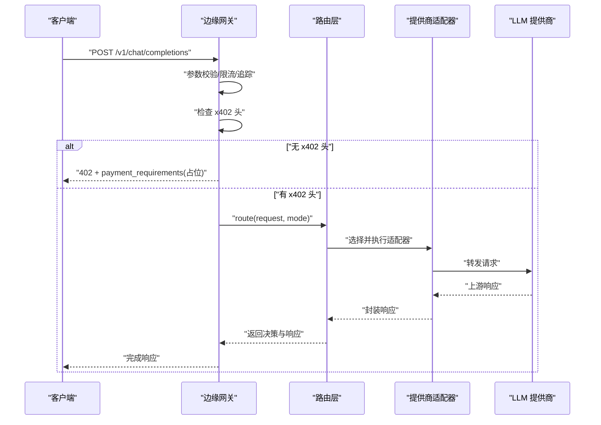
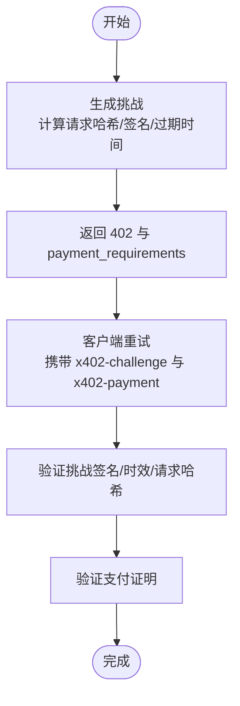
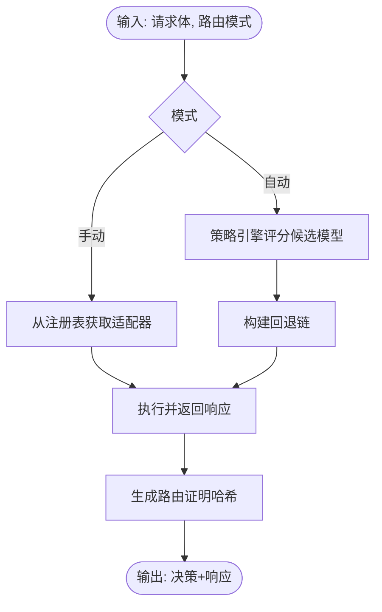
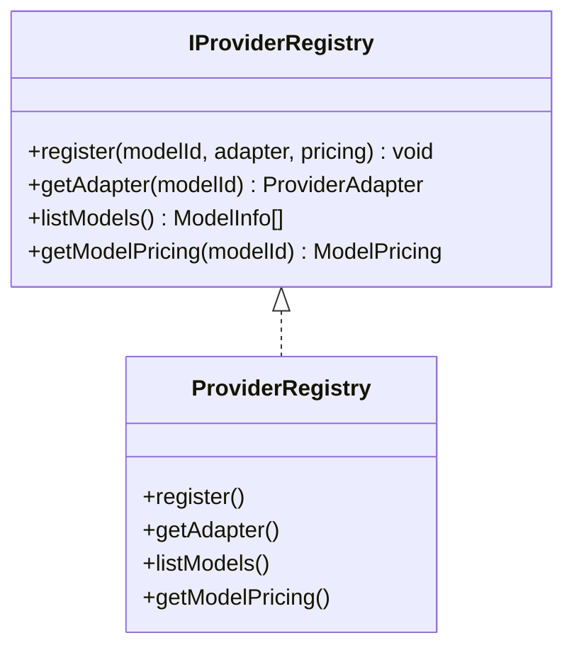
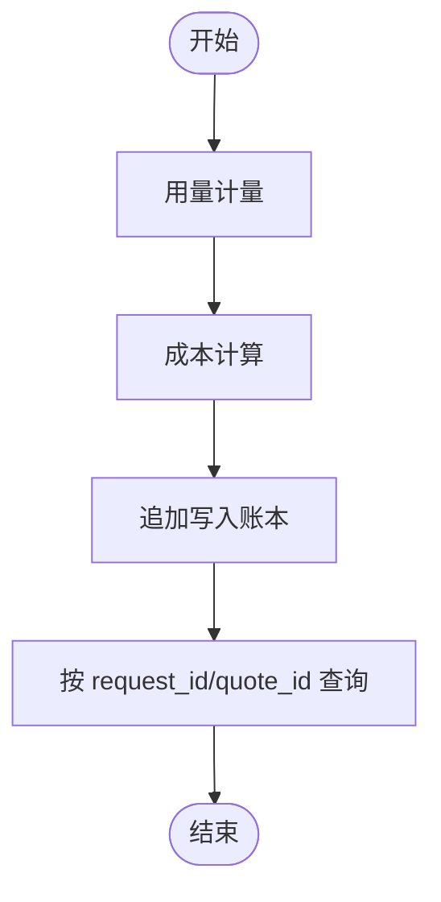
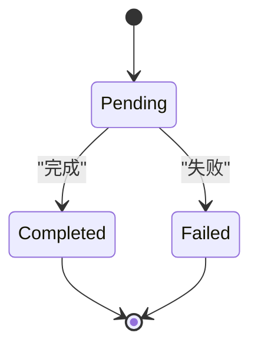
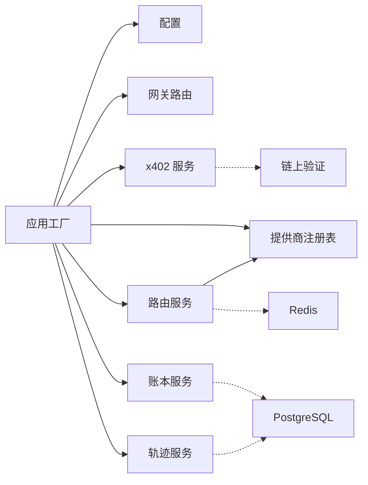

# 架构概览

<cite>
**本文引用的文件**
- [src/app.ts](file://src/app.ts)
- [src/server.ts](file://src/server.ts)
- [src/config.ts](file://src/config.ts)
- [src/types.ts](file://src/types.ts)
- [src/gateway/index.ts](file://src/gateway/index.ts)
- [src/gateway/routes.ts](file://src/gateway/routes.ts)
- [src/x402/index.ts](file://src/x402/index.ts)
- [src/x402/challenge.service.ts](file://src/x402/challenge.service.ts)
- [src/router/index.ts](file://src/router/index.ts)
- [src/router/router.service.ts](file://src/router/router.service.ts)
- [src/provider/index.ts](file://src/provider/index.ts)
- [src/provider/registry.ts](file://src/provider/registry.ts)
- [src/billing/index.ts](file://src/billing/index.ts)
- [src/billing/ledger.service.ts](file://src/billing/ledger.service.ts)
- [src/audit/index.ts](file://src/audit/index.ts)
- [src/audit/trace.service.ts](file://src/audit/trace.service.ts)
- [README.md](file://README.md)
</cite>

## 目录
1. [引言](#引言)
2. [项目结构](#项目结构)
3. [核心组件](#核心组件)
4. [架构总览](#架构总览)
5. [详细组件分析](#详细组件分析)
6. [依赖分析](#依赖分析)
7. [性能考虑](#性能考虑)
8. [故障排查指南](#故障排查指南)
9. [结论](#结论)
10. [附录](#附录)

## 引言
本文件为 x402 Gateway 的架构概览与技术洞察，面向架构师与高级开发者，系统阐述分层架构设计（边缘网关层、x402 支付层、路由层、提供商适配器层、计费层、审计层），解释各层职责与相互关系，并结合代码级依赖注入模式、服务容器设计与模块化优势进行深入分析。同时给出数据流与组件交互的完整架构图，以及关键流程的时序与流程图，帮助读者快速理解系统全貌与演进方向。

## 项目结构
项目采用按“功能域”划分的模块化组织方式，入口文件负责应用装配与启动，核心业务由独立模块实现并通过统一的服务容器注入到路由层。配置通过环境变量加载并使用类型校验，共享类型定义贯穿各模块。

图表来源
- [src/server.ts:1-33](file://src/server.ts#L1-L33)
- [src/app.ts:35-100](file://src/app.ts#L35-L100)
- [src/gateway/index.ts:1-9](file://src/gateway/index.ts#L1-L9)
- [src/gateway/routes.ts:1-96](file://src/gateway/routes.ts#L1-L96)
- [src/x402/index.ts:1-13](file://src/x402/index.ts#L1-L13)
- [src/x402/challenge.service.ts:1-71](file://src/x402/challenge.service.ts#L1-L71)
- [src/router/index.ts:1-8](file://src/router/index.ts#L1-L8)
- [src/router/router.service.ts:1-50](file://src/router/router.service.ts#L1-L50)
- [src/provider/index.ts:1-6](file://src/provider/index.ts#L1-L6)
- [src/provider/registry.ts:1-65](file://src/provider/registry.ts#L1-L65)
- [src/billing/index.ts:1-8](file://src/billing/index.ts#L1-L8)
- [src/billing/ledger.service.ts:1-42](file://src/billing/ledger.service.ts#L1-L42)
- [src/audit/index.ts:1-6](file://src/audit/index.ts#L1-L6)
- [src/audit/trace.service.ts:1-68](file://src/audit/trace.service.ts#L1-L68)

章节来源
- [README.md:79-106](file://README.md#L79-L106)
- [src/server.ts:1-33](file://src/server.ts#L1-L33)
- [src/app.ts:35-100](file://src/app.ts#L35-L100)
- [src/config.ts:28-45](file://src/config.ts#L28-L45)

## 核心组件
- 应用工厂与服务容器
  - 应用工厂负责注册插件、错误处理、钩子与路由，并通过服务容器集中注入各领域服务实例，确保路由处理器只承担薄薄的参数解析与委托职责。
  - 服务容器接口聚合了所有领域服务，便于在路由中按需注入与组合。
- 配置管理
  - 使用类型安全的配置加载器，从环境变量读取并校验关键参数（端口、主机、日志级别、挑战密钥、商户地址、支付链与资产、上游提供商密钥、平台费率等）。
- 共享类型
  - 定义请求体、响应体、模型目录、用量收据、审计记录等跨模块共享的数据契约，保证 API 规范与实现一致。

章节来源
- [src/app.ts:21-33](file://src/app.ts#L21-L33)
- [src/app.ts:77-94](file://src/app.ts#L77-L94)
- [src/config.ts:28-45](file://src/config.ts#L28-L45)
- [src/types.ts:17-118](file://src/types.ts#L17-L118)

## 架构总览
系统采用“边缘网关 + 分层处理”的架构，边缘网关负责请求接入、鉴权与限流；x402 层负责挑战生成与支付验证；路由层根据策略选择上游模型并构建回退链；提供商适配器层屏蔽上游差异；计费层负责用量计量与账本；审计层记录全流程轨迹与证据。

图表来源
- [README.md:26-35](file://README.md#L26-L35)
- [src/gateway/routes.ts:9-96](file://src/gateway/routes.ts#L9-L96)
- [src/x402/challenge.service.ts:4-26](file://src/x402/challenge.service.ts#L4-L26)
- [src/router/router.service.ts:5-18](file://src/router/router.service.ts#L5-L18)
- [src/provider/registry.ts:4-16](file://src/provider/registry.ts#L4-L16)
- [src/billing/ledger.service.ts:3-15](file://src/billing/ledger.service.ts#L3-L15)
- [src/audit/trace.service.ts:4-36](file://src/audit/trace.service.ts#L4-L36)

## 详细组件分析

### 边缘网关层
- 职责
  - 请求参数校验（OpenAI 兼容体）、速率限制、CORS、安全头、全局错误处理。
  - 注入 traceId 钩子，统一请求标识。
  - 注册路由：聊天补全、模型列表、审计查询。
- 关键点
  - 路由处理器保持“零业务逻辑”，仅做参数解析与委托给服务层。
  - 对于未携带 x402 头的请求，返回 402 并附带支付要求（占位实现，待完善）。
  - 模型列表与审计查询同样保留占位实现，体现模块化与渐进式开发。

图表来源
- [src/gateway/routes.ts:23-67](file://src/gateway/routes.ts#L23-L67)
- [src/router/router.service.ts:14-17](file://src/router/router.service.ts#L14-L17)
- [src/provider/registry.ts:44-50](file://src/provider/registry.ts#L44-L50)

章节来源
- [src/gateway/index.ts:1-9](file://src/gateway/index.ts#L1-L9)
- [src/gateway/routes.ts:9-96](file://src/gateway/routes.ts#L9-L96)

### x402 支付层
- 职责
  - 生成挑战（绑定请求哈希、签名、过期时间）。
  - 验证挑战（签名、时效、请求哈希一致性）。
  - 计算请求哈希用于绑定挑战与请求体。
- 设计要点
  - 采用 HMAC 签名与可配置挑战密钥、TTL。
  - 请求哈希采用确定性序列化与哈希算法，防止挑战被滥用或重放。
  - 与链上验证解耦，通过支付证明接口抽象，便于后续接入 EVM RPC。

图表来源
- [src/x402/challenge.service.ts:12-26](file://src/x402/challenge.service.ts#L12-L26)
- [src/x402/challenge.service.ts:36-68](file://src/x402/challenge.service.ts#L36-L68)

章节来源
- [src/x402/index.ts:1-13](file://src/x402/index.ts#L1-L13)
- [src/x402/challenge.service.ts:4-71](file://src/x402/challenge.service.ts#L4-L71)

### 路由层
- 职责
  - 手动模式：直接使用请求指定模型。
  - 自动模式：评分候选模型、构建回退链、执行并产出路由证明。
  - 统一产出路由决策与上游响应，供计费与审计使用。
- 设计要点
  - 通过策略引擎与回退服务解耦评分与执行细节。
  - 路由证明用于审计与争议解决，确保可追溯性。

图表来源
- [src/router/router.service.ts:14-17](file://src/router/router.service.ts#L14-L17)
- [src/router/router.service.ts:27-47](file://src/router/router.service.ts#L27-L47)

章节来源
- [src/router/index.ts:1-8](file://src/router/index.ts#L1-L8)
- [src/router/router.service.ts:5-50](file://src/router/router.service.ts#L5-L50)

### 提供商适配器层
- 职责
  - 维护模型注册表，提供适配器查询与模型列表。
  - 未来扩展不同提供商（如 OpenAI、Anthropic）的适配器。
- 设计要点
  - 注册表以内存 Map 存储，支持按模型 ID 获取适配器与定价。
  - 与上游差异隔离，统一对外接口。

图表来源
- [src/provider/registry.ts:4-16](file://src/provider/registry.ts#L4-L16)
- [src/provider/registry.ts:27-64](file://src/provider/registry.ts#L27-L64)

章节来源
- [src/provider/index.ts:1-6](file://src/provider/index.ts#L1-L6)
- [src/provider/registry.ts:1-65](file://src/provider/registry.ts#L1-L65)

### 计费层
- 职责
  - 用量计量、成本拆分与账本追加写入。
  - 账本为只追加结构，不更新或删除，便于审计与合规。
- 设计要点
  - 通过流水账形式记录每笔交易，支持按 request_id 或 quote_id 查询。
  - 与上游响应与路由决策联动，确保计费准确。

图表来源
- [src/billing/ledger.service.ts:3-15](file://src/billing/ledger.service.ts#L3-L15)
- [src/billing/ledger.service.ts:17-41](file://src/billing/ledger.service.ts#L17-L41)

章节来源
- [src/billing/index.ts:1-8](file://src/billing/index.ts#L1-L8)
- [src/billing/ledger.service.ts:1-42](file://src/billing/ledger.service.ts#L1-L42)

### 审计层
- 职责
  - 初始化与完成请求轨迹，记录路由决策、用量、成本、支付信息。
  - 提供按 request_id 查询审计记录的能力。
- 设计要点
  - 轨迹状态机：pending -> completed/fail，支持失败归档与重试。
  - 与计费与支付环节协同，形成闭环证据链。

图表来源
- [src/audit/trace.service.ts:9-36](file://src/audit/trace.service.ts#L9-L36)
- [src/audit/trace.service.ts:38-67](file://src/audit/trace.service.ts#L38-L67)

章节来源
- [src/audit/index.ts:1-6](file://src/audit/index.ts#L1-L6)
- [src/audit/trace.service.ts:1-68](file://src/audit/trace.service.ts#L1-L68)

## 依赖分析
- 依赖注入与服务容器
  - 应用工厂集中创建并注入服务实例，路由层通过服务容器访问各领域服务，降低耦合度，提升可测试性与可替换性。
  - 服务容器接口定义清晰，便于按需扩展与替换实现。
- 模块内聚与模块间耦合
  - 各模块边界明确：网关只负责接入与编排；支付、路由、适配器、计费、审计各自专注单一职责。
  - 模块间通过接口与共享类型耦合，避免直接依赖具体实现。
- 外部依赖与集成点
  - 链上验证：通过支付验证服务抽象，未来接入 EVM RPC。
  - 数据存储：账本与审计持久化至 PostgreSQL；回退与去重使用 Redis。
  - 上游提供商：通过适配器抽象屏蔽差异。

图表来源
- [src/app.ts:77-94](file://src/app.ts#L77-L94)
- [src/gateway/routes.ts:74-76](file://src/gateway/routes.ts#L74-L76)
- [src/router/router.service.ts:20-25](file://src/router/router.service.ts#L20-L25)
- [src/billing/ledger.service.ts:17-41](file://src/billing/ledger.service.ts#L17-L41)
- [src/audit/trace.service.ts:38-67](file://src/audit/trace.service.ts#L38-L67)

章节来源
- [src/app.ts:21-33](file://src/app.ts#L21-L33)
- [src/app.ts:77-94](file://src/app.ts#L77-L94)
- [src/gateway/routes.ts:9-96](file://src/gateway/routes.ts#L9-L96)

## 性能考虑
- 连接池与资源管理
  - 应用工厂预留数据库与缓存连接初始化位置，建议在生产环境启用连接池与健康检查，避免冷启动抖动。
- 缓存与去重
  - 利用 Redis 实现请求去重与回退链缓存，减少重复调用与网络开销。
- 日志与可观测性
  - traceId 钩子与审计层配合，实现端到端追踪；建议结合采样与结构化日志优化性能分析。
- 路由与适配器
  - 将评分与回退链计算前置，减少上游调用失败重试次数；对热点模型建立本地缓存。

## 故障排查指南
- 常见错误分类
  - 应用层错误：统一错误处理器将已知错误映射为标准响应，未知错误记录日志并返回通用错误。
  - 参数校验错误：Zod 校验失败返回 400 与结构化错误。
- 排查步骤
  - 检查 traceId 与日志级别，定位请求生命周期。
  - 核对 x402 头是否正确传递与签名验证是否通过。
  - 确认路由模式与模型 ID 是否匹配注册表。
  - 检查账本与审计记录是否存在，必要时清理缓存后重试。
- 关键接口
  - 审计查询接口可用于复现问题与取证。

章节来源
- [src/app.ts:53-70](file://src/app.ts#L53-L70)
- [src/gateway/routes.ts:82-94](file://src/gateway/routes.ts#L82-L94)

## 结论
该架构以“边缘网关 + 分层处理”为核心，通过依赖注入与服务容器实现高内聚低耦合；模块化设计使支付、路由、适配器、计费与审计职责清晰分离，既满足当前 MVP 的快速落地，也为未来扩展（链上验证、更多提供商、更复杂的计费规则）提供了稳定基础。建议优先完善支付流程与审计查询接口，同步补齐数据库与缓存连接，以保障生产可用性与可运维性。

## 附录
- 技术栈与工具
  - 运行时：TypeScript + Fastify
  - 数据库：PostgreSQL（账本、审计）
  - 缓存：Redis（回退/去重）
  - 链上验证：viem（EVM RPC）
  - 校验：Zod
  - 签名：jose（JWT/JWS）
- API 与模块职责参考
  - 模块职责与路径详见 README 中的模块表格与架构图。

章节来源
- [README.md:39-47](file://README.md#L39-L47)
- [README.md:108-115](file://README.md#L108-L115)