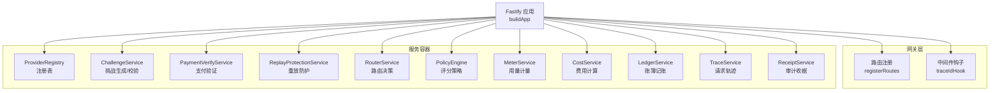
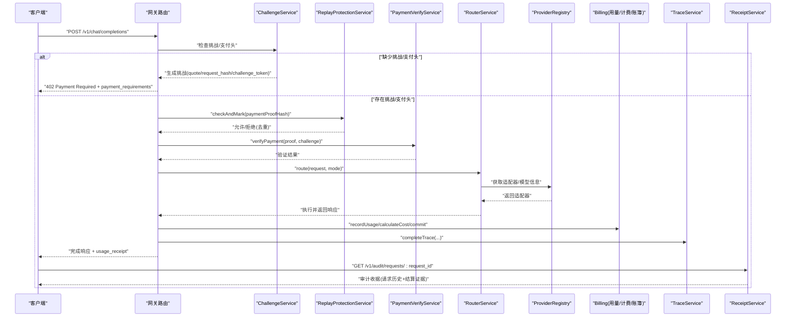
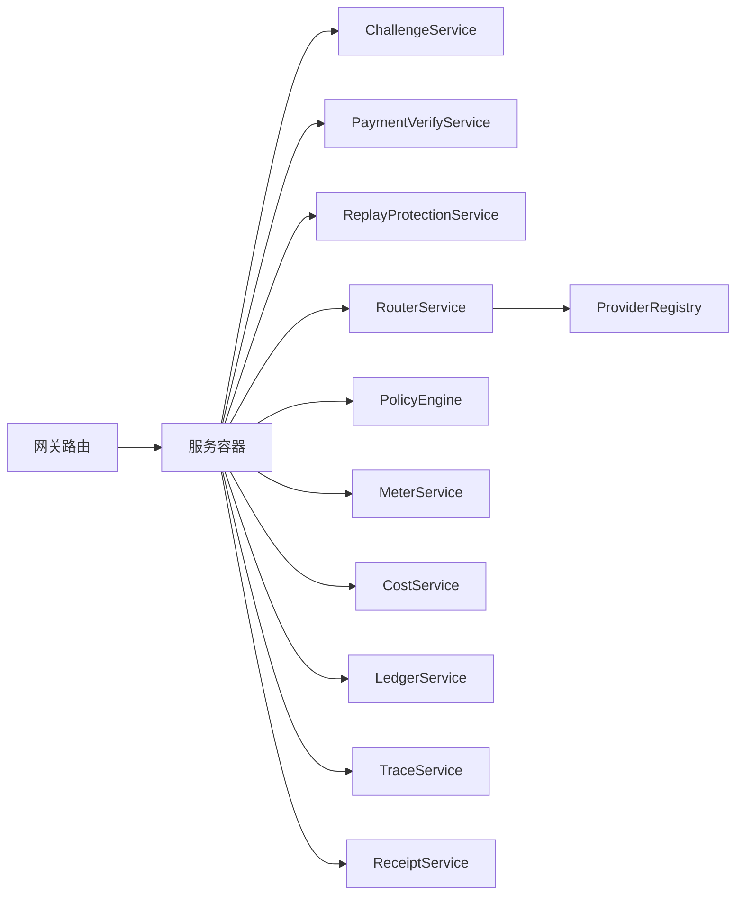

# 核心特性

<cite>
**本文引用的文件**
- [src/app.ts](file://src/app.ts)
- [src/gateway/routes.ts](file://src/gateway/routes.ts)
- [src/gateway/index.ts](file://src/gateway/index.ts)
- [src/x402/challenge.service.ts](file://src/x402/challenge.service.ts)
- [src/x402/verify.service.ts](file://src/x402/verify.service.ts)
- [src/x402/replay.service.ts](file://src/x402/replay.service.ts)
- [src/router/router.service.ts](file://src/router/router.service.ts)
- [src/router/policy.ts](file://src/router/policy.ts)
- [src/audit/trace.service.ts](file://src/audit/trace.service.ts)
- [src/audit/receipt.service.ts](file://src/audit/receipt.service.ts)
- [src/provider/registry.ts](file://src/provider/registry.ts)
- [src/billing/index.ts](file://src/billing/index.ts)
</cite>

## 目录
1. [引言](#引言)
2. [项目结构](#项目结构)
3. [核心组件](#核心组件)
4. [架构总览](#架构总览)
5. [详细组件分析](#详细组件分析)
6. [依赖关系分析](#依赖关系分析)
7. [性能考量](#性能考量)
8. [故障排查指南](#故障排查指南)
9. [结论](#结论)
10. [附录](#附录)

## 引言
本文件面向 x402 Gateway 的四大核心特性进行系统化说明：1）per-request 加密货币支付认证（x402 支付）；2）基于成本与性能的智能路由；3）无账户访问模式；4）透明审计追踪。文档从技术实现原理、业务价值、典型使用场景与优势对比四个维度展开，并结合源码路径给出可落地的配置与集成建议。

## 项目结构
后端采用 Fastify 应用容器，通过服务容器统一注入各子系统能力：支付挑战与校验、重放防护、路由决策、计费与账簿、审计追踪与收据、上游适配器注册表等。路由层负责参数解析与错误处理，业务逻辑委托给服务层。

图示来源
- [src/app.ts:77-94](file://src/app.ts#L77-L94)
- [src/gateway/routes.ts:9-96](file://src/gateway/routes.ts#L9-L96)

章节来源
- [src/app.ts:35-101](file://src/app.ts#L35-L101)
- [src/gateway/index.ts:1-9](file://src/gateway/index.ts#L1-L9)

## 核心组件
- 支付挑战与校验：生成 per-request 的挑战要求，校验客户端回传的支付证明，绑定请求体哈希，防止篡改与重放。
- 路由与策略：根据成本、能力匹配与可用性评分上游模型，自动构建降级链路，支持手动直连。
- 计费与账簿：按用量与费率计算费用，记录明细并写入账簿。
- 审计与收据：完整记录请求生命周期，提供按请求 ID 查询的审计证据。

章节来源
- [src/x402/challenge.service.ts:28-71](file://src/x402/challenge.service.ts#L28-L71)
- [src/x402/verify.service.ts:18-34](file://src/x402/verify.service.ts#L18-L34)
- [src/router/router.service.ts:20-50](file://src/router/router.service.ts#L20-L50)
- [src/billing/index.ts:1-8](file://src/billing/index.ts#L1-L8)
- [src/audit/trace.service.ts:38-68](file://src/audit/trace.service.ts#L38-L68)
- [src/audit/receipt.service.ts:14-26](file://src/audit/receipt.service.ts#L14-L26)

## 架构总览
下图展示一次典型的聊天补全请求在网关中的处理流程：未支付时返回 402 并附带挑战；支付后经重放保护与链上验证，再进入路由与计费，最终产出审计收据。

图示来源
- [src/gateway/routes.ts:23-67](file://src/gateway/routes.ts#L23-L67)
- [src/x402/challenge.service.ts:36-68](file://src/x402/challenge.service.ts#L36-L68)
- [src/x402/replay.service.ts:25-49](file://src/x402/replay.service.ts#L25-L49)
- [src/x402/verify.service.ts:20-31](file://src/x402/verify.service.ts#L20-L31)
- [src/router/router.service.ts:27-47](file://src/router/router.service.ts#L27-L47)
- [src/provider/registry.ts:27-65](file://src/provider/registry.ts#L27-L65)
- [src/audit/trace.service.ts:49-65](file://src/audit/trace.service.ts#L49-L65)
- [src/audit/receipt.service.ts:16-22](file://src/audit/receipt.service.ts#L16-L22)

## 详细组件分析

### 特性一：x402 支付认证系统（per-request 加密货币支付）
- 技术实现原理
  - 挑战生成：基于请求体生成确定性请求哈希，结合签名令牌与过期时间，形成一次性挑战。
  - 支付验证：对链上交易进行金额、资产、收款人三要素核验，确保与挑战一致。
  - 重放防护：以支付证明哈希为键进行原子标记，配合幂等缓存提升鲁棒性。
- 业务价值
  - 为每次请求即时付费，降低预付费门槛与坏账风险。
  - 通过链上不可篡改证据，保障支付与结算透明可信。
- 典型使用场景
  - SaaS 试用与按次计费；内容创作与图像生成；企业合规审计。
- 优势对比
  - 相比传统 API Key，无需长期凭证管理，降低泄露风险；相比中心化钱包，无需账户注册即可完成支付。
- 配置与集成要点
  - 网关路由已预留挑战/支付头解析与 402 返回；请按接口定义填充挑战字段并接入链上验证服务。
  - 重放保护依赖外部存储（Redis），需在应用初始化时注入连接实例。

章节来源
- [src/gateway/routes.ts:23-67](file://src/gateway/routes.ts#L23-L67)
- [src/x402/challenge.service.ts:36-68](file://src/x402/challenge.service.ts#L36-L68)
- [src/x402/verify.service.ts:20-31](file://src/x402/verify.service.ts#L20-L31)
- [src/x402/replay.service.ts:25-49](file://src/x402/replay.service.ts#L25-L49)

### 特性二：智能路由系统（基于成本与性能的模型选择）
- 技术实现原理
  - 自动模式：从注册表收集可用模型，通过策略引擎评分（成本、能力匹配、可用性），构建降级链路并执行。
  - 手动模式：直接按请求指定模型路由至适配器。
  - 决策证明：生成路由决策哈希，用于审计与复现。
- 业务价值
  - 在保证质量的前提下优先成本最优，提升资源利用率与客户体验。
  - 通过降级链路增强稳定性，避免单点失败导致整体不可用。
- 典型使用场景
  - 多供应商混合编排；突发流量下的弹性调度；多区域低延迟优化。
- 优势对比
  - 相比静态路由，动态评分与降级链显著提高鲁棒性与性价比。
- 配置与集成要点
  - 在启动阶段注册模型与定价信息；策略评分逻辑可扩展以纳入更多指标。

章节来源
- [src/router/router.service.ts:27-47](file://src/router/router.service.ts#L27-L47)
- [src/router/policy.ts:18-32](file://src/router/policy.ts#L18-L32)
- [src/provider/registry.ts:31-62](file://src/provider/registry.ts#L31-L62)

### 特性三：无账户访问模式（无需 API Key 或账户注册）
- 技术实现原理
  - 通过 per-request 支付替代长期凭证；客户端仅需在请求头携带挑战与支付证明。
  - 审计查询接口支持按请求 ID 获取完整证据，无需登录态。
- 业务价值
  - 降低新用户门槛，简化集成流程；减少账户运维与安全风险。
- 典型使用场景
  - 快速原型与实验；第三方 SDK 集成；合规要求下的最小权限访问。
- 优势对比
  - 相比账户体系，无状态设计更易扩展与迁移。
- 配置与集成要点
  - 审计查询接口已预留实现位置；请按接口规范组装返回数据。

章节来源
- [src/gateway/routes.ts:73-94](file://src/gateway/routes.ts#L73-L94)
- [src/audit/receipt.service.ts:16-22](file://src/audit/receipt.service.ts#L16-L22)

### 特性四：透明审计追踪（完整的请求历史与结算证据）
- 技术实现原理
  - 请求生命周期：开始、完成、失败三种状态；记录路由决策、用量、费用、支付等关键字段。
  - 审计收据：按请求 ID 聚合轨迹、路由决策、用量、费用与支付证据，形成结算凭据。
- 业务价值
  - 满足合规与财务对账需求；便于问题定位与责任追溯。
- 典型使用场景
  - 企业内部审计；外部监管报告；争议仲裁与对账。
- 优势对比
  - 相比事后统计，实时轨迹与聚合收据提供更强的可验证性。
- 配置与集成要点
  - 轨迹服务与收据服务均预留数据库操作；请按接口定义实现持久化。

章节来源
- [src/audit/trace.service.ts:49-65](file://src/audit/trace.service.ts#L49-L65)
- [src/audit/receipt.service.ts:16-22](file://src/audit/receipt.service.ts#L16-L22)

## 依赖关系分析
- 组件内聚与耦合
  - 网关路由薄处理，强依赖服务容器；服务之间通过接口解耦，利于替换与测试。
  - 路由模块依赖注册表与策略引擎；计费模块依赖用量与费率；审计模块贯穿全流程。
- 外部依赖与集成点
  - 支付验证依赖链上 RPC（如 viem）；重放防护依赖 Redis；轨迹与收据依赖数据库。
- 潜在循环依赖
  - 当前结构清晰，未见循环依赖迹象。

图示来源
- [src/app.ts:77-94](file://src/app.ts#L77-L94)
- [src/gateway/routes.ts:9-96](file://src/gateway/routes.ts#L9-L96)
- [src/router/router.service.ts:20-50](file://src/router/router.service.ts#L20-L50)
- [src/provider/registry.ts:27-65](file://src/provider/registry.ts#L27-L65)

章节来源
- [src/app.ts:77-94](file://src/app.ts#L77-L94)
- [src/gateway/routes.ts:9-96](file://src/gateway/routes.ts#L9-L96)

## 性能考量
- 路由评分与降级链构建应尽量缓存模型定价与可用性状态，减少重复查询。
- 重放防护与幂等缓存使用原子操作，避免热点竞争；合理设置 TTL 与过期回收。
- 审计轨迹写入建议批量提交或异步落库，降低尾延迟。
- 支付验证调用链上 RPC 时启用并发限流与退避策略，避免上游限流。

## 故障排查指南
- 常见错误类型与定位
  - 支付相关：挑战过期、请求哈希不匹配、金额不足、资产不符、收款人不正确、重复支付。
  - 路由相关：模型不存在、评分异常、降级链构建失败。
  - 审计相关：轨迹未写入、收据聚合缺失、查询不到记录。
- 排查步骤
  - 检查请求头是否包含正确的挑战与支付证明；确认挑战签名与过期时间。
  - 核对链上交易详情与挑战要求三要素一致性。
  - 查看路由决策日志与降级链执行情况。
  - 确认审计服务的数据库连接与事务提交状态。
- 参考实现位置
  - 支付验证与挑战校验抛出的错误类型与参数校验入口。

章节来源
- [src/x402/verify.service.ts:20-31](file://src/x402/verify.service.ts#L20-L31)
- [src/x402/challenge.service.ts:49-60](file://src/x402/challenge.service.ts#L49-L60)
- [src/router/router.service.ts:27-47](file://src/router/router.service.ts#L27-L47)
- [src/audit/trace.service.ts:49-65](file://src/audit/trace.service.ts#L49-L65)

## 结论
x402 Gateway 将 per-request 加密货币支付、智能路由、无账户访问与透明审计四大特性有机整合：以支付为入口实现即付即用，以路由为手段实现成本与性能平衡，以审计为保障实现合规与信任。通过清晰的服务边界与可插拔架构，项目为实际业务提供了高扩展性与高可靠性的基础平台。

## 附录
- 快速集成清单
  - 初始化服务容器并注入 Redis 与数据库连接。
  - 注册上游模型与定价信息到注册表。
  - 实现支付验证与链上查询、重放防护与幂等缓存、轨迹与收据持久化。
  - 在路由层启用自动模式并配置策略评分规则。
- 关键接口参考
  - 支付挑战与验证：[挑战服务:36-68](file://src/x402/challenge.service.ts#L36-L68)、[支付验证服务:20-31](file://src/x402/verify.service.ts#L20-L31)、[重放防护服务:25-49](file://src/x402/replay.service.ts#L25-L49)
  - 路由与策略：[路由服务:27-47](file://src/router/router.service.ts#L27-L47)、[策略引擎:18-32](file://src/router/policy.ts#L18-L32)、[注册表:31-62](file://src/provider/registry.ts#L31-L62)
  - 审计与收据：[轨迹服务:49-65](file://src/audit/trace.service.ts#L49-L65)、[收据服务:16-22](file://src/audit/receipt.service.ts#L16-L22)
  - 网关路由与错误处理：[路由注册:23-67](file://src/gateway/routes.ts#L23-L67)、[应用构建:77-94](file://src/app.ts#L77-L94)