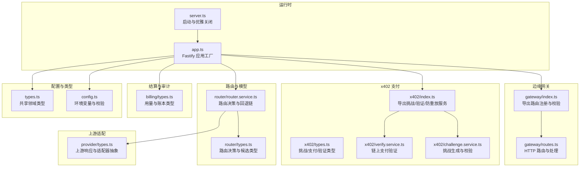
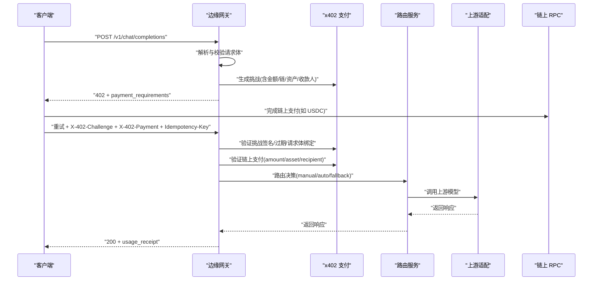
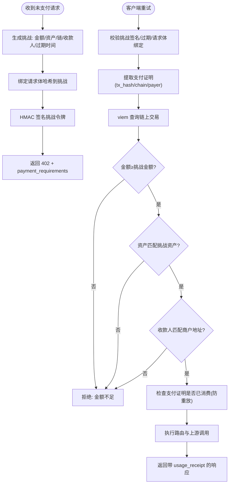
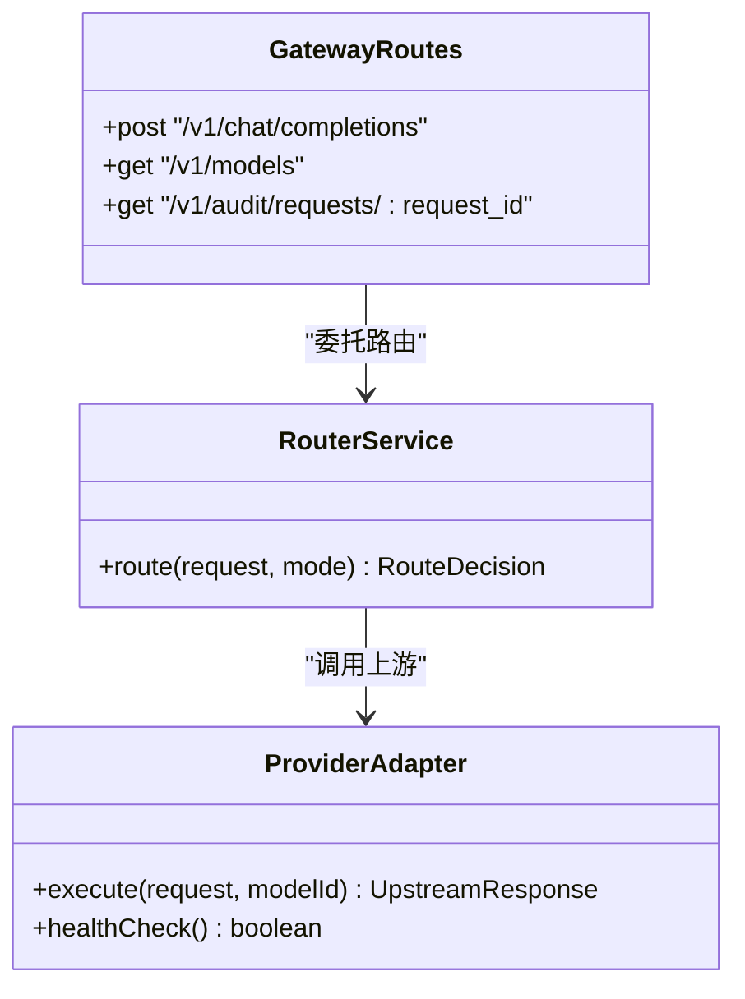
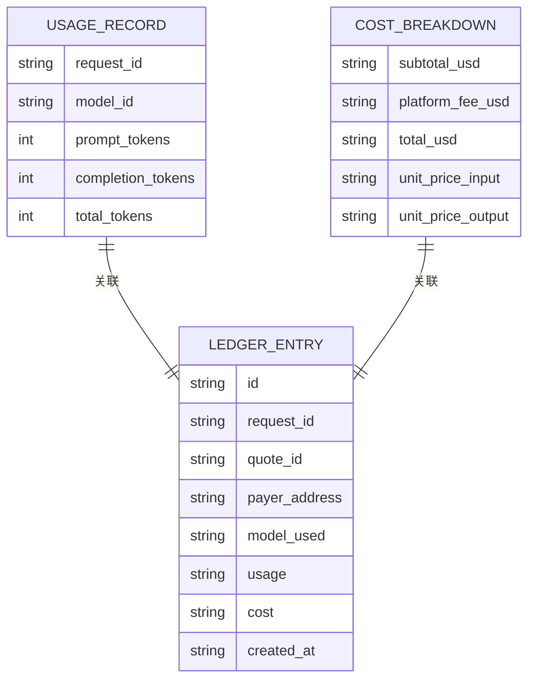
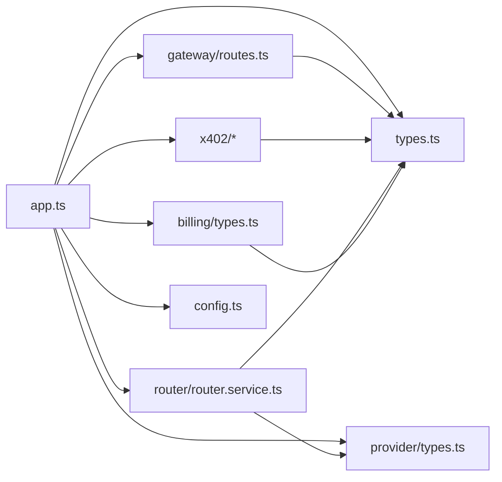

# 项目介绍

<cite>
**本文引用的文件**
- [README.md](file://README.md)
- [package.json](file://package.json)
- [src/server.ts](file://src/server.ts)
- [src/app.ts](file://src/app.ts)
- [src/config.ts](file://src/config.ts)
- [src/types.ts](file://src/types.ts)
- [src/gateway/index.ts](file://src/gateway/index.ts)
- [src/gateway/routes.ts](file://src/gateway/routes.ts)
- [src/x402/index.ts](file://src/x402/index.ts)
- [src/x402/types.ts](file://src/x402/types.ts)
- [src/x402/challenge.service.ts](file://src/x402/challenge.service.ts)
- [src/x402/verify.service.ts](file://src/x402/verify.service.ts)
- [src/router/router.service.ts](file://src/router/router.service.ts)
- [src/router/types.ts](file://src/router/types.ts)
- [src/provider/types.ts](file://src/provider/types.ts)
- [src/billing/types.ts](file://src/billing/types.ts)
- [docs/api-spec-v0-x402-gateway.md](file://docs/api-spec-v0-x402-gateway.md)
- [docs/adr-001-x402-only-architecture.md](file://docs/adr-001-x402-only-architecture.md)
</cite>

## 目录
1. [引言](#引言)
2. [项目结构](#项目结构)
3. [核心组件](#核心组件)
4. [架构总览](#架构总览)
5. [详细组件分析](#详细组件分析)
6. [依赖关系分析](#依赖关系分析)
7. [性能考量](#性能考量)
8. [故障排查指南](#故障排查指南)
9. [结论](#结论)
10. [附录](#附录)

## 引言
x402 Gateway 是一个“代理到代理”的计算中继服务，旨在以 per-request 的加密货币支付模式，彻底改变访问 AI 推理服务的方式。其核心使命是：在无需 API 密钥与账户的前提下，通过链上 USDC 支付实现即时、透明、可审计的推理请求结算；其愿景是构建一个去中心化的、按次付费的智能路由与结算基础设施，让开发者与智能体能够以统一接口、统一体验接入多家上游模型提供商。

本项目解决的核心问题包括：
- 传统 AI 服务访问门槛高：需要注册账户、申请密钥、配置环境，流程繁琐且易出错。
- 成本不透明：账单分散在不同平台，缺乏统一视图与可验证的明细。
- 缺乏去中心化特性：用户资金与数据被集中于少数平台，缺乏可移植性与抗审查能力。

x402 协议的创新价值主张在于：
- 每次请求即一次支付，无需预存余额或长期授权。
- 使用标准 HTTP 头部承载挑战与支付证明，兼容 OpenAI 风格的请求格式。
- 通过链上验证确保支付不可篡改、不可重复消费，同时返回透明的使用收据（usage receipt）用于审计与计费。

技术突破点：
- 基于 HMAC 签名的短期挑战令牌，绑定请求体哈希，防止重放与篡改。
- 基于 viem 的 EVM 链上交易查询，校验金额、资产与收款人三要素。
- 路由层支持手动与自动两种模式，并生成可审计的路由证明。
- 结算层采用只增式账本与可查询的审计记录，保障不可抵赖与可追溯。

为初学者提供的通俗解释：
- 将 x402 类比为“先下单后付款”的餐厅模式：你先发起请求，服务器返回一个“支付要求”，你完成链上支付后再把支付证明发回来，服务器核验通过后才执行推理并返回结果。整个过程不需要注册账户、不需要长期密钥，也不需要担心隐私泄露。

**章节来源**
- [README.md:1-124](file://README.md#L1-L124)
- [docs/adr-001-x402-only-architecture.md:1-101](file://docs/adr-001-x402-only-architecture.md#L1-L101)
- [docs/api-spec-v0-x402-gateway.md:1-198](file://docs/api-spec-v0-x402-gateway.md#L1-L198)

## 项目结构
项目采用模块化分层设计，围绕“边缘网关 + x402 支付 + 路由 + 上游适配 + 结算与审计”五大能力域组织代码。入口文件负责加载配置、装配服务并启动 HTTP 服务器；各模块通过清晰的接口边界协作，保持高内聚、低耦合。

**图表来源**
- [src/server.ts:1-33](file://src/server.ts#L1-L33)
- [src/app.ts:1-101](file://src/app.ts#L1-L101)
- [src/config.ts:1-46](file://src/config.ts#L1-L46)
- [src/types.ts:1-119](file://src/types.ts#L1-L119)
- [src/gateway/index.ts:1-9](file://src/gateway/index.ts#L1-L9)
- [src/gateway/routes.ts:1-96](file://src/gateway/routes.ts#L1-L96)
- [src/x402/index.ts:1-13](file://src/x402/index.ts#L1-L13)
- [src/x402/types.ts:1-37](file://src/x402/types.ts#L1-L37)
- [src/x402/challenge.service.ts:1-71](file://src/x402/challenge.service.ts#L1-L71)
- [src/x402/verify.service.ts:1-34](file://src/x402/verify.service.ts#L1-L34)
- [src/router/router.service.ts:1-50](file://src/router/router.service.ts#L1-L50)
- [src/router/types.ts:1-22](file://src/router/types.ts#L1-L22)
- [src/provider/types.ts:1-36](file://src/provider/types.ts#L1-L36)
- [src/billing/types.ts:1-32](file://src/billing/types.ts#L1-L32)

**章节来源**
- [README.md:79-106](file://README.md#L79-L106)
- [src/server.ts:1-33](file://src/server.ts#L1-L33)
- [src/app.ts:1-101](file://src/app.ts#L1-L101)

## 核心组件
- 边缘网关（Gateway）
  - 负责请求参数解析、OpenAI 兼容体校验、速率限制、追踪 ID 注入、路由处理。
  - 提供 /v1/chat/completions、/v1/models、/v1/audit/requests/:request_id 三个端点。
- x402 支付（x402）
  - 挑战服务：生成短期挑战令牌，绑定请求体哈希，设置过期时间。
  - 验证服务：基于 viem 查询链上交易，校验金额、资产与收款人。
  - 防重放服务：利用 Redis TTL 实现一次性消费保护。
- 路由服务（Router）
  - 支持 manual/auto 两种模式，自动模式下根据策略评分与回退链选择最优模型。
- 上游适配（Provider）
  - 抽象统一的上游响应结构，屏蔽不同提供商差异。
- 结算与审计（Billing/Audit）
  - 记录用量、计算费用、写入只增式账本；提供审计查询能力。

**章节来源**
- [README.md:37-47](file://README.md#L37-L47)
- [src/gateway/routes.ts:1-96](file://src/gateway/routes.ts#L1-L96)
- [src/x402/types.ts:1-37](file://src/x402/types.ts#L1-L37)
- [src/router/router.service.ts:1-50](file://src/router/router.service.ts#L1-L50)
- [src/provider/types.ts:1-36](file://src/provider/types.ts#L1-L36)
- [src/billing/types.ts:1-32](file://src/billing/types.ts#L1-L32)

## 架构总览
x402 Gateway 的整体交互路径如下：客户端通过边缘网关发起推理请求；若未携带支付证明，网关返回 402 并附带支付要求；客户端完成链上支付后重试，携带挑战令牌与支付证明；网关进行挑战校验、链上支付验证与防重放检查，随后路由至上游模型，最终返回带使用收据的响应。

**图表来源**
- [src/gateway/routes.ts:23-67](file://src/gateway/routes.ts#L23-L67)
- [src/x402/challenge.service.ts:12-26](file://src/x402/challenge.service.ts#L12-L26)
- [src/x402/verify.service.ts:3-16](file://src/x402/verify.service.ts#L3-L16)
- [src/router/router.service.ts:14-18](file://src/router/router.service.ts#L14-L18)
- [docs/api-spec-v0-x402-gateway.md:21-103](file://docs/api-spec-v0-x402-gateway.md#L21-L103)

**章节来源**
- [README.md:26-35](file://README.md#L26-L35)
- [docs/api-spec-v0-x402-gateway.md:56-64](file://docs/api-spec-v0-x402-gateway.md#L56-L64)

## 详细组件分析

### x402 协议工作原理
- 挑战生成与绑定
  - 服务端为每次未支付请求生成短期挑战，其中包含报价号、请求体哈希、金额、资产、链、收款地址与过期时间；挑战令牌通过 HMAC 签名，防止伪造。
- 支付证明与链上验证
  - 客户端完成链上支付后，将交易哈希、链与付款人地址放入请求头；服务端使用 viem 查询交易，核验金额不低于挑战金额、资产匹配、收款人匹配挑战中的商户地址。
- 防重放与幂等
  - 通过 Redis TTL 与支付证明哈希实现一次性消费；同时要求重试时携带幂等键，避免重复执行。

**图表来源**
- [src/x402/challenge.service.ts:12-26](file://src/x402/challenge.service.ts#L12-L26)
- [src/x402/verify.service.ts:3-16](file://src/x402/verify.service.ts#L3-L16)
- [src/gateway/routes.ts:23-67](file://src/gateway/routes.ts#L23-L67)
- [docs/api-spec-v0-x402-gateway.md:46-103](file://docs/api-spec-v0-x402-gateway.md#L46-L103)

**章节来源**
- [src/x402/types.ts:1-37](file://src/x402/types.ts#L1-L37)
- [src/x402/challenge.service.ts:12-71](file://src/x402/challenge.service.ts#L12-L71)
- [src/x402/verify.service.ts:3-34](file://src/x402/verify.service.ts#L3-L34)
- [docs/api-spec-v0-x402-gateway.md:46-103](file://docs/api-spec-v0-x402-gateway.md#L46-L103)

### 边缘网关与路由服务
- 边缘网关
  - 负责 OpenAI 兼容体解析、头部校验（挑战令牌、支付证明、幂等键）、错误处理与审计日志注入。
  - 提供模型目录查询与审计查询端点。
- 路由服务
  - 手动模式直接选择指定模型；自动模式根据策略评分构建回退链，执行并生成路由证明，便于审计与复现。

**图表来源**
- [src/gateway/routes.ts:9-96](file://src/gateway/routes.ts#L9-L96)
- [src/router/router.service.ts:5-18](file://src/router/router.service.ts#L5-L18)
- [src/provider/types.ts:26-35](file://src/provider/types.ts#L26-L35)

**章节来源**
- [src/gateway/routes.ts:9-96](file://src/gateway/routes.ts#L9-L96)
- [src/router/router.service.ts:5-50](file://src/router/router.service.ts#L5-L50)
- [src/provider/types.ts:1-36](file://src/provider/types.ts#L1-L36)

### 结算与审计
- 用量计量与费用拆分
  - 记录提示词、补全与总计 token 数量；按单价与平台费率计算小计、平台费用与总费用。
- 账本与收据
  - 写入只增式账本，保证不可篡改；响应中附带使用收据，包含请求 ID、报价号、付款人地址、所用模型、单价与总费用、路由证明哈希等。
- 审计查询
  - 提供按请求 ID 查询路由决策、用量、费用与支付验证状态的能力。

**图表来源**
- [src/billing/types.ts:3-32](file://src/billing/types.ts#L3-L32)
- [src/types.ts:36-62](file://src/types.ts#L36-L62)
- [docs/api-spec-v0-x402-gateway.md:129-163](file://docs/api-spec-v0-x402-gateway.md#L129-L163)

**章节来源**
- [src/billing/types.ts:1-32](file://src/billing/types.ts#L1-L32)
- [src/types.ts:42-62](file://src/types.ts#L42-L62)
- [docs/api-spec-v0-x402-gateway.md:129-163](file://docs/api-spec-v0-x402-gateway.md#L129-L163)

## 依赖关系分析
- 运行时与框架
  - Fastify 作为 HTTP 服务器，配合 CORS、Helmet、限流与错误处理插件。
  - TypeScript + Zod 用于类型安全与配置校验。
- 存储与缓存
  - PostgreSQL 用于只增式账本与审计记录；Redis 用于挑战/支付防重放与缓存。
- 区块链与加密
  - viem 用于 EVM 链上交易查询；jose 用于 HMAC 签名与挑战令牌生成；nanoid 用于生成报价号等标识符。
- 开发与测试
  - Vitest 用于单元与集成测试；ESLint/Prettier 保证代码质量。

**图表来源**
- [src/app.ts:72-98](file://src/app.ts#L72-L98)
- [src/gateway/routes.ts:1-96](file://src/gateway/routes.ts#L1-L96)
- [src/x402/types.ts:1-37](file://src/x402/types.ts#L1-L37)
- [src/router/router.service.ts:1-50](file://src/router/router.service.ts#L1-L50)
- [src/provider/types.ts:1-36](file://src/provider/types.ts#L1-L36)
- [src/billing/types.ts:1-32](file://src/billing/types.ts#L1-L32)
- [src/config.ts:1-46](file://src/config.ts#L1-L46)
- [src/types.ts:1-119](file://src/types.ts#L1-L119)

**章节来源**
- [package.json:21-36](file://package.json#L21-L36)
- [src/app.ts:72-98](file://src/app.ts#L72-L98)

## 性能考量
- 请求处理路径尽量短路：未支付请求立即返回 402，避免无谓的上游调用。
- 重试路径前置校验：挑战签名、过期与请求体绑定优先于链上查询，减少无效链上交互。
- 防重放与幂等：通过 Redis TTL 与支付证明哈希降低重复执行风险，提升吞吐。
- 缓存与回退：路由层的回退链与缓存策略有助于在上游波动时稳定响应时间。
- 数据库与缓存连接：建议在应用初始化阶段建立持久连接，避免热重启带来的抖动。

## 故障排查指南
常见错误与定位要点：
- 402 Payment Required
  - 检查是否正确携带挑战令牌与支付证明；确认请求体与挑战绑定一致。
- 挑战过期/请求体不匹配
  - 核对挑战过期时间与本地时间；确保请求体序列化顺序一致（规范中要求确定性 JSON）。
- 支付验证失败/金额不足
  - 核对链、资产与收款人是否与挑战一致；确认链上交易哈希有效且金额满足要求。
- 支付重放
  - 检查支付证明哈希是否已被消费；确认幂等键唯一且正确传递。
- 上游超时/不可用
  - 查看路由回退链是否生效；关注上游健康检查与限流策略。
- 内部错误
  - 查看服务容器装配与数据库/缓存连接状态；检查日志级别与错误映射。

**章节来源**
- [docs/api-spec-v0-x402-gateway.md:165-176](file://docs/api-spec-v0-x402-gateway.md#L165-L176)
- [src/gateway/routes.ts:23-67](file://src/gateway/routes.ts#L23-L67)

## 结论
x402 Gateway 以 per-request 的加密货币支付为核心，结合短期挑战令牌、链上支付验证与只增式账本，构建了无需账户与密钥、透明可审计的 AI 推理接入方案。通过边缘网关、x402 支付、路由与上游适配的协同，项目在 MVP 阶段即实现了从“请求—支付—路由—结算—审计”的闭环，为未来扩展账户体系与更多支付通道奠定了坚实基础。

## 附录
- 快速开始
  - 安装依赖、启动数据库与缓存、复制并配置环境变量、启动开发服务器。
- 技术栈
  - 运行时：TypeScript + Fastify；数据库：PostgreSQL；缓存：Redis；链上验证：viem；校验：Zod；签名：jose。
- 文档索引
  - API 规范、工程执行手册、评审与合并门禁、架构决策记录等。

**章节来源**
- [README.md:5-24](file://README.md#L5-L24)
- [README.md:108-124](file://README.md#L108-L124)
- [docs/adr-001-x402-only-architecture.md:72-101](file://docs/adr-001-x402-only-architecture.md#L72-L101)