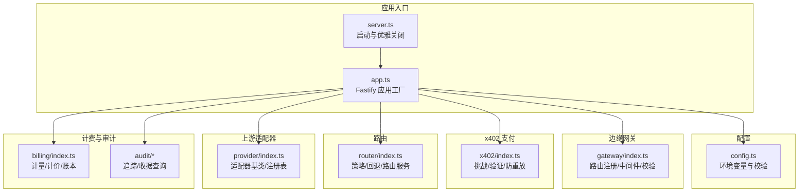
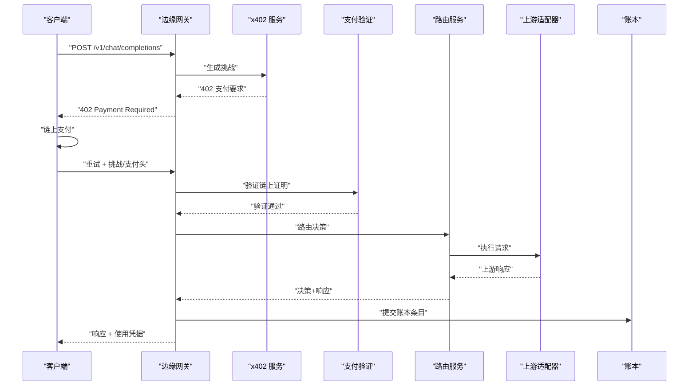
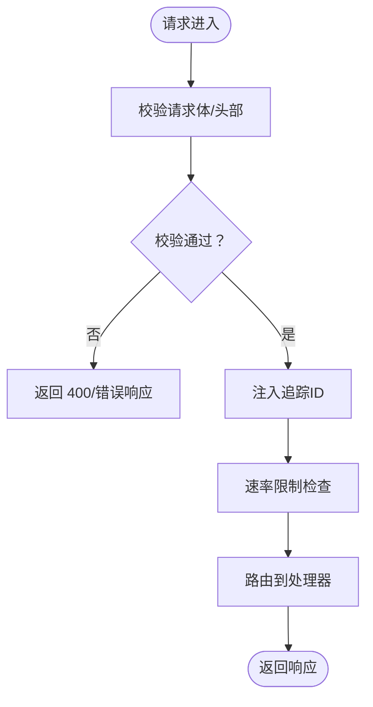
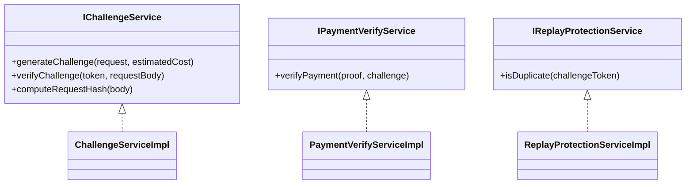
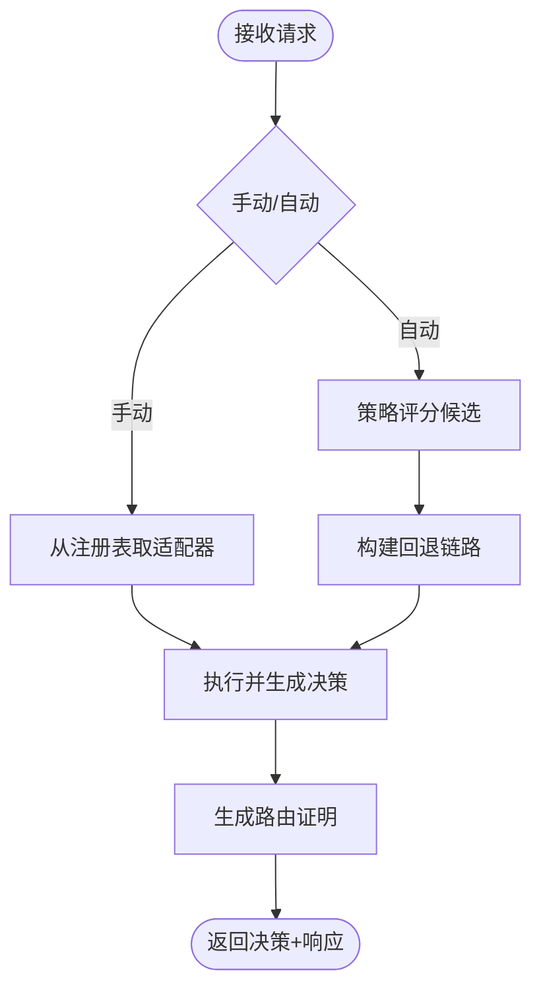
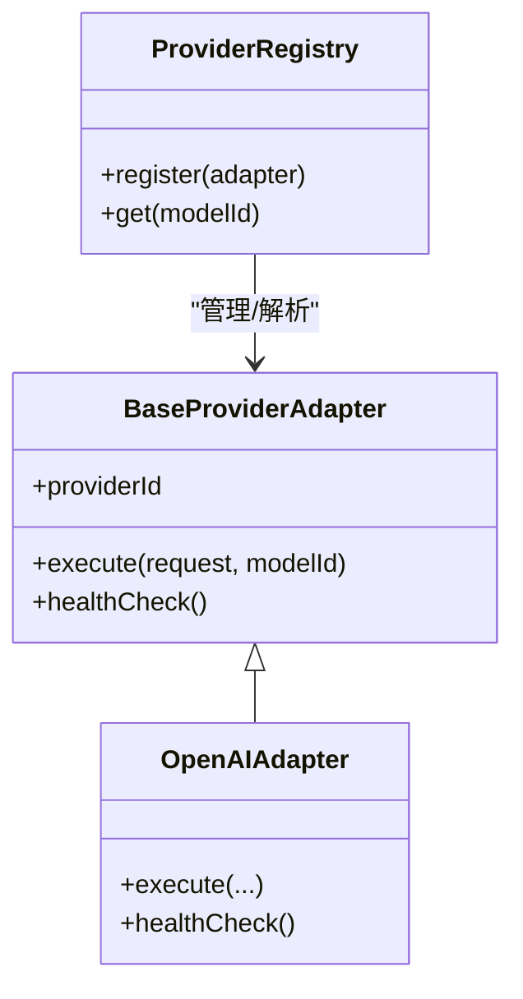
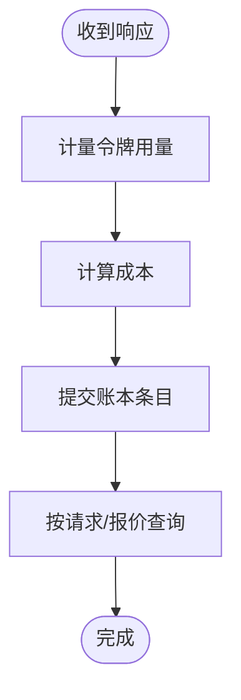
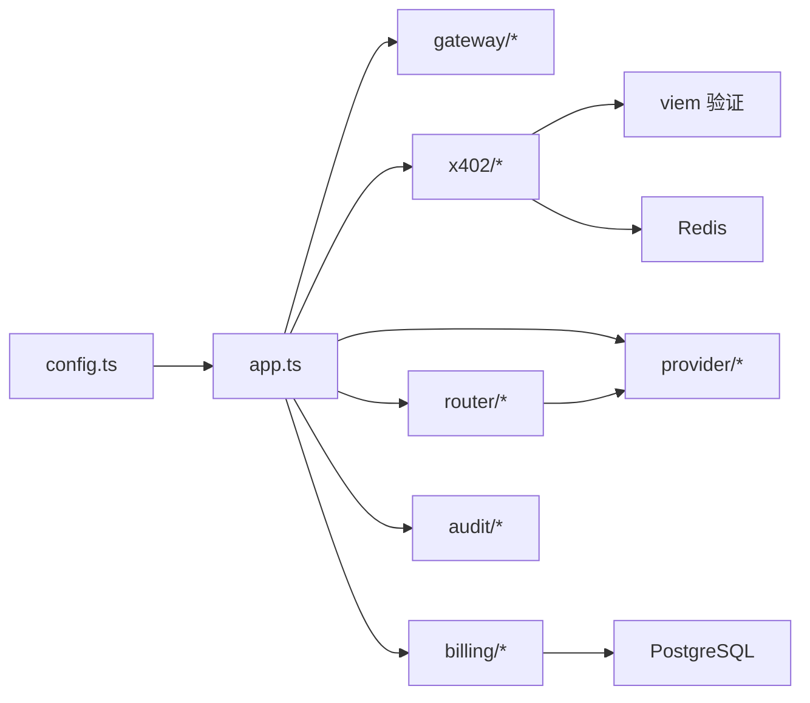

# 项目概述

<cite>
**本文引用的文件**
- [README.md](file://README.md)
- [src/app.ts](file://src/app.ts)
- [src/server.ts](file://src/server.ts)
- [src/config.ts](file://src/config.ts)
- [src/gateway/index.ts](file://src/gateway/index.ts)
- [src/x402/index.ts](file://src/x402/index.ts)
- [src/router/index.ts](file://src/router/index.ts)
- [src/provider/index.ts](file://src/provider/index.ts)
- [src/billing/index.ts](file://src/billing/index.ts)
- [src/x402/challenge.service.ts](file://src/x402/challenge.service.ts)
- [src/x402/verify.service.ts](file://src/x402/verify.service.ts)
- [src/router/router.service.ts](file://src/router/router.service.ts)
- [src/provider/adapter.ts](file://src/provider/adapter.ts)
- [src/billing/ledger.service.ts](file://src/billing/ledger.service.ts)
- [docs/adr-001-x402-only-architecture.md](file://docs/adr-001-x402-only-architecture.md)
</cite>

## 目录
1. [引言](#引言)
2. [项目结构](#项目结构)
3. [核心组件](#核心组件)
4. [架构总览](#架构总览)
5. [详细组件分析](#详细组件分析)
6. [依赖关系分析](#依赖关系分析)
7. [性能考量](#性能考量)
8. [故障排查指南](#故障排查指南)
9. [结论](#结论)
10. [附录](#附录)

## 引言
x402 Gateway 是一个“代理到代理”的计算中继服务，其核心使命是通过每请求付费的 x402 加密货币支付模式，将 LLM 请求路由至上游模型提供商，并在链上完成支付验证与结算证据生成。项目以“无账户、无 API 密钥”为起点，强调透明性与可审计性：每次请求都返回使用凭据（usage receipt），并记录在不可篡改的账本中。

- 技术愿景：构建一个以“按请求付费 + 链上验证 + 可审计账本”为核心的轻量级中继层，降低合规与运营成本，加速市场验证。
- 核心价值主张：
  - 每次请求即付，无需长期账户或余额管理；
  - 支付证明由链上验证，确保不可抵赖；
  - 路由决策与执行结果可追溯，账本不可篡改；
  - 对比传统 AI 服务：不提供 API 密钥通道，不托管用户账户，不提供托管余额，避免复杂的 KYC/合规与资金池风险。
- 与传统 AI 服务的区别：传统平台常提供账户体系、API 密钥、托管余额与多重支付渠道；而 x402 Gateway 在 MVP 阶段仅支持 per-request x402 支付，简化路径、聚焦“付费路由 + 透明账本”。

**章节来源**
- [README.md:1-124](file://README.md#L1-L124)
- [docs/adr-001-x402-only-architecture.md:1-101](file://docs/adr-001-x402-only-architecture.md#L1-L101)

## 项目结构
项目采用按功能域划分的模块化组织方式，核心模块包括网关、x402 支付、路由、上游适配器、计费与审计等。入口点负责装配服务容器并通过 Fastify 注册路由与中间件。

**图表来源**
- [src/server.ts:1-33](file://src/server.ts#L1-L33)
- [src/app.ts:1-101](file://src/app.ts#L1-L101)
- [src/config.ts:1-46](file://src/config.ts#L1-L46)
- [src/gateway/index.ts:1-9](file://src/gateway/index.ts#L1-L9)
- [src/x402/index.ts:1-13](file://src/x402/index.ts#L1-L13)
- [src/router/index.ts:1-8](file://src/router/index.ts#L1-L8)
- [src/provider/index.ts:1-6](file://src/provider/index.ts#L1-L6)
- [src/billing/index.ts:1-8](file://src/billing/index.ts#L1-L8)

**章节来源**
- [README.md:79-106](file://README.md#L79-L106)
- [src/server.ts:1-33](file://src/server.ts#L1-L33)
- [src/app.ts:1-101](file://src/app.ts#L1-L101)

## 核心组件
- 边缘网关（Gateway）：负责请求校验、速率限制、追踪 ID 注入、路由注册与 OpenAI 兼容接口暴露。
- x402 支付（x402）：生成 402 挑战、校验挑战与请求绑定、验证链上支付证明、防重放保护。
- 路由（Router）：支持手动与自动模式，基于策略评分与回退链路，输出路由决策与执行结果。
- 上游适配器（Provider）：抽象适配器基类，统一执行与健康检查接口，注册表管理多提供商。
- 计费与账本（Billing）：令牌计量、成本拆分、不可篡改账本写入与查询。
- 审计（Audit）：请求追踪持久化与收据查询能力。

**章节来源**
- [README.md:37-47](file://README.md#L37-L47)
- [src/gateway/index.ts:1-9](file://src/gateway/index.ts#L1-L9)
- [src/x402/index.ts:1-13](file://src/x402/index.ts#L1-L13)
- [src/router/index.ts:1-8](file://src/router/index.ts#L1-L8)
- [src/provider/index.ts:1-6](file://src/provider/index.ts#L1-L6)
- [src/billing/index.ts:1-8](file://src/billing/index.ts#L1-L8)

## 架构总览
系统从客户端发起请求开始，经边缘网关进行鉴权与校验，若未满足支付条件则返回 402 并携带支付要求；客户端完成链上支付后重试，服务端验证挑战与链上证明，随后路由到上游模型，最终返回响应并生成使用凭据与审计记录。

**图表来源**
- [README.md:56-64](file://README.md#L56-L64)
- [src/x402/challenge.service.ts:1-71](file://src/x402/challenge.service.ts#L1-L71)
- [src/x402/verify.service.ts:1-34](file://src/x402/verify.service.ts#L1-L34)
- [src/router/router.service.ts:1-50](file://src/router/router.service.ts#L1-L50)
- [src/billing/ledger.service.ts:1-42](file://src/billing/ledger.service.ts#L1-L42)

## 详细组件分析

### 组件一：边缘网关（Gateway）
- 职责：注册 OpenAI 兼容路由、注入追踪 ID、执行请求体与头部校验、统一错误处理。
- 关键点：与服务容器解耦，通过依赖注入将 x402、路由、计费、审计等服务组合进处理器。
- 安全与合规：启用 CORS、Helmet、速率限制与全局错误处理，保证基础安全与可观测性。

**图表来源**
- [src/app.ts:35-100](file://src/app.ts#L35-L100)
- [src/gateway/index.ts:1-9](file://src/gateway/index.ts#L1-L9)

**章节来源**
- [src/app.ts:1-101](file://src/app.ts#L1-L101)
- [src/gateway/index.ts:1-9](file://src/gateway/index.ts#L1-L9)

### 组件二：x402 支付（Challenge/Verify/Replay）
- 挑战生成：为未支付请求生成挑战，包含报价号、金额、链与资产、挑战令牌与过期时间；挑战令牌对请求体进行签名绑定。
- 支付验证：使用 viem 查询链上交易，核验金额、资产与收款地址是否匹配挑战要求。
- 防重放：基于 Redis TTL 的最小化状态存储，防止同一挑战被重复使用。

**图表来源**
- [src/x402/challenge.service.ts:1-71](file://src/x402/challenge.service.ts#L1-L71)
- [src/x402/verify.service.ts:1-34](file://src/x402/verify.service.ts#L1-L34)
- [src/x402/index.ts:1-13](file://src/x402/index.ts#L1-L13)

**章节来源**
- [src/x402/challenge.service.ts:1-71](file://src/x402/challenge.service.ts#L1-L71)
- [src/x402/verify.service.ts:1-34](file://src/x402/verify.service.ts#L1-L34)
- [src/x402/index.ts:1-13](file://src/x402/index.ts#L1-L13)

### 组件三：路由（Router）
- 自动模式：从注册表获取可用模型，策略引擎评分，构建回退链路，最终执行并生成路由证明。
- 手动模式：直接根据请求指定模型执行。
- 输出：同时返回路由决策元数据与上游响应，便于审计与计费。

**图表来源**
- [src/router/router.service.ts:1-50](file://src/router/router.service.ts#L1-L50)
- [src/router/index.ts:1-8](file://src/router/index.ts#L1-L8)

**章节来源**
- [src/router/router.service.ts:1-50](file://src/router/router.service.ts#L1-L50)
- [src/router/index.ts:1-8](file://src/router/index.ts#L1-L8)

### 组件四：上游适配器（Provider）
- 基类契约：定义统一的执行与健康检查接口，具体适配器（如 OpenAI）实现差异化逻辑。
- 注册表：集中管理适配器实例，按模型 ID 解析与调度。

**图表来源**
- [src/provider/adapter.ts:1-16](file://src/provider/adapter.ts#L1-L16)
- [src/provider/index.ts:1-6](file://src/provider/index.ts#L1-L6)

**章节来源**
- [src/provider/adapter.ts:1-16](file://src/provider/adapter.ts#L1-L16)
- [src/provider/index.ts:1-6](file://src/provider/index.ts#L1-L6)

### 组件五：计费与账本（Billing）
- 计量与计价：统计令牌用量并计算成本，生成成本拆分。
- 账本：不可篡改的追加式账本，按请求 ID 或报价号查询，用于审计与对账。

**图表来源**
- [src/billing/ledger.service.ts:1-42](file://src/billing/ledger.service.ts#L1-L42)
- [src/billing/index.ts:1-8](file://src/billing/index.ts#L1-L8)

**章节来源**
- [src/billing/ledger.service.ts:1-42](file://src/billing/ledger.service.ts#L1-L42)
- [src/billing/index.ts:1-8](file://src/billing/index.ts#L1-L8)

### 组件六：审计（Audit）
- 追踪：持久化请求轨迹，支持按 request_id 查询路由与结算证据。
- 收据：对外提供审计查询接口，保障透明度与合规需求。

**章节来源**
- [README.md:46-47](file://README.md#L46-L47)

## 依赖关系分析
- 服务装配：应用工厂负责初始化各服务并注入到路由处理器；配置通过 zod 校验后驱动服务行为。
- 外部依赖：viem 用于链上查询，jose 用于挑战签名与校验，Redis 用于防重放与缓存，PostgreSQL 用于账本与审计。
- 耦合与内聚：模块边界清晰，服务间通过接口契约交互，路由与适配器解耦，计费与账本独立。

**图表来源**
- [src/config.ts:1-46](file://src/config.ts#L1-L46)
- [src/app.ts:77-94](file://src/app.ts#L77-L94)
- [src/x402/verify.service.ts:18-33](file://src/x402/verify.service.ts#L18-L33)

**章节来源**
- [src/config.ts:1-46](file://src/config.ts#L1-L46)
- [src/app.ts:77-94](file://src/app.ts#L77-L94)

## 性能考量
- 热路径优化：挑战生成与请求哈希计算应尽量避免不必要的对象序列化；链上验证建议结合本地缓存与批量查询策略。
- 缓存策略：Redis 用于挑战令牌去重与热点数据缓存；PostgreSQL 写入采用批量插入与索引优化。
- 路由性能：策略评分与回退链构建应限制候选数量，避免过长链路导致延迟。
- 错误与超时：统一错误处理与超时控制，防止级联失败；对上游适配器增加健康检查与熔断机制。

## 故障排查指南
- 常见错误类型：参数校验失败（400）、内部错误（500）、支付验证失败（402/400）、上游适配器异常。
- 排查步骤：
  - 检查挑战令牌签名与过期时间；
  - 核对链上交易金额、资产与收款地址；
  - 确认路由模式与模型可用性；
  - 查看账本与审计日志定位问题。
- 日志与追踪：开启合适日志级别，确保每个请求具备唯一追踪 ID，便于跨服务串联定位。

**章节来源**
- [src/app.ts:52-70](file://src/app.ts#L52-L70)

## 结论
x402 Gateway 以“每请求付费 + 链上验证 + 不可篡改账本”为核心，提供简洁而强大的代理到代理计算中继能力。通过模块化设计与清晰的职责边界，项目在 MVP 阶段即能快速验证核心价值，并为未来扩展账户体系、支付渠道与更复杂路由策略奠定基础。

## 附录

### 快速开始与运行
- 环境要求：Node.js 20+、pnpm、Docker
- 启动流程：安装依赖 → 启动数据库与缓存 → 配置环境变量 → 启动开发服务器
- 默认监听：http://localhost:3000

**章节来源**
- [README.md:5-24](file://README.md#L5-L24)

### API 端点概览
- POST /v1/chat/completions：OpenAI 兼容聊天补全（需 x402 支付）
- GET /v1/models：模型目录与定价元数据
- GET /v1/audit/requests/:request_id：审计查询（路由与结算证据）

**章节来源**
- [README.md:48-55](file://README.md#L48-L55)

### 技术栈选择理由
- 运行时：TypeScript + Fastify，兼顾类型安全与高性能网络处理。
- 数据库：PostgreSQL（账本与审计）、Redis（防重放与缓存）。
- 验签与链上验证：jose（挑战签名/验签）、viem（EVM RPC）。
- 参数校验：zod，确保配置与请求输入的一致性与安全性。

**章节来源**
- [README.md:108-115](file://README.md#L108-L115)
- [src/config.ts:1-46](file://src/config.ts#L1-L46)

### 架构决策背景（ADR-001）
- 决策：MVP 采用 x402-only 架构，不引入账户、API 密钥与托管余额，简化合规与运营负担。
- 架构要点：边缘网关、x402 网关、路由服务、适配器、账本与审计。
- 状态策略：无用户账户状态，最小化防重放状态，账本追加式写入。

**章节来源**
- [docs/adr-001-x402-only-architecture.md:1-101](file://docs/adr-001-x402-only-architecture.md#L1-L101)

### 实际使用场景示例
- 场景一：智能体原生钱包支付
  - 客户端在本地钱包完成 USDC 支付后重试请求，服务端验证链上证明并返回响应与使用凭据。
- 场景二：代理到代理的路由中继
  - 第三方代理通过 x402 Gateway 将请求路由至多个 LLM 提供商，账本记录完整使用明细，审计接口可查询路由与结算证据。

**章节来源**
- [README.md:56-64](file://README.md#L56-L64)

### 发展路线图（概念性）
- 短期：完善挑战生成、支付验证与账本写入；上线审计查询接口。
- 中期：接入更多上游提供商与模型；增强路由策略与回退链路。
- 长期：探索账户体系与支付渠道扩展，保持 x402 作为首选支付通道。