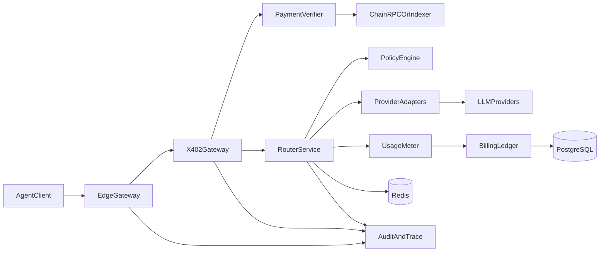
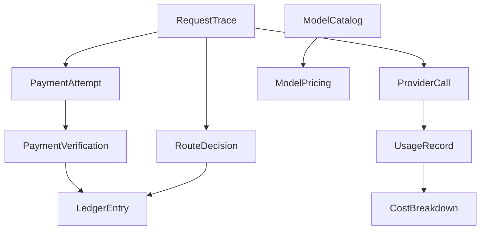

# x402-only MVP 最终计划

## 1. 目标与范围

- MVP 目标：先上线仅支持 x402 的 Agent 算力中转，验证真实付费与路由价值。
- MVP 不做：用户注册登录、API Key 体系、Stripe 充值、余额钱包、订阅系统。
- MVP 必做：
  - OpenAI 兼容接口
  - 模型目录与价格信息查询
  - 手动选模型与自动路由开关（manual/auto）
  - 请求级透明账单（真实模型、token、USD）
  - x402 支付挑战与无状态验证

## 2. 软件架构

## 3. 交付协议与请求关联（无状态）

- 首次请求无支付头时返回 `402 Payment Required`，包含：
  - `quote_id`
  - `amount` / `asset` / `chain`
  - `expires_at`
  - `request_hash`
  - `challenge_token`（服务端签名）
- 客户端支付后重试并携带：
  - `X-402-Challenge`
  - `X-402-Payment`
  - `Idempotency-Key`
- 服务端验证顺序：
  - challenge 有效且未过期
  - `request_hash` 与重试请求一致
  - 支付金额、币种、收款地址匹配
  - 支付证明未被重复消费（Redis 去重）

## 4. 核心数据模型

- `ModelCatalog`：模型能力、上下文、供应商
- `ModelPricing`：输入输出价格、币种、生效时间
- `RequestTrace`：请求哈希、路由模式、延迟、状态
- `RouteDecision`：候选模型、评分、最终模型、回退链
- `UsageRecord`：token 用量
- `CostBreakdown`：成本构成与最终价格
- `PaymentAttempt` / `PaymentVerification`：支付与验签记录
- `LedgerEntry`：不可变消费流水

## 5. 风险与问题清单

- 支付安全：重放攻击、金额不足、伪造证明、RPC 故障
- 路由风险：误判模型、回退风暴、价格缓存过期
- 计费风险：流式中断结算、上游口径差异、幂等重复扣费
- 稳定性风险：突发并发导致延迟上升、上游限流
- 合规风险（仍需关注）：地域限制、制裁名单、税务披露、滥用治理

## 6. 透明计费机制（核心卖点）

- 每次响应返回 `usage_receipt`：
  - `request_id`
  - `quote_id`
  - `payer_address`
  - `model_used`
  - `token_usage`
  - `total_cost_usd`
  - `routing_mode`
  - `route_proof_hash`
- 提供按 `request_id` 的审计查询接口，确保“声明模型 = 实际模型”。

## 7. 基础硬件与预算（单地域）

- 2 台网关应用机：2 vCPU / 4GB
- 1 套托管 PostgreSQL：2 vCPU / 4GB / 50GB SSD
- 1 套托管 Redis：1GB
- 对象存储：日志与账单归档
- 预算估算：¥1200 - ¥3500 / 月（不含上游模型调用成本）

## 8. 技术选型（当前建议）

- 后端：TypeScript + Fastify
- 数据：PostgreSQL + Redis
- 链验证：EVM RPC + 索引服务兜底
- 可观测：OpenTelemetry + Prometheus + Grafana + Loki
- 原因：开发快、吞吐高、适合 x402-only 的短路径 MVP，后续可平滑扩展账户体系。

## 9. 里程碑（4-6 周）

- Week 1：网关骨架、x402 挑战与验签、模型目录
- Week 2：manual 路由、上游适配、基础用量计费
- Week 3：auto 路由开关、回退链、透明回执
- Week 4：审计接口、压测、重放防护、幂等机制
- Week 5-6（可选）：监控告警完善、灰度上线

## 10. 后续扩展预留

- 账户体系：`User`、`ApiKey`、`WalletAccount`、`Invoice`
- 双支付网关：抽象 `PaymentChannel` 支持 `x402` / `stripe`
- MCP 市场：`McpProvider`、`McpService`、`McpSubscription`、`McpUsageSettlement`

